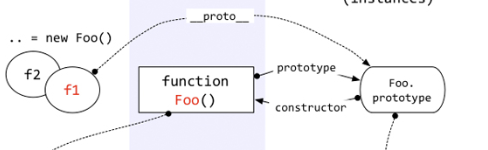
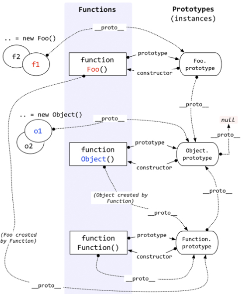
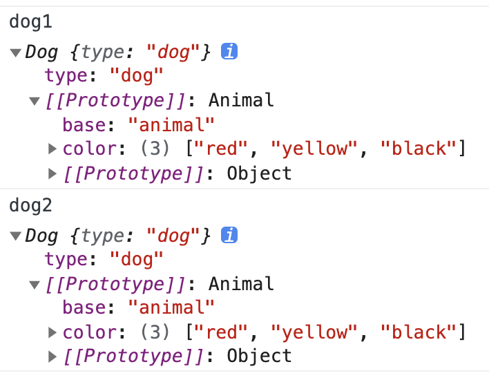

# 原型/原型链

> 对象可以通过 __proto__ 来寻找不属于该对象的属性，__proto__ 将对象连接起来组成了原型链。

## 构造函数/原型/实例



```
实例.__proto__ === 构造函数.prototype
实例.__proto__.constructor === 构造函数
```

```js
// 构造函数
function Foo() { }

// prototype指向原型
Foo.prototype.say = function () { }

// 实例
const f1 = new Foo()

console.log(
  // true
  // 实例.__proto__ === 构造函数.prototype
  f1.__proto__ === Foo.prototype,
  // true
  // 实例.__proto__.constructor === 构造函数
  f1.__proto__.constructor === Foo
)
```

## 完整图例

- 每个函数(除了Function.protype.bind())都有一个prototype,指向原型
- 每个对象(除了null)都有一个__proto__ 指向构造函数的原型
- 对象通过__proto__找不属于该对象的属性,__proto__将对象和原型连起来组成原型链



```js
// 构造函数
function Foo() { }

// prototype指向原型
Foo.prototype.say = function () { }

// 实例
const f1 = new Foo()

console.log(
  // 指向构造函数的原型prototype
  f1.__proto__,
  // 构造函数的原型.__proto__ 指向 Object的原型
  f1.__proto__.__proto__ === Object.prototype,
  // 构造函数的原型.__proto__.constructor 指向Object构造函数
  f1.__proto__.__proto__.constructor === Object,
  // Object.__proto__ === Function.prototype
  f1.__proto__.__proto__.constructor.__proto__ === Function.prototype,
  // 构造函数的原型.__proto__.__proto__
  // => Object.prototype.__proto__ = null
  f1.__proto__.__proto__.__proto__ === null,

  // 构造函数的原型对象 => Function构造函数的原型
  Foo.__proto__ === Function.prototype,

  Foo.__proto__.constructor === Function.prototype,
  // 构造函数.原型对象.原型对象 => Object的原型
  Foo.__proto__.__proto__ === Object.prototype,
)
```

```js
// undefined
console.log(Function.prototype.bind().prototype)
```

## new

### 使用

```js
function Person() {
  this.name = 'allen'
}

// 使用new去初始化构造函数
const p = new Person()
console.log(p)  // Person { name: 'allen' }

// 不适用new
const p1 = Person()
console.log(p1)  // undefined
console.log(window.name)  // allen
```

### 构造函数体返回不同值
- 返回对象,数组,函数会直接作为实例
- 返回其他不会影响原来实例

```js
function Person() {
  this.name = 'allen'
  return 1   // 实例为Person {name: "allen"}
  return 'string'  //实例为 Person {name: "allen"}
  return null     // 实例为Person {name: "allen"}
  return undefined  // //实例为 Person {name: "allen"}

  return { name: 'tom' }  // 实例为{name: "tom"}
  return []   // 实例为 []

  return function () {  // 实例为  ƒ () { console.log('1') }
    console.log('1')
  } 
}

const p = new Person()
console.log(p)
```

### 手写new
```js
function myNew(constructor, ...args) {
  // 创建空对象
  const obj = {}
  // 将对象的__proto__ 指向构造函数的原型
  obj.__proto__ = constructor.prototype
  // 执行构造函数,并且将this执行obj
  const result = constructor.apply(obj, args)
  // 处理构造函数的返回值
  if (
    (result !== null && typeof result !== 'object')
    || typeof result !== 'function'
  ) {
    return obj
  }

  return result
}
```

## 继承

### 原型链上继承

- 在原型对象上的引用类型会互相影响

#### 代码

```js
// 原型链继承
function Animal() {
  this.base = 'animal'
  this.color = ['red', 'yellow']
}

Animal.prototype.say = function () {
  console.log(this.type)
}

function Dog() {
  this.type = 'dog'
}

// 在原型对象上去继承Animal
Dog.prototype = new Animal()

const dog1 = new Dog()
const dog2 = new Dog()

dog1.color.push('black')
// [ 'red', 'yellow', 'black' ]
console.log(dog2.color)
```



### 利用构造函数继承

```js
// 借用构造函数继承
function Animal() {
  this.colors = ['red']
}

function Dog() {
  // 在构造函数里面继承
  Animal.call(this)
}

const xiaohuang = new Dog()
const wangcai = new Dog()

xiaohuang.colors.push('yellow')

console.log(wangcai.colors) // ['red']
console.log(xiaohuang.colors) // ['red','yellow']
```

#### 问题

- 只能继承父类的实例属性和方法，不能继承父类的原型对象
- 无法实现复用，每个子类都会有父类实例函数的副本，影响性能

```js
// 借用构造函数继承
function Animal() {
  this.colors = ['red']
}

Animal.prototype.say = function () {
  console.log(this.colors)
}

function Dog() {
  // 无法使用Animal.prototype
  Animal.call(this)
}

const xiaohuang = new Dog()
const wangcai = new Dog()

// ** 无法继承父类原型对象的属性或方法
console.log(wangcai.say)  // undefined

console.log(wangcai.colors === xiaohuang.colors)// false
```

### 组合继承

> 集合原型链继承和借助构造函数继承

1. **借助原型链继承：复用父类的实例和原型上的属性和方法，**
2. **借助构造函数继承：用父类的实例属性和方法去覆盖原型链上**

```js
// 组合继承
function Animal() {
  this.colors = ['red']
}

Animal.prototype.say = function () {
  console.log(this.colors)
}

function Dog() {
  // **2** 用构造函数继承去覆盖父类的实例属性和方法
  Animal.call(this)
}

// **1**将父类的实例作为原型对象
Dog.prototype = new Animal()
Dog.prototype.constructor = Dog

const xiaohuang = new Dog()
const wangcai = new Dog()

console.log(wangcai.say)  // undefined

console.log(wangcai.colors === xiaohuang.colors)// false
```

#### 缺点

- 调用两次`new Animal()`
- 存在两份Animal实例属性和方法（构造函数继承的会覆盖原型链上继承）

### 原型式继承

> 利用一个空对象作为中介，将某个对象直接赋值给空对象构造函数的原型

```js
// 原型式继承
function createObject(obj) {
  function F() { }
  F.prototype = obj
  return new F()
}

const animal = {
  colors: ['red', 'yellow'],
  name: 'animal'
}

const xiaohuang = createObject(animal)
xiaohuang.colors.push('green')
xiaohuang.name = 'xiaohuang'

const wangcai = createObject(animal)
// 对于引用类型地址一样，[ 'red', 'yellow', 'green' ]
console.log(wangcai.colors)

console.log(wangcai.name) // animal
```

#### 缺点

- 只是对对象进行浅层赋值
- 无法传递参数

#### Object.create

```js
const animal = {
  colors: ['red', 'yellow'],
  name: 'animal'
}

const xiaohuang = Object.create(animal)
xiaohuang.colors.push('green')

// 是对实例赋值
xiaohuang.name = 'xiaohuang'

const wangcai = Object.create(animal)
// 对于引用类型地址一样，[ 'red', 'yellow', 'green' ]
console.log(wangcai.colors)

console.log(wangcai.name) // animal
```

### 寄生式继承

> 在原型式继承的基础上，增加对象，返回实例

```js
function createAnimal(obj) {
  const clone = Object(obj)
  // 只是比原型式继承增强了可以新增属性和方法
  clone.type = 'animal'
  clone.say = function () {
    console.log('hello allen')
  }
  return clone
}

const animal = {
  colors: ['red', 'yellow'],
  name: 'animal'
}

const wangcai = createAnimal(animal)
const xiaohuang = createAnimal(animal)
```

#### 缺点（跟原型式继承一样）

- 多个实例的引用类型的地址一样
- 无法传递参数


### 寄生组合式继承

```js
// 寄生组合式继承

function inheritPrototype(Sub, Parent) {
  // 创建一个父类原型对象的副本
  const prototype = Object.create(Parent.prototype)

  // 将原型对象的构造函数执行子类
  prototype.constructor = Sub

  // 指定子类的原型对象
  Sub.prototype = prototype
}

function Animal() {
  this.colors = ['red']
}

Animal.prototype.say = function () {
  console.log(this.colors)
}

function Dog() {
  // 增加父类的实例属性和方法
  Animal.call(this)
  this.name = 'dog'
}

inheritPrototype(Dog, Animal)

Dog.prototype.wang = function () {
  console.log('wang')
}

const xiaohuang = new Dog()
const wangcai = new Dog()
```

### 混入方式继承多个对象

```js
// 混入方式继承多个对象

function Animal() {
  this.colors = ['red']
}

Animal.prototype.say = function () {
  console.log(this.colors)
}

function Dog() {
  this.name = 'dog'
}

Dog.prototype.tell = function () { }

function Wang() {
  // 增加父类的实例属性和方法
  Animal.call(this)
  Dog.call(this)
}

Wang.prototype = Object.create(Animal.prototype)
Object.assign(Wang.prototype, Dog.prototype)

Wang.prototype.constructor = Wang

const wangcai = new Wang()
```


### es6-class

```js
class Animal {
  constructor() {
    this.colors = ['red']
  }
  say() {
    console.log(this.colors)
  }
}

class Dog extends Animal {
  constructor(props) {
    super(props)
    this.name = 'dog'
  }

  tell() { }
}
```

### extends原理

```js
function _inherits(subClass, superClass) {
  if (typeof superClass !== "function" && superClass !== null) {
    throw new TypeError("Super expression must either be null or a function");
  }

  // 子级的原型对象使用父级的原型对象
  subClass.prototype = Object.create(
    superClass && superClass.prototype,
    // 指定prototype.constructor为subClass
    {
      constructor: { value: subClass, writable: true, configurable: true }
    }
  );

  if (superClass) {
    _setPrototypeOf(subClass, superClass);
  }
}
```


