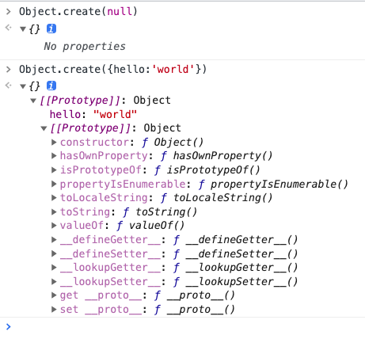

# Object

## 对象的遍历

### 模拟数据

```js
const sex = Symbol('sex')
const age = Symbol('age')
const marry = Symbol('marry')

const person = {
  name: 'allen',
  [sex]: '男',
  __proto__: {
    from: '广东',
    [age]: 27,
    __proto__: {
      job: 'web',
      [marry]: false
    }
  }
}

Object.defineProperty(person, 'hobby', {
  // 不能枚举
  enumerable: false,
  value: ['nba', 'lol']
})
```

### for-in

- 遍历对象"自身"和原型链上的可枚举属性
- 不含 Symbol 属性

```js
for (const key in allen) {
  // name,from,job
  console.log(key)
}
```

### Object.keys

- Object.keys返回一个key数组
- 包括对象"自身"的（不含继承的）所有可枚举的属性
- 不含 Symbol 属性

```js
//  ["name"]
console.log(Object.keys(person))
```

### Object.values

- Object.values返回一个数组
- 包括对象"自身"的（不含继承的）所有可枚举的属性的值
- 不含 Symbol 属性

```js
//  ["name"]
console.log(Object.keys(person))
```

### Object.getOwnPropertyNames

- 返回一个数组，
- 对象"自身"的所有属性
- 含对象“自身”不可枚举的属性
- 不含 Symbol 属性
- 不包含原型链上的属性

```js
// [ 'name', 'hobby' ]
console.log(Object.getOwnPropertyNames(person))
```


### Object.getOwnPropertySymbols

- 返回一个数组
- 含对象"自身"的所有 Symbol 属性的键名。
- 不包含对象原型链上的

```js
// [Symbol(sex)]
console.log(Object.getOwnPropertySymbols(person))
```

### Reflect.ownKeys

- 返回一个数组
- 包含对象"自身"的所有属性
  - 字符串
  - Symbol
  - 设置为不可枚举
- 不含对象原型链上的属性

```js
// ["name", "address", "hobby","Symbol(sex)]
console.log(Reflect.ownKeys(allen))
```

## 创建对象

### 字面量
```js
const preson = {
  name: 'allen',
  sex: 'man'
}
```

### Object构造函数
```js
const person = new Object()
person.name = 'allen'
```

### Object.create

```js
const jack = Object.create(null)
```




**手写Object.create**
```js
function create(obj) {
  const newObj = {}
  newObj.__proto__ = obj
  return newObj
}
```

### 工厂模式

> 缺乏类型

```js
function createPerson(name, sex) {
  return {
    name,
    sex
  }
}

const allen = createPerson('allen', 'man')
const lili = createPerson('lili', 'woman')

```

### 构造函数
> 有类型

```js
function CreatePersonConstrctuor(name, sex) {
  this.name = name
  this.sex = sex
}

const a = new CreatePersonConstrctuor('allen', 'man')
```
### 构造函数+原型模式
```js
function Person() { }
Person.prototype.name = 'allen'
```

### ES6 class 
```js
class Person {
}
const tom = new Person()
```