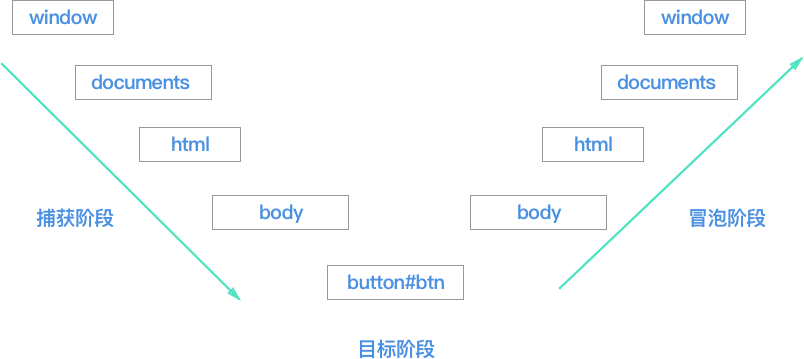

# DOM
## DOM事件级别
- DOM0 `element.onclick=function(){}`
- DOM1 `element.addEventListener('click',function(){},false)`
- DOM# `element.addEventListener('keyup',function(){},false)`

## 事件模型/事件流


## 几个标签获取
- html:`document.documentElement`
- body: `document.body`

### 事件委托(代理)
> 利用事件冒泡

**特点**
- 减少事件注册，提高性能
- 对新增自元素无需对其绑定

```javascript
/**
<ul id="ul">
  <li>1</li>
  <li>2</li>
  <li>3</li>
</ul>
*/
let ul = document.getElementById('ul')
ul.addEventListener('click', function (event) {
  console.log(event.target.tagName.toLowerCase())
})
```

### 阻止冒泡
- event.stopPropagation()
```javascript
box.addEventListener('click', function (event) {
  // stopPropagation()会阻止事件传播
  // 但不彻底取消click
  event.stopPropagation()
  console.log('box捕获')
}, true)
box.addEventListener('click', function (event) {
  // 虽然阻止了事件传播，但另一个绑定的事件还会触发
  console.log('box捕获1')
}, true)
```

- event.stopImmediatePropagation()
> 如果想要彻底取消该事件，不再触发后面所有click的监听函数，可以使用stopImmediatePropagation方法

## 事件绑定与解绑
```
// dom0级事件绑定
<div onclick="fn()">测试</div>
function fn(){}
// dom0级事件解绑
fn=null
// dom2级事件绑定
<div id="btn">按钮</div>
document.getElementById('btn').addEventListener('click',function(){
},false)
// dom2级事件解绑
document.getElementById('btn').removeEventListener('click',function(){
},false)
```

### this指向
```vue
<!-- btn -->
<button id="btn" onclick="console.log(this.id)">按钮</button>
<script>
btn.addEventListener('click', function (event) {
  console.log(this) // btn(调用者)
})
</script> 
```

### target.addEventListener()参数
```
/**
 * type 事件名，不带on，小写
 * listener 事件处理
 * useCapture 监听函数是否在捕获阶段触发，
 * 默认是false(在冒泡阶段)，true(在捕获阶段)
 */
target.addEventListener(type, listener[, useCapture]);
target.removeEventListener(type, listener[, useCapture]);
```

#### 例子
```javascript
let btn = document.getElementById('btn')
btn.addEventListener('click', function (event) {
  console.log('true代表捕获')
}, true)
btn.addEventListener('click', function (event) {
  console.log('false代表冒泡，默认是false')
}, false)
```

## Event
### Event.currentTarget,Event.target
> 事件源

```javascript
box.addEventListener('click', function (event) {
  console.log(event.currentTarget)  // 绑定事件的元素 box
  console.log(event.target) // 点击最小元素
})
```

### Event.preventDefault()
> 阻止事件的默认行为

### Event.stopPropagation()
> 阻止事件继续传播，但不会阻止事件的另外监听

### Event.stopImmediatePropagation()
> 取消该事件监听


## 遍历整个dom树
```javascript
function Tree (node, layer) {
  const roots = Array.from(node)
  while (roots.length) {
    const root = roots.shift()
    print(root, layer)
    if (root.children && root.children.length) {
      Tree(root.children, layer + 1)
    }
  }
}
let print = (node, layer) => {
  console.log(`${node.tagName} --className .${node.className} --level ${layer}`)
}
Tree(document.querySelectorAll('.root'), 1)
```

## 获取和设置盒模型对应的宽高
```javascript
// 设置和获取，但获取只限于行内属性
el.style[attr]=value
// 获取属性值，返回是300px
function getStyle (el, attr) {
  if (window.getComputedStyle) {
    return window.getComputedStyle(el)[ attr ]
  } else {
    return el.currentStyle[ attr ]
  }
}
```

## 自定义事件
```
<button id="btn">按钮</button>
<script>
var eve = new Event('customer')
let btn = document.getElementById('btn')
btn.addEventListener('customer', function () {
  console.log('customer')
})
btn.dispatchEvent(eve)
```

## 判断浏览器类型
- `navigator.userAgent` 浏览器的类型
- location 跳转
```javascript
location.href
location.search
location.pathname
```
- history 历史
```javascript
history.back()  // 回退
history.forward() // 前进
```

## 解析url各部分
