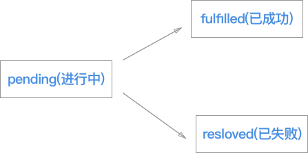

# JS
- 垃圾回收机制
- Commonjs、 AMD和CMD
- Symbol
- Proxy
- From、Map、FlatMap 和 Reduce
- promise
> https://juejin.im/post/5b16800fe51d4506ae719bae
- https://zhuanlan.zhihu.com/p/25863288

## js组成
- 核心 ECMAScript
- 文档对象模型 DOM
- 浏览器对象模型 BOM

## 数据类型
- 基本数据类型：`undefined,string,number,boolean`
- 引用数据类型：`null,object`


### 判断数据类型
- `typeof`
> 只能区分基本类型和函数(小写)

```javascript
console.log(typeof 'str') // 'string'
console.log(typeof 1) // 'number'
console.log(typeof true)  // 'boolean'
console.log(typeof b) // 'undefined'
console.log(typeof Symbol()) // 'symbol'
console.log(typeof [])  // 'object'
console.log(typeof {})  // 'object'
console.log(typeof null)  // 'object'
console.log(typeof console.log) // 'function'
```

- 最准确判断数据类型
> Object.prototype.toString.call(xx) 得到 `[object Xxx]`

```javascript
// console.log(Object.prototype.toString.call(a)) // 报错
console.log(Object.prototype.toString.call(undefined)) // '[object Undefined]'
console.log(Object.prototype.toString.call('str')) // '[object String]'
console.log(Object.prototype.toString.call(1)) // '[object Number]'
console.log(Object.prototype.toString.call(true)) // '[object Boolean]'
console.log(Object.prototype.toString.call(Symbol())) // '[object Symbol]'
console.log(Object.prototype.toString.call([])) // '[object Array]'
console.log(Object.prototype.toString.call({})) // '[object Object]'
console.log(Object.prototype.toString.call(null)) // '[object Null]'
console.log(Object.prototype.toString.call(console.log)) // '[object Function]'
```

- 判断空对象和空数组
```javascript
console.log(JSON.stringify([])) // '[]'
console.log(JSON.stringify({})) // '{}'
```

## 类型转换
- 类数组转换成真实数组
```javascript
function fn () {
  let arr = [].slice.call(arguments)
  console.log(arr)  // Array[4]
  console.log(arguments)  // Arguments[4]
}
fn(1, 2, 3, 4)
```

- 转换为false

```javascript
console.log(Boolean(undefined)) // false
console.log(Boolean(null))  // false
console.log(Boolean(''))  // false
console.log(Boolean(0)) // false
console.log(Boolean(false)) // false
console.log(Boolean(NaN)) // false
console.log(Boolean(-0))  // false
```

-  一些其他的比较

```javascript
console.log(undefined == null)  // true
console.log(NaN == NaN) // false
console.log(isNaN(NaN)) // true
console.log(isNaN(NaN)) // true
```

- 逻辑运算符
```javascript
console.log(10 && 0)  // 0
console.log('' || 'abc')  // 'abc'
```

## 四则运算
- 加法运算，一方是字符串类型，另一个也变成字符串
- 其他运算则一方为数字，则另一方转换成数字
- 加法运算将值转换为原始值，转换为数字，转换为字符串

```javascript
console.log(1 + '2')  // '1'+'2'  => 12
console.log(1 * '2')  // 1*2  => 2
console.log([ 1, 2 ] + [ 3, 4 ])  // 1,23,4
// => [1,2].toString() + [3,4].toString()
// => '1,2'+'3,4'

console.log([] + {})  // ?
console.log({} + [])  // ?
```

## 异步编程
### 回调函数
> 是解决异步的核心代码

```javascript
function myTimer (callback, time) {
  setTimeout(function () {
    callback()
  }, time)
}
myTimer(function () {
  console.log(1111)
}, 1000)
```

### Promise常用用法
> http://www.ituring.com.cn/article/66566

```javascript
function wait (time) {
  return new Promise(resolve => {
    setTimeout(function () {
      resolve('111')
    }, time)
  })
}
wait(1000).then(res => {
  // success
  console.log('数据' + res)
}, e => {
  // fail
  console.log('error' + e)
})

wait(1000).then(res => {
  // success
  console.log('返回' + res)
}).catch(e => {
  // fail
  console.log('错误' + e)
})
```

#### Promise.all,Promise.race
```javascript
function p1 () {
  return new Promise(resolve => {
    setTimeout(() => { resolve(11) }, 1000)
  })
}
function p2 () {
  return new Promise((resolve, reject) => {
    setTimeout(() => { reject(22) }, 2000)
  })
}
function p3 () {
  return new Promise((resolve, reject) => {
    setTimeout(() => { resolve(33) }, 4000)
  })
}
// 都没有报错，状态为fulfilled
Promise.all([ p1(), p3() ]).then(res => {
  console.log(res) // [11 , 33]
}).catch(e => {
  console.log('error' + e)
})

// 异步中只有一个报错，状态就为rejected
Promise.all([ p1(), p2(),p3() ]).then(res => {
  console.log('数据' + res)
}).catch(e => {
  console.log('error' + e)  // error 22
})

// 只要p1、p2之中有一个实例率先改变状态，p的状态就跟着改变
Promise.race([p1(),p2()]).then(res=>{
  console.log(res)  // 11
}).catch(e => {
  console.log('error'+e)
})

Promise.race([p2(),p3()]).then(res=>{
  console.log(res)
}).catch(e => {
  console.log('error'+e)  // 22
})
```

### 关于Promise的执行顺序
```javascript
var p = new Promise(resolve => {
  console.log(1)
  resolve(2)
  console.log(3)
})
p.then(value => {
  console.log(value)
})
console.log(4)
// 1,3,4,2
```

### async,await
```javascript
(async function () {
  try {
    let res = await p1()
    console.log(res)
  } catch (e) {
    console.log('error' + e)
  }
})()
```

### ? 手写Promise


> todo then().then()

```javascript
const PENDING = 'pending'
const RESOLVED = 'resolved'
const REJECTED = 'rejected'

function MyPromise (executor) {
  let _this = this
  _this.status = PENDING // 当前状态
  _this.value = undefined // 要是成功返回的数据
  _this.reason = undefined // 失败的原因
  // 成功或失败的订阅回调数组
  _this.resolvedCallbacks = []
  _this.rejectedCallbacks = []
  // 成功
  _this.resolve = function (value) {
    // 保证reslove执行前，then方法注册完毕
    setTimeout(function () {
      _this.status = RESOLVED
      _this.value = value
      // 发布订阅的回调函数
      _this.resolvedCallbacks.forEach(fn => fn())
    }, 0)
  }
  // 失败
  _this.reject = function (reason) {
    // 保证reject执行前，then方法注册完毕
    setTimeout(function () {
    _this.status = REJECTED
        _this.reason = reason
        // 发布订阅的回调函数
        _this.rejectedCallbacks.forEach(fn => fn())  
    },0)
  }
  try {
    executor(_this.resolve, _this.reject)
  } catch (e) {
    _this.reject(e)
  }
}

MyPromise.prototype.then = function (onResolved, onRejected) {
  let _this = this
  // then返回的是一个Promise
  let promsie2
  // 成功
  if (_this.status === RESOLVED) {
    onResolved(_this.value)
  }
  // 失败
  if (_this.status === REJECTED) {
    onRejected(_this.reason)
  }
  // 等待
  if (_this.status === PENDING) {
    // 添加订阅
    _this.resolvedCallbacks.push(function () {
      onResolved(_this.value)
    })
    // 添加订阅
    _this.rejectedCallbacks.push(function () {
      onRejected(_this.reason)
    })
  }
}
```

## 用setTimeout实现setInterval
```javascript
function MockSetInterval (fn, interval = 1000) {
  setTimeout(function () {
    fn()
    setTimeout(arguments.callee, interval)
  }, interval)
}
```

## 事件环EventLoop
- javascript是一门单线程语言
- 单线程：一个时间点上只能做一件事情

### 任务的分类
**任务分类**
- 同步任务
- 异步任务
- macro-task(宏任务)：包括整体代码script，setTimeout，setInterval
- micro-task(微任务)：Promise，process.nextTick

#### 执行顺序
- 执行主进程代码
- 执行微任务队列
- 在宏任务队列里面取出第一个
- 再执行所有的微任务
- 在宏任务队列中取出第二个，再执行所有微任务
- 如此一来就形成了事件环

#### 硬菜
```javascript
console.log('1')    // [0]
setTimeout(function () {   // [1]
  console.log('2')
  new Promise(function (resolve) {
    console.log('4')
    resolve()
  }).then(function () {
    console.log('5')
  })
})
new Promise(function (resolve) {  
  console.log('7')  // [2]
  resolve()
}).then(function () {   
  console.log('8')  // [3]
})
setTimeout(function () {  // [4]
  console.log('9')
  new Promise(function (resolve) {
    console.log('11')
    resolve()
  }).then(function () {
    console.log('12')
  })
})
// 1 7 8 2 4 5 9 11 12
```


### js延迟加载的方式
- 在`script`标签上写`async=async`属性
- 动态创建script标签
```javascript
function newScript (url) {
  let script = document.createElement('script')
  script.type = 'text/javascript'
  script.src = url
  document.body.appendChild(script)
}
```


## 大千世界，脑洞可以这么大
```javascript
function f () {
  return {
    hello: 'world'
  }
}
function f1 () {
  return
  {
    hello: 'world'
  }
}
console.log(f())
console.log(f1()) // undefined
```


## 浮点数精度问题
```javascript
function calculate(num){
  return parseFloat((num).toFixed(10))
}
```

## 判断两个对象是否相等
```javascript
let obj = {
  a: 1,
  b: 2
}
let obj1 = {
  a: 1,
  b: 2
}
let obj2 = {
  a: '1',
  b: 2
}
console.log(JSON.stringify(obj)==JSON.stringify(obj1))  // true
console.log(JSON.stringify(obj)==JSON.stringify(obj2))  // false
```

## ? 对象克隆
### JSON.parse
- 无法对函数，正则等特殊对象的克隆
```javascript
const newObj = JSON.parse(JSON.stringify(oldObj))
```

## 不用遍历生成0->100的数组
```javascript
Array.from(new Array(100).keys())
```

## 数组
### forEach
```javascript
var arr = [ 1, 2, 3, 4 ]
arr.forEach((item, index) => {
  console.log(`item-${item},index-${index}`)
})
```

### map
```javascript
// map 映射操作，对原数组每个元素进行处理，并回传新的数组
let newArr = arr.map(num => {
  return num * 2
})
console.log(arr)  // [2,4,6,8,10]
console.log(newArr) // [4,8,12,16,20]

let sum = newArr.reduce(function (a, b) {
  return a + b
})
console.log(sum)  // 60
console.log(newArr) // [4,8,12,16,20]

// filter过滤操作，筛选符合条件的所有元素，若为true则返回组成新数组
let arr1 = newArr.filter(function (item, index, arr) {
  return item > 12
})
console.log(arr1) // [16,20]
```

### `["1", "2", "3"].map(parseInt)`
```javascript
/**
* val 值
* radix 数字的基数
* parseInt(val,radix)
* val 值
* index下表
* data 数据
* .map(val,index,data)
*/
["1", "2", "3"].map(parseInt) // [1,NaN,NaN]
```

## 对象深克隆
```javascript
// 对于正则，undefined，函数就无能为力了
var obj = {
    a: 1,
    c: 'str',
    h: null,
    d: [1, 2, 3],
    e: {
      name: 'allen'
    },
    b: undefined,
    f: function () {
      console.log('function')
    },
    g: /[a-zA-Z]/,
}
console.log(JSON.parse(JSON.stringify(obj)))
/**
var obj = {
  a:1,
  c:'str',
  d:[1,2,3],
  e:{
    name:'allen'
  },
  g:{},
  h:null
}
*/
```

### 考虑数组和对象的深克隆
```javascript
function deepClone (origin, target = {}) {
    for (let key in origin) {
      // 判断自身属性是否存在
      if (origin.hasOwnProperty(key)) {
        if (typeof origin[key] === 'object' && origin[key] !== null) {
          target[key] = Object.prototype.toString.call(origin[key]) === '[object Array]' ? [] : {}
          deepClone(origin[key], target[key])
        } else {
          target[key] = origin[key]
        }
      }
    }
    return target
}
```
