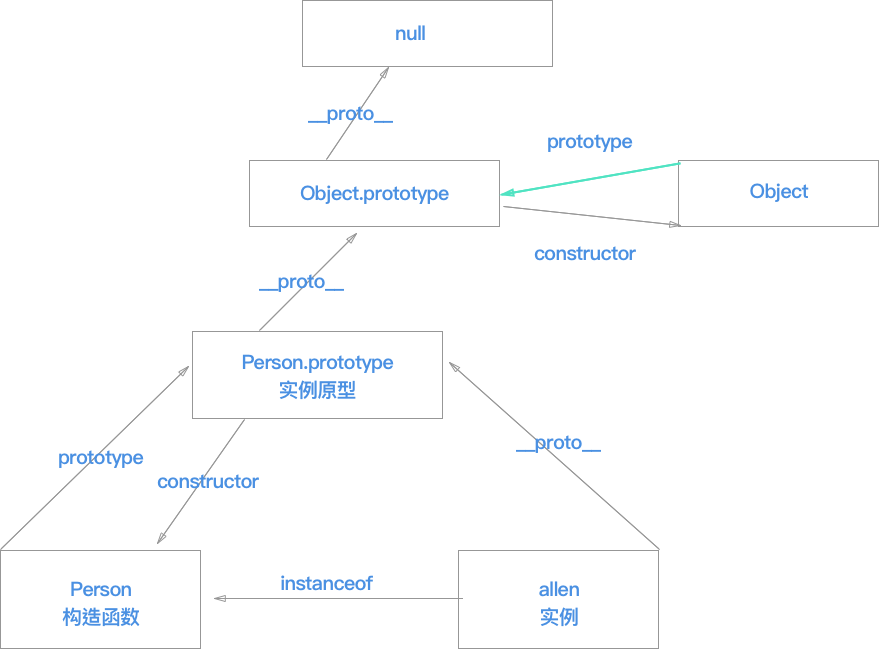

# 面向对象
- 闭包
- 继承
    - https://segmentfault.com/a/1190000015727237

## 创建对象
```javascript
// 字面量
var obj1 = {name:'allen'}
var obj2 = new Object({name:'tom'})
// 构造函数
function M() {
  this.name='ali'
}
var obj3 = new M()
// 使用Object.create()
var obj4 = {name:'answer'}
var obj5 = Object.create(obj4)
```

## 作用域
- 全局作用域
- 函数作用域
- 没有块级作用域(es6有)

## 构造函数
> 所谓"构造函数"，就是专门用来生成实例对象的函数
```javascript
function Person (name) {
  this.name = name
  // 如果返回普通类型，会被new忽略调
  // return 1000
  // 如果返回对象，则会被new返回
  return {
    name: 'tom'
  }
}
var yao = new Person('allen')
console.log(yao === 1000)   // false
console.log(yao.name) // tom
```

## prototype
- 每个函数都有一个prototype属性，指向一个对象

```javascript
function f () {}
console.log(typeof f.prototype) // object
```

## new原理
- 创建空对象
- 并把空对象的实例原型指向构造函数的prototype属性
- 将空对象绑定到函数的this
- 执行构造函数
- 返回对象 

### 代码
```javascript
function Person (name) {
  this.name = name
}
Person.prototype.age = 29
function _new (constructor, params) {
  // 把类数组(arguments)转换成数组
  var args = [].slice.call(arguments)
  // 取出构造函数
  constructor = args.shift()
  // 创建空对象，并继承构造函数的prototype属性
  // var context = {}
  // context.__proto__ = constructor.prototype
  var context = Object.create(constructor.prototype)
  // 执行构造函数
  let result = constructor.apply(context, args)
  // 如果返回结果是对象，直接返回，否则返回context对象
  return (typeof result === 'object' && result !== null) ? result : context
}
var ming = _new(Person, 'tony')
console.log(ming)
console.log(ming.age)
```

### new优先级
```javascript
function Foo() {
    return this;
}
Foo.getName = function () {
    console.log('1');
};
Foo.prototype.getName = function () {
    console.log('2');
};
// new (Foo.getName)
new Foo.getName();   // -> 1
// (new Foo()).getName
new Foo().getName(); // -> 2     
```

## Object.create()
> 复制对象，包含原型
```javascript
function Person (name) {
  this.name = name
}
Person.prototype.age = 20
var yao = new Person('allen')
var ming = Object.create(yao)
console.log(ming.age)
```

## this
> this指向调用者

> this要在执行时才能确认值，定义时无法确定

### call,apply,bind
```javascript
var a = 'tony'
var obj = {
  a: 'allen'
}
function fn (b, c) {
  console.log(this.a + `-${b}-${c}`)
}
// call,apply会动态绑定this，并会立即执行
fn.call(obj, 2, 3)  // allen-2-3
fn(2, 3)  // tony-2-3
// 不传，null，undefined,window都会this
fn.call() // tony
fn.call(null, 2, 3) // tony-2-3
fn.call(undefined, 2, 3)  // tony-2-3
fn.call(window, 2, 3) // tony-2-3
fn.apply(obj, [ 2, 3 ]) // allen-2-3
// 使用
// 类数组转换成数组
console.log(Array.prototype.slice.call({ 0: 2, 1: 3, length: 2 }))  // [2,3]
console.log(Object.prototype.toString.call({})) // [object Object]
let f = fn.bind(obj, 5)
f(3, 4) // allen-5-3
let f1 = fn.bind(obj)
f1(6, 7)  // allen-6-7
```

## 模拟call,bind,apply
```javascript
Function.prototype.call1 = function (context) {
  // 处理绑定为空
  context = context || window
  context.fn = this
  // 处理参数
  let args = []
  for (let i = 1; i < arguments.length; i++) {
    args.push(arguments[ i ])
  }
  args = args.join(',')
  let res = eval('context.fn(' + args + ')')
  delete context.fn
  return res
}
Function.prototype.apply1 = function (context, args) {
  let result
  context = context || window
  context.fn = this
  if (args && args.length > 0) {
    args = args.join(',')
    result = eval('context.fn(' + args + ')')
  } else {
    result = context.fn()
  }
  delete context.fn
  return result
}
Function.prototype.bind1 = function (context) {
  let _this = this
  let args = Array.prototype.slice.call(arguments, 1)
  return function () {
    let args1 = Array.prototype.slice.call(arguments)
    _this.apply(context, args.concat(args1))
  }
}
```

## instanceof原理
> `实例.__proto__  === 构造器.prototype`

```javascript
function _instanceof (obj, constructor) {
  while (obj !== null) {
    obj = obj.__proto__
    if (obj === constructor.prototype) {
      return true
    }
  }
  return false
}
```


## ?? 面向对象知识
- `prototype` : 每个函数都有一个 prototype 属性，指向实例原型
- `__proto__` : 每一个JavaScript对象(除了 null )都具有的属性，指向实例原型
- `constructor` : 每个原型都有一个 constructor 属性指向关联的构造函数
- `instanceof` : 返回一个布尔值，表示对象是否为某个构造函数的实例。



## 继承
### 构造函数实现继承
- 在构造函数调用`Animal.call(this)`
- 能够继承父类构造函数声明的属性和方法，但没有继承父类原型的属性和方法 
- 使通过this创建的属性和方法在子类中复制一份，因为是单独复制的，所以各个实例化的子类互不影响。但是会造成内存浪费的问题

```javascript
function Person (name) {
  this.name = name
  this.happy = [ 'cba' ]
}
Person.prototype.say = function () {
  console.log(`我是${this.name}`)
}
function Man (name) {
  Person.call(this, name)
}
var allen = new Man('allen')
var tom = new Man('tom')
console.log(allen.name) // allen
console.log(allen.say)  // undefined
console.log(allen.happy)
console.log(tom.happy)
// 构造函数继承父类构造函数的属性和对象是独立
allen.happy.push(111)
console.log(tom.happy)  // ['cba']
```

### 借助原型链实现继承
- 父类的实例属性变成公共
- 能找到父类的原型

```javascript
function Person () {
  this.happy = [ 'cba' ]
}

Person.prototype.say = function () {
  console.log(`我是` + this.happy)
}

function Man () {
}

Man.prototype = new Person()

var allen = new Man('allen')
// 能够继承父类的原型
allen.say() // 我是cba
console.log(allen.happy) // ['cba']
var tom = new Man('tom')
tom.happy.push('nba')
// 通过类继承的方式，父类的属性会被共用
console.log(allen.happy) // ['cba','nba']
```

### 组合式继承
- 解决上面两种继承的问题
- 引发：父类构造函数会被两次调用

```javascript
function Person () {
  this.happy = [ 'cba' ]
}

Person.prototype.say = function () {
  console.log(`我是` + this.happy)
}

function Man () {
  Person.call(this)
}

Man.prototype = new Person()
var allen = new Man()
var tom = new Man()
allen.say() // 我是cba
allen.happy.push('nba')
console.log(tom.happy)  // [cba]
```

- 组合继承的优化1

```javascript
function Animal () {
  this.name = '动物'
  this.play = [ 1, 2 ]
}
Animal.prototype.say = function () {
  console.log(this.play)
}
function Man () {
  Animal.call(this)
  this.sex = '男'
}
Man.prototype = Object.create(Animal.prototype)
Man.prototype.constructor = Man
```

## 设计模式
### 工厂模式
```javascript
function factory (name, age) {
  var obj = {}
  obj.name = name
  obj.age = age
  return obj
}

let obj = factory('allen', 23)
```

### 单例模式
```javascript
function Person (name) {
  this.name = name
}
var instance = (function () {
  var instance = null
  return function (name) {
    if (!instance) {
      instance = new Person(name)
    }
    return instance

  }
})()
var a = instance('allen')
var b = instance('tom')
console.log(a === b)  // true
```


### 订阅与发布
```javascript
var Obj = {
  // 订阅列表
  list: [],
  // 添加订阅
  addListener (fn) {
    this.list.push(fn)
  },
  // 发布
  trigger () {
    let _this = this
    let args = arguments
    this.list.forEach(fn => {
      fn.apply(_this, args)
    })
  }
}
Obj.addListener(function (color, size) {
  console.log('颜色' + color + ',大小' + size)
})
Obj.addListener(function (color, size) {
  console.log('再次颜色' + color + ',再次大小' + size)
})
Obj.trigger('黑色', '超大')
```

## 闭包
> 闭包是指有权访问另一个函数作用域中的变量的函数

## 内存泄露
> 内存泄露是指你用不到（访问不到）的变量，依然占居着内存空间，不能被再次利用起来