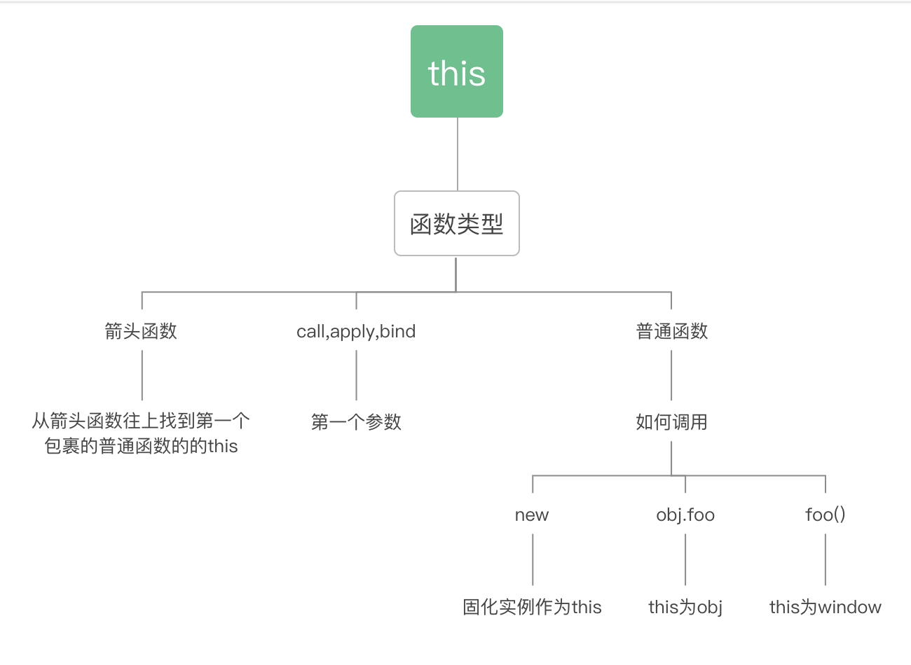

# this

## 资料
- https://muyiy.cn/blog/2/2.1.html#%E4%BD%9C%E7%94%A8%E5%9F%9F%E9%93%BE

## 规则

> 代码执行时, 谁调用函数，函数内部的this指向谁

```js
function foo() {
  console.log(this.a)
}
var a = 1 // 等价于 window.a = 1
foo() // 1  this=window

const obj = {
  a: 2,
  foo: foo
}
obj.foo() // 2  this=obj

const c = new foo() // undefined  this=c
```

## 绑定规则

### 1. 默认绑定
```js
var a = 'hello this'

function foo0() {
    'use strict'
    // 使用严格模式, this会绑定为undefind
    console.log(this.a)
}

// TypeError: Cannot read property 'a' of undefined
// foo0()

function foo1() {
    console.log(this.a)
}
// hello this
foo1();

(() => {
    'use strict'
    // 默认模式不影响函数调用的默认绑定
    // hello this
    foo1()
})()
```

### 2. 隐式绑定

```js
function foo() {
    console.log(this.a)
}

var obj = {
    foo,
    a: 'object'
}

// { foo: [Function: foo], a: 2 }
obj.foo()
// 最后一个点前面的对象
window.obj.foo()

var a = 'global'

// 隐式绑定丢失
var b = obj.foo
// global
// 等价于 window.b()
b()
```

### 3. 显式绑定
```js
function foo(b, c) {
    console.log(this.a, b, c)
}

var obj = {
    a: 'object'
}

foo.call(obj, 1, 2) // object 1 2
foo.apply(obj, [3, 4])  // object 3 4

const bindFunction = foo.bind(obj)
bindFunction(5, 6)  // object 5 6
bindFunction.apply({ a: 'new object' }, [7, 8]) // object 7 8
```

### 4. new绑定

```js
function Person(name) {
    this.name = name
}

const man = new Person('allen')
console.log(man.name)
```

### 5. 箭头函数

往父级作用域找最近一个`非箭头函数或全局作用域`来决定this指向

```js
function Foo() {
    // <-- 找到此处的作用域
    this.sayArrow = () => {
        // 往父级作用域找最近一个非箭头函数或全局作用域来决定this指向
        console.log(this)
    }
}

const f = new Foo()

console.log(f)

// <-- 找到这里的作用域
const obj = {
    a: 'object',
    c: () => {
        console.log(this.a)
    }
}

obj.c()
const { c } = obj
c()
```

## 箭头函数

### 箭头函数的this无法通过bind，call，apply来直接修改
```js
function Foo() {
  this.sayArrow = () => {
    console.log(this)
  }
}

const f = new Foo()

const { sayArrow } = f

sayArrow()  // Foo{sayArrow:f}
f.sayArrow.call({ a: 1 })  // Foo{sayArrow:f}
sayArrow.call({ a: 1 })  // Foo{sayArrow:f}
```

### 箭头函数的this

> 向上找第一个包裹箭头函数的普通函数

```js
function a() {
  return () => {
    return () => {
      console.log(this)
    }
  }
}
console.log(a()()())  // window
```

## this的优先级

1. 箭头函数：定义箭头函数就锁死
2. call,apply,bind: 强制改this指向
3. new
4. obj.foo()
5. foo()



## 例子

```js
function foo() {
    console.log(this.a);
}

var a = 2;
var o = { a: 3, foo: foo };
var p = { a: 4 };

o.foo(); // 3
(p.foo = o.foo)()   // 2

console.log(p.foo = o.foo)  // function foo(){}
```

### this指向是什么

```js
function Foo() {
  this.say = function () {
    console.log(this)
  }
}

const f = new Foo()

const { say } = f

f.say() // Foo{say:f}
f.say.call({ a: 1 })  // {a:1}
say.call({ a: 1 })  // {a:1}
say() // window
```

### 示例0

```js
var num = 1;
var myObject = {
    num: 2,
    add: function () {
        this.num = 3;
        /**
        1. function fn(){console.log(this.num);this.num = 4}
        2. fn()
        3. window.fn()
        */
        (function () {
            // this = window
            console.log(this.num);  // 1
            this.num = 4;   // window.num = 4
        })();
        console.log(this.num);  // 3
    },
    sub: function () {
        console.log(this.num)
    }
}

myObject.add();
console.log(myObject.num);  // 3
console.log(num);   // 4
var sub = myObject.sub;
sub();  // 4
```

### 示例1
```js
var name = 'window'

var person1 = {
    name: 'person1',
    show1: function () {
        console.log(this.name)
    },
    show2: () => console.log(this.name),
    show3: function function3() {
        return function () {
            console.log(this.name)
        }
    },
    show4: function () {
        // 下面箭头函数的this执行这里的this
        return () => console.log(this.name)
    }
}
var person2 = { name: 'person2' }

person1.show1() // person1
person1.show1.call(person2) // person2

person1.show2() // window
person1.show2.call(person2) // window

// (person1.show3() -> function3)()
person1.show3()()  // window
person1.show3().call(person2)   // person2

person1.show3.call(person2)()   // window

person1.show4()()   // person1
person1.show4().call(person2)   // person1
person1.show4.call(person2)()   // person2
```

### 示例2

```js
var name = 'window'

function Person(name) {
    this.name = name;
    this.show1 = function () {
        console.log(this.name)
    }
    this.show2 = () => console.log(this.name)
    this.show3 = function () {
        return function () {
            console.log(this.name)
        }
    }
    this.show4 = function () {
        return () => console.log(this.name)
    }
}

var personA = new Person('personA')
var personB = new Person('personB')

personA.show1() // personA
personA.show1.call(personB) // personB

personA.show2() // personA
personA.show2.call(personB) // personA

personA.show3()()   // window
personA.show3().call(personB)   // personB
personA.show3.call(personB)()   // window

personA.show4()()   // personA
personA.show4().call(personB)   // personA
personA.show4.call(personB)()   // personB
```

## call/apply

> 作用都是改变函数调用时this，都只能作用域函数

|      | call     | apply    | bind             |
| ------ | -------- | -------- | ---------------- |
| 参数   | 多个     | 数组     | 多个             |
| 返回值 | 直接执行 | 直接执行 | 返回带执行的函数 |

### call,apply基础使用

```js
const obj = { name: 'allen' };

function say(param1, param2, ...args) {
  console.log(this.name, param1, param2, args);
}

// 改变this的指向
// call和apply的区别，除了上下文后面的参数传递方式不同
say.call(obj, 'man', 27);   // allen man 27 []
say.apply(obj, ['man', 27]);  // allen man 27 []
```

### 箭头函数无法改变其this

> 箭头函数在定义时就绑定好this

```js
const fn = () => {
  console.log(this)
}

fn.call({ name: 'allen' })  // window
fn.apply({ name: 'allen' }) // window
fn.bind({ name: 'allen' })()  // window
```

## bind
### bind的基础使用

```js
const obj = { name: 'allen' };
function say(...args) {
  console.log(this, args);
}

// bind返回的是函数
const fn = say.bind(obj, 'man', 27);

fn(1); // { name: 'allen' } [ 'man', 27, 1 ]
fn(2);  // { name: 'allen' } [ 'man', 27, 2 ]
```

### bind后再次调用call，apply,bind都无法改变this

```js
const obj = { name: 'allen' };
function say(...args) {
  console.log(this, args);
}

// bind返回的是函数
const fn = say.bind(obj, 'man', 27);

// { name: 'allen' } [ 'man', 27, 1, 2 ]
fn.call({ b: 'new', name: 'jack' }, 1, 2)
// { name: 'allen' } [ 'man', 27, 1, 2 ]
fn.apply({ b: 'new', name: 'jack' }, [1, 2])
// { name: 'allen' } [ 'man', 27, 1, 2 ]
fn.bind({ b: 'new', name: 'jack' }, 1, 2)()
```

### bind后new

```js
const obj = { name: 'allen' };
function say(...args) {
  console.log(this, args);
}

// bind返回的是函数
const fn = say.bind(obj, 'man', 27);

new fn(1) // {} ["man", 27, 1]
```

### 多次bind

> 第一次bind决定this,后续只会用其参数

```js
const obj = { name: 'allen' };
function say(...args) {
  console.log(this, args);
}

// bind返回的是函数
const fn = say.bind(obj, 'man', 27);

// {name: "allen"}  ["man", 27, 1, 2, 3, 4, 5, 6]
fn
  .bind({ name: 'jack' }, 1, 2)
  .bind({ name: 'tom' }, 3, 4)
  .bind({ name: 'tim' }, 5, 6)
  ()
```

## 手写call

```js
Function.prototype.customCall = function (context = window, ...args) {
    const name = Symbol()
    context[name] = this
    const result = context[name](...args)
    delete context[name]
    return result
}

function say(...args) {
    console.log(this, args)
    return this.hello
}

// { hello: 'call', [Symbol()]: [Function: say] } [ 1, 2, 3 ]
// call
console.log(
    say.customCall({ hello: 'call' }, 1, 2, 3)
)
```

## 手写apply
```js
Function.prototype.customApply = function (context = window, args = []) {
    const _args = Array.isArray(args) ? args : []
    const name = Symbol()
    context[name] = this
    const result = context[name](..._args)
    delete context[name]
    return result
}

function say(...args) {
    console.log(this, args)
    return this.hello
}

console.log(
    say.customApply({ hello: 'call' }, [1, 2, 3])
)
```

## 手写bind 
- 指定this
- 返回函数
- 可以传入参数
- 返回函数可以执行new, 但绑定的this被忽略

```js
Function.prototype.customBind = function (context = window, ...args) {
    const fn = this

    return function Fn(...restArgs) {
        if (this instanceof Fn) {
            return new fn(...args, ...restArgs)
        }
        return fn.call(context, ...args, ...restArgs)
    }
}

function func(...args) {
    console.log(args)
    this.name = 'allen'
}
func.prototype.say = function () {
    console.log('hello', this.name)
}

const fn = func.customBind({ hello: 'call' }, 1, 2, 3)
// fn(12)

const f = new fn(22)
f.say()

// true
console.log(f instanceof func)


function func1() {
    console.log(this.a)
}

// 多次绑定只是第一次有效
const f1 = func1
    .bind({ a: 1 })
    .bind({ a: 2 })
    .bind({ a: 3 })
// 1
f1()
```

## 手写new

1. 创建一个新对象。
2. 这个新对象会被执行[[Prototype]]连接。__proto__ = 构造函数.prototype
3. 这个新对象会绑定到函数调用的this。
4. 如果函数没有返回其他对象，那么new表达式中的函数调用会自动返回这个新对象。

```js
function customNew(Construtor, ...args) {
    const obj = new Object()

    obj.__proto__ = Construtor.proptype

    const result = Construtor.apply(obj, args)

    return result instanceof Object ? result : obj
}

const woman = customNew(Person, 'tiya')
console.log(woman)
```
