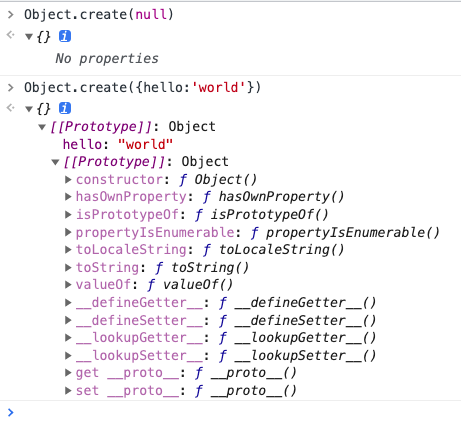

# Object

## 对象的遍历

### 模拟数据

```js
const sex = Symbol('sex')
const age = Symbol('age')
const marry = Symbol('marry')

const person = {
    name: 'allen',
    [sex]: '男',
    // 模拟原型链
    __proto__: {
        from: '广东',
        [age]: 27,
        __proto__: {
            job: 'web',
            [marry]: false
        }
    }
}

// 设置hobby不能被枚举
Object.defineProperty(person, 'hobby', {
    enumerable: false,
    value: ['nba', 'lol']
})

```

### for-in

- 包含
  - 遍历对象"自身"和原型链上的可枚举属性
- 不含 
  - Symbol 属性

```js
for (const key in allen) {
  // name,from,job
  console.log(key)
}
```

### Object.keys/Object.values

- 返回一个key数组
- 包括
  - 对象"自身"的（不含继承的）所有可枚举的属性
- 不含 
  - Symbol 属性

```js
//  ["name"]
console.log(Object.keys(person))
```

### Object.getOwnPropertyNames

- 返回一个数组，
- 包含
  - 对象"自身"的所有属性
  - 含对象“自身”不可枚举的属性
- 不含 
  - Symbol 属性
  - 原型链上的属性

```js
// [ 'name', 'hobby' ]
console.log(Object.getOwnPropertyNames(person))
```

### Object.getOwnPropertySymbols

- 返回一个数组
- 包含
  - 对象"自身"的所有 Symbol 属性的键名
- 不包含
  - 对象原型链上的 Symbol 属性的键名

```js
// [Symbol(sex)]
console.log(Object.getOwnPropertySymbols(person))
```

### Reflect.ownKeys

- 返回一个数组
- 包含
  - 对象"自身"的所有属性(包括Symbol和不可枚举)
- 不含
  - 对象原型链上的属性

```js
// ["name", "hobby", "Symbol(sex)]
console.log(Reflect.ownKeys(allen))
```

## 创建对象

### 字面量
```js
const preson = {
  name: 'allen',
  sex: 'man'
}
```

### Object构造函数
```js
const person = new Object()
person.name = 'allen'
```

### Object.create

```js
const jack = Object.create(null)
```




**手写Object.create**
```js
function create(obj) {
  const newObj = {}
  newObj.__proto__ = obj
  return newObj
}
```

### 工厂模式

> 缺乏类型

```js
function createPerson(name, sex) {
  return {
    name,
    sex
  }
}

const allen = createPerson('allen', 'man')
const lili = createPerson('lili', 'woman')

```

### 构造函数
> 有类型

```js
function CreatePersonConstrctuor(name, sex) {
  this.name = name
  this.sex = sex
}

const a = new CreatePersonConstrctuor('allen', 'man')
```
### 构造函数+原型模式
```js
function Person() { }
Person.prototype.name = 'allen'
```

### ES6 class 
```js
class Person {
}
const tom = new Person()
```

## 代理 Proxy

```ts
interface TmpObject {
    a?: unknown
    _a?: number
    _b?: number,
    fn: () => void
}

const source = {
    _a: 1,
    fn() {
        // this指向的是代理后返回的对象
        console.log('', this === source)
        console.log('', this === obj)
    }
}

const obj = new Proxy<TmpObject>(source, {
    // 拦截 obj.a, 
    // obj[xxx]
    get(target, p, receiver) {
        console.log('获取属性名', p, receiver)
        return Reflect.get(target, p, receiver)
    },
    // 拦截 obj.a = 22 
    // obj[xx] = any
    set(target, p, v, receiver) {
        console.log('设置属性的值', p, v)
        return Reflect.set(target, p, v, receiver)
    },
    // 拦截 xx in obj
    has(target, p) {
        if (typeof p === 'string' && p.startsWith('_')) {
            return false
        }

        return Reflect.has(target, p)
    },
    // delete obj[xx]
    deleteProperty(target, p) {
        if (typeof p === 'string' && p.startsWith('_')) {
            return false
        }
        // delete target[p]
        return true
    },
    // obj[new propertyName] = xx
    defineProperty(_, p) {
        if (typeof p === 'string' && p.startsWith('_')) {
            return false
        }
        return true
    },
    // Object.getOwnPropertyNames(obj),
    // Object.getOwnPropertySymbols(obj),
    // Object.keys()
    // for...in循环
    ownKeys(target) {
        console.log(target)
        return ['a']
    }
}
)

console.log(obj.a)

obj.a = 2

console.log('_a' in obj)

// console.log(delete obj['_a'])

// TypeError: 'set' on proxy: trap returned falsish for property '_b'
// obj._b = 3

console.log(
    Object.getOwnPropertyNames(obj),
    Object.getOwnPropertySymbols(obj),
    Reflect.ownKeys(obj)
)

obj.fn()
```

## 代理 Object.defineProperty

## Reflect

### api

```ts

declare namespace Reflect {
    // 等价于 target.apply(thisArgument, argumentsList)
    function apply(target: Function, thisArgument: any, argumentsList: ArrayLike<any>): any;

    // 等价于 new target(...argumentsList)
    function construct(target: Function, argumentsList: ArrayLike<any>, newTarget?: Function): any;

    // Object.defineProperty
    function defineProperty(target: object, propertyKey: PropertyKey, attributes: PropertyDescriptor & ThisType<any>): boolean;

    // delete target[propertyKey]
    function deleteProperty(target: object, propertyKey: PropertyKey): boolean;

    // 相当于 target[propertyKey]
    // receiver接收器, 指定this
    function get(target: object, propertyKey: PropertyKey, receiver?: any): any;

    // Object.getOwnPropertyDescriptor
    function getOwnPropertyDescriptor(target: object, propertyKey: PropertyKey): PropertyDescriptor | undefined;

    // Object.getPrototypeOf
    function getPrototypeOf(target: object): object | null;

    // propertyKey in target
    function has(target: object, propertyKey: PropertyKey): boolean;

    // Object.isExtensible
    function isExtensible(target: object): boolean;

    // Object.getOwnPropertyNames + Object.getOwnPropertySymbols
    function ownKeys(target: object): (string | symbol)[];

    /**
     * Prevents the addition of new properties to an object.
     * @param target Object to make non-extensible.
     * @return Whether the object has been made non-extensible.
     */
    function preventExtensions(target: object): boolean;

    // [receiver || target][propertyKey] = value
    function set(target: object, propertyKey: PropertyKey, value: any, receiver?: any): boolean;

    // Object.setPrototypeOf
    function setPrototypeOf(target: object, proto: object | null): boolean;
}
```

**示例**

```ts
const obj = {
    a: 1,
    b: 2,
    get c() {
        return this.a + this.b
    }
}

console.log(Reflect.get(obj, 'a'))  // 1
console.log(Reflect.get(obj, 'b'))  // 2
console.log(Reflect.get(obj, 'c', { a: 3, b: 4 }))  // 7
```


## 实现观察者模式

```ts
interface Fn {
    (): void
}
const { observable, observe } = (() => {
    const queuedObserve = new Set<Fn>()
    function observable<T extends Object>(target: T) {
        return new Proxy<T>(target, {
            set(target, p, value, receiver) {
                const bool = Reflect.set(target, p, value, receiver)
                // 执行监听函数
                queuedObserve.forEach(observe => {
                    observe()
                })

                return bool
            }
        })
    }

    function observe(fn: Fn) {
        queuedObserve.add(fn)
    }

    return {
        observable,
        observe
    }
})()


const person = observable({
    name: '张三',
    age: 20
});

function print() {
    console.log('监听', `${person.name}, ${person.age}`)
}

observe(print);
person.name = '李四';
```

## Iterator

> 它是一种接口，为各种不同的数据结构提供统一的`访问`机制。任何数据结构只要部署 Iterator 接口`Symbol.iterator`，就可以完成遍历操作

**作用**
- 一是为各种数据结构，提供一个统一的、简便的访问接口；
- 二是使得数据结构的成员能够按某种次序排列；
- 三是 ES6 创造了一种新的遍历命令`for...of`循环，Iterator 接口主要供for...of消费。

```js
var it = makeIterator(['a', 'b']);

console.log(it.next()) // { value: "a", done: false }
console.log(it.next()) // { value: "b", done: false }
console.log(it.next()) // { value: undefined, done: true }
console.log(it.next()) // { value: undefined, done: true }

function makeIterator(array) {
    let index = 0
    return {
        next() {
            return (
                index < array.length
                    ? { done: false, value: array[index++] }
                    : { done: true, value: undefined }
            )
        }
    }
}
```

### 为Object类型增加迭代接口

```js
const obj1 = {
    a: 1,
    b: 2,
    [Symbol.iterator]() {
        let i = 0
        const arr = Object.keys(this)
        return {
            next() {
                return i < arr.length
                    ? { value: arr[i++], done: false }
                    : { value: undefined, done: true }
            }
        }
    }
}

for (const key of obj1) {
    console.log(222, key)
}

const obj2 = {
    a: 1,
    b: 2
}
// TypeError: obj2 is not iterable
for (const key of obj2) {
    console.log(222, key)
}
```

### 原生具备 Iterator 接口

- Array
- Map
- Set
- String
- TypedArray
- 函数的 arguments 对象
- NodeList 对象

```js
const arr = [1, 2, 3]

const it = arr[Symbol.iterator]()

// { value: 1, done: false }
console.log(it.next())
// { value: 2, done: false }
console.log(it.next())
// { value: 3, done: false }
console.log(it.next())
// { value: undefined, done: true }
console.log(it.next())

for (const item of arr) {
    // 1
    // 2
    // 3
    console.log(item)
}
```

## class
- https://es6.ruanyifeng.com/#docs/class
- https://es6.ruanyifeng.com/#docs/class-extends

