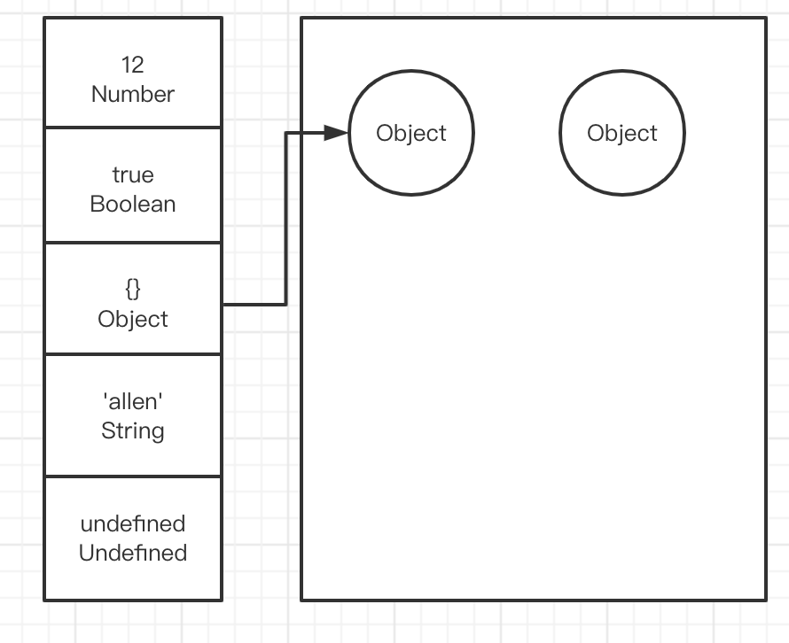

# 数据类型

## 数据类型

### 原始类型
  - 存放在栈内存中
  - 按值直接访问

```js
console.log(
  typeof 'string',  // string
  typeof 10,  // number
  typeof true,  // boolean
  typeof null,  // object
  typeof undefined, // undefined
  typeof Symbol(),  // symbol
  typeof BigInt(10),  //  bigint
)
```

### 引用类型
  - 存放在堆内存中，每个对象在堆内存中有一个引用地址
  - 按引用地址访问

```js
console.log(
  typeof {},  // object
  typeof [],  // object
  typeof new Date(),  // object
  typeof /\d/,  // object
  typeof console.log, // function
)
```

## 类型判断

### typeof

- 适用于判断原始类型(除了null)和function
- 其他都是返回object

```js
console.log(
  typeof 'string',  // string
  typeof 10,  // number
  typeof true,  // boolean
  typeof undefined, // undefined
  typeof Symbol(),  // symbol
  typeof BigInt(10),  //  bigint

  typeof null,  // object
  typeof {},  // object
  typeof [],  // object
  typeof new Date(),  // object
  typeof /\d/,  // object
  
  typeof console.log, // function
)
```

### instanceof

- undefined,null使用instanceof会报错
- 原始类型(除了undefined,null)都会返回false
- 引用类型能判断类型

```js
console.log(
  true instanceof Boolean,  // false
  'string' instanceof String, // false
  10 instanceof Number,   // false
  Symbol() instanceof Symbol, // false
  BigInt(20) instanceof BigInt, // false

  // 报错
  // undefined instanceof undefined,
  // null instanceof null,

  {} instanceof Object, // true
  {} instanceof Array,  // false

  [] instanceof Object, // true
  [] instanceof Array,  // true

  console.log instanceof Object, // true
  console.log instanceof Function,  // true
)
```

### constructor
```js
console.log(
  (2).constructor === Number, // true
  ('string').constructor === String, // true
  (true).constructor === Boolean, // true
  (Symbol()).constructor === Symbol,  //true

  // 报错
  // (undefined).constructor,
  // (null).constructor,

  [].constructor === Array, // true
  [].constructor === Object,  // false
  
  {}.constructor === Object,  // true

  (console.log).constructor === Function, // true
  (console.log).constructor === Object, // false
)
```

**存在不稳定**
```js
// 可以任意修改
function Person() { }
Person.prototype.constructor = Array

const p = new Person()
console.log(p.constructor === Person) // false
console.log(p.constructor === Array)  // true
```

### Object.prototype.toString.call
```js
console.log(Object.prototype.toString.call(undefined)) // [object Undefined]

console.log(Object.prototype.toString.call(true)) // [object Undefined]
console.log(Object.prototype.toString.call(1)) // [object Number]
console.log(Object.prototype.toString.call('string')) // [object String]

console.log(Object.prototype.toString.call(null)) // [object Null]
console.log(Object.prototype.toString.call({})) // [object Object]
console.log(Object.prototype.toString.call(/\d/)) // [object RegExp]
console.log(Object.prototype.toString.call([])) // [object Array]

console.log(Object.prototype.toString.call(console.log)) // [object Function]
console.log(Object.prototype.toString.call(Symbol())) // [object Symbol]

console.log(Object.prototype.toString.call(new Map())) // [object Map]
console.log(Object.prototype.toString.call(new WeakMap())) // [object WeakMap]
console.log(Object.prototype.toString.call(new Set())) // [object Set]


function Person() { }
Person.prototype.constructor = Person
const p = new Person()

console.log(Object.prototype.toString.call(p))  // [object Object]
```

## undefined和null
- 相同点
  - 都是原始类型,只有一个值
- 不同
  - 含义: undefined表示未定义，null表示空对象
  - 使用: 变量声明但未赋值时返回undefined, null一般赋值给可能存储对象的变量
  - typeof的结果不同

```js
undefined == null // true
```

## Symbol

> 一种新的原始数据类型, 表示`独一无二`的值

```js
console.log(Symbol('foo')) // Symbol(foo)
console.log(Symbol('foo').toString()) // Symbol(foo)

// 类型
console.log(typeof Symbol('foo'))  // symbol

// 判断: 都是独一无二的值
console.log(Symbol('foo') === Symbol('foo'))  // false

// 获取symbol的描述
console.log(Symbol('hello symbol').description) // hello symbo

// 不能参与计算
// console.log(s1 + 'hello')   // TypeError: Cannot convert a Symbol value to a string
```

### Symbol的遍历方式

> Object.getOwnPropertySymbols,Reflect.ownKeys

```js
const s = Symbol('foo')
const obj = { [s]: 'symbol' }

for (let i in obj) {
    console.log('for in ' + i)  // 不会执行
}

console.log(Object.keys(obj))   // []

console.log(Object.getOwnPropertyNames(obj))    // []

console.log(JSON.stringify(obj))    // {}

// symbol属性的专属遍历方法
console.log(Object.getOwnPropertySymbols(obj))  // [ Symbol(foo) ]
console.log(Reflect.ownKeys(obj))   // [ Symbol(foo) ]
```

### Symbol.for
```js
console.log(Symbol.for('foo') === Symbol.for('foo'))    // true

const s1 = Symbol.for('bar')
console.log(Symbol.keyFor(s1))  // bar

const s2 = Symbol.for('bar')
console.log(Symbol.keyFor(s2))  // bar
```

## Set 和 Map 数据结构

### Set
> 类似于数组，但是成员的值都是唯一的，没有重复的值。

```js
const arr = [1, '1', 22, 1, NaN, NaN]
console.log(new Set(arr)) // Set(4) { 1, '1', 22, NaN }

console.log([...new Set(arr)])  // [ 1, '1', 22, NaN ]

console.log([...new Set('ababbc')].join(''))    // abc
```

```ts
interface Set<T> {
  // 添加值
  add(value: T): this;
  // 清空
  clear(): void;
  // 删除某个值
  delete(value: T): boolean;
  // 遍历
  forEach(
    callbackfn: (value: T, value2: T, set: Set<T>) => void,
    thisArg?: any
  ): void;
  // 是否有这个成员
  has(value: T): boolean;
  // 实例成员的总数
  readonly size: number;

  /** Iterates over values in the set. */
  [Symbol.iterator](): IterableIterator<T>;
  /**
   * 返回键值对 [ [key,value] ]
   */
  entries(): IterableIterator<[T, T]>;
  /**
   * 返回键名 [a,b]
   */
  keys(): IterableIterator<T>;

  /**
   * Returns an iterable of values in the set.
   */
  values(): IterableIterator<T>;
}
```

### WeakSet

#### 跟Set的区别

- WeakSet 的成员只能是对象，而不能是其他类型的值。
- WeakSet 中的对象都是`弱引用`，即垃圾回收机制不考虑 WeakSet 对该对象的引用，也就是说，如果其他对象都不再引用该对象，那么垃圾回收机制会自动回收该对象所占用的内存，不考虑该对象还存在于 WeakSet 之中。

### Map

> JavaScript 的对象（Object），本质上是键值对的集合（Hash 结构）

```ts
interface Map<K, V> {
  // 清除所有成员
  clear(): void;
  // 删除某个键
  delete(key: K): boolean;
  // 遍历 Map 的所有成员
  forEach(callbackfn: (value: V, key: K, map: Map<K, V>) => void, thisArg?: any): void;
  // 读取key对应的键值
  get(key: K): V | undefined;
  // 某个键是否在当前 Map 对象之中。
  has(key: K): boolean;
  // 键名key对应的键值为value
  set(key: K, value: V): this;

  // 成员总数
  readonly size: number;

  /** Returns an iterable of entries in the map. */
  [Symbol.iterator](): IterableIterator<[K, V]>;

  /**
   * 返回所有成员的遍历器
   */
  entries(): IterableIterator<[K, V]>;

  /**
   * 返回键名的遍历器
   */
  keys(): IterableIterator<K>;

  /**
   * 返回键值的遍历器 
   */
  values(): IterableIterator<V>;
}
```

#### Map,Array,Object相互转换

```js
// Map to Array
const map = new Map()
map.set('hello', 'world')
map.set({}, 'world')
console.log([...map])   // [ [ 'hello', 'world' ], [ {}, 'world' ] ]

// Array to Map
const arr = [['hello', 'world'], [{}, 'world']]
console.log(new Map(arr))

// Map to Object
const map1 = new Map()
map1.set('jack', 'tom')

const mapToObject = (_map) => {
    const obj = {}
    for (let [key, value] of _map.entries()) {
        obj[key] = value
    }
    return obj
}

console.log(mapToObject(map1))

// object to Map
const obj = { jack: 'tom' }
console.log(new Map(Object.entries(obj)))

const objectToMap = (_object) => {
    const map = new Map()
    Object.entries(_object).forEach(([key, value]) => {
        map.set(key, value)
    })
    return map
}
console.log(objectToMap(obj))
```

### WeakMap和Map的区别
- WeakMap只接受对象作为键名（null除外），不接受其他类型的值作为键名
- WeakMap的键名所指向的对象，不计入垃圾回收机制
- WeakMap
  - 没有Map的遍历操作keys(),values(),enteries()
  - 没有Map的size
  - 没有Map的clear()

## 存储空间

- 基础类型:
  - 存储在栈
- 引用类型:
  - 在栈存储引用地址
  - 存储在堆内存

  

```js
var a = { name: '前端开发' }
var b = a;
// 因为null是基础类型,所以只是将a存储在栈的值改为null, 删除原来的引用地址
// 而原来{name: '前端开发'}这个存储在堆内存的对象并为替换
// 只是把a在栈存储改为null, 
// b的引用地址没变
a = null;
console.log(b)
```

```js
var a = { n: 1 };
var b = a;
a.x = a = { n: 2 };

console.log(a.x)
console.log(b.x)

/**
var a = { n: 1 };
var b = a;
a.x = { n: 2 };
a = { n: 2 };

console.log(a.x)
console.log(b.x)
 */
```