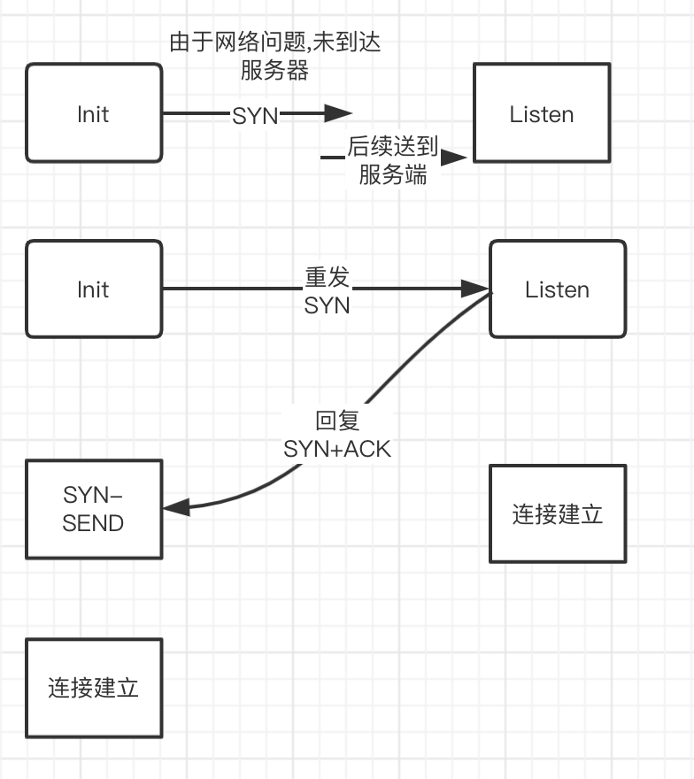
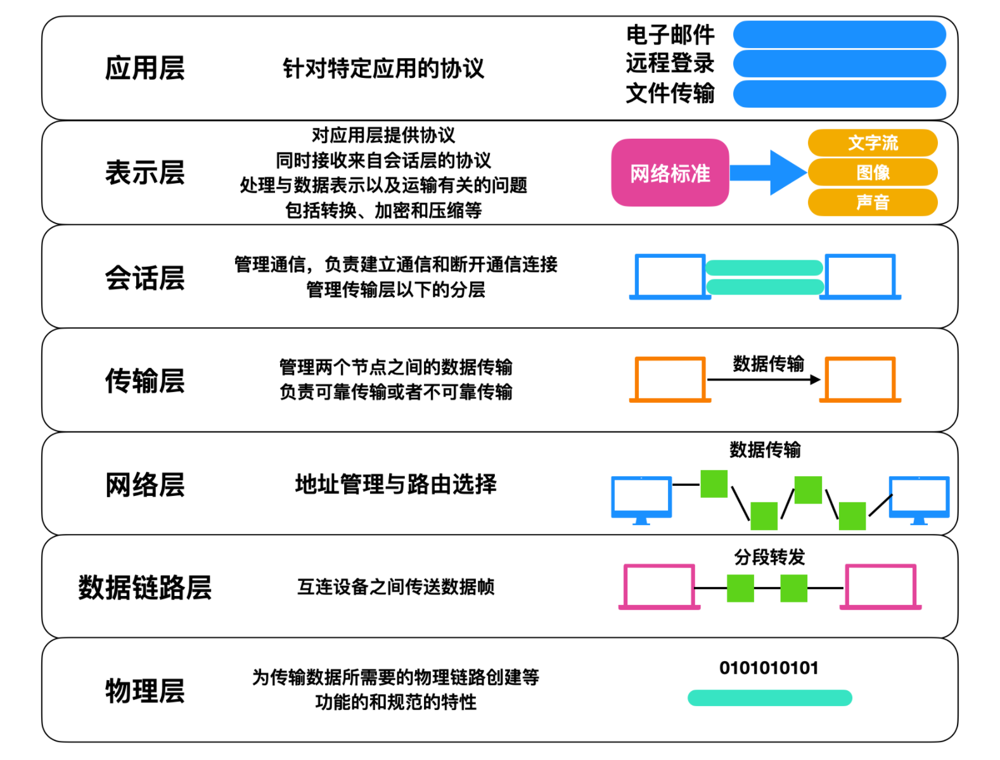
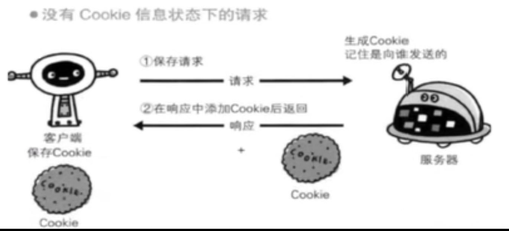

# 网络协议

- https://juejin.cn/post/6857287743966281736#heading-61
- https://juejin.cn/post/6908327746473033741
- https://juejin.cn/post/6844904070889603085
- https://juejin.cn/post/6847902222349500430

## 任务
- http
  - 特点
  - 版本
    - 1.0
    - 1.1
    - 2.0
    - 3.0
  - 报文
  - 状态码
  - HTTPS
- cookie/session
- 缓存机制
  - cookie,session
  - localstorage，sessionstorage
  - indexDB
- 跨域
- 安全
  - XSS
  - CSRF

## tcp的三次握手和四次挥手
### 三次握手

> 都是在不可靠的网络通信中建立可靠的连接


**细节**
1. 客户端发送SYN到服务端, 请求建立连接
2. 如果可以连接, 服务端会发送SYN+ACK包给客户端
3. 客户端收到后发送ACK包建立连接, 服务端收到ACK包后建立连接

**如果是两次握手会存在的问题**



**细节**

1. 第一次发送SYN到服务端,由于网络等问题,没有到达服务端
2. 客户端重发SYN包
3. 服务端接收到SYN包后回复SYN+ACK,直接建立连接
4. 之前未到达的SYN到达服务端,服务端会以为是新的建立请求,但客户端是同一个建立请求.出现了状态不一致

### 四次挥手


**细节**
1. 客户端向服务端发送一个FIN包,表示要关闭连接,自己进入终止等待1状态
2. 服务端向客户端发送一个ACK包,便是服务端进入关闭等待状态, 客户端进入终止等待2状态

中间客户端还可以接收发送请求,客户端还可以发送响应

3. 服务端向客户端发送FIN包,进入最后确认状态
4. 客户端收到后发送ACK包,进入`超时等待`状态,超时后关闭连接. 服务端收到ACK包后立即关闭连接

**客户端为什么要超时等待**
> 保证ACK发送到服务端

- 客户端发送ACK包后立即关闭连接,如果由于网络问题,服务端没收到ACK包,服务端会停留在 LAST-ACK(最后确认状态).
- 客户端回复ACK包后超时等待, 如果服务端在一定时间内未收到ACK包,服务端会重发FIN包给客户端去响应

## OSI网络协议


### TCP/IP协议

- 应用层、表示层、会话层三个层次提供的服务相差不是很大，所以在 TCP/IP 协议中，它们被合并为应用层一个层次。
- 由于数据链路层和物理层的内容很相似，所以在 TCP/IP 协议中它们被归并在网络接口层一个层次里


### TCP

- 传输控制协议，也就是 Transmission Control Protocol，
- TCP 是一种传输层的协议，
- 它是一种`面向连接`的、`可靠`的、基于字节流的传输协议，
- TCP 协议是 TCP/IP 协议簇中的核心协议，
- 它最大的特点就是提供`可靠的数据交付`


### UDP
将数据包发送到服务端
- 优点
  - 性能损耗小
  - 资源占用少
- 缺点
  - 稳定性弱

## HTTP
> 超文本传输协议, HTTP 是一个在计算机世界里专门在两点之间`传输`文字、图片、音频、视频等`超文本数据`的约定和规范

### HTTP特点
- 「`灵活可扩展`」。一个是语法上只规定了基本格式，空格分隔单词，换行分隔字段等。另外一个就是传输形式上不仅可以传输文本，还可以传输图片，视频等任意数据。
- 「`请求-应答模式`」，通常而言，就是一方发送消息，另外一方要接受消息，或者是做出相应等。
- 「`可靠传输`」，HTTP是基于TCP/IP，因此把这一特性继承了下来。
- 「无状态」，这个分场景回答即可。

### HTTP 缺点
- 「`无状态`」，有时候，需要保存信息，比如像购物系统，需要保留下顾客信息等等，另外一方面，有时候，无状态也会减少网络开销，比如类似直播行业这样子等，这个还是分场景来说。
- 「`明文传输`」，即协议里的报文(主要指的是头部)不使用二进制数据，而是文本形式。这让HTTP的报文信息暴露给了外界，给攻击者带来了便利。
- 「`队头阻塞`」，当http开启长连接时，共用一个TCP连接，当某个请求时间过长时，其他的请求只能处于阻塞状态，这就是队头阻塞问题。

### http版本
- http1.0
  - 文字,图片,视频等内容都可以发送
  - 提供http的header,根据header的不同处理不同资源
  - 只使用 header 中的 If-Modified-Since 和 Expires 作为缓存失效的标准。
  - 不支持断点续传
- http1.1
  - 引入了`持久连接`（ persistent connection），即TCP连接默认不关闭，可以被多个请求复用，不用声明Connection: keep-alive。长连接的连接时长可以通过请求头中的 keep-alive 来设置
  - 引入了`管道机制`（ pipelining），即在同一个TCP连接里，客户端可以同时发送多个请求，进一步改进了HTTP协议的效率。
  - HTTP 1.1 中新增加了 `E-tag，If-None-Match` 等缓存控制标头来控制缓存失效。
  - 支持断点续传，通过使用请求头中的 `Range` 来实现。
  - 新增方法：PUT、 PATCH、 OPTIONS、 DELETE。
- http2.0
  - `二进制分帧`  这是一次彻底的二进制协议，头信息和数据体都是二进制，并且统称为"帧"：头信息帧和数据帧。
  - `头部压缩`  HTTP 1.1版本会出现 「User-Agent、Cookie、Accept、Server、Range」 等字段可能会占用几百甚至几千字节，而 Body 却经常只有几十字节，所以导致头部偏重。HTTP 2.0 使用 HPACK 算法进行压缩。
  - `多路复用` 复用TCP连接，在一个连接里，客户端和浏览器都可以同时发送多个请求或回应，且不用按顺序一一对应，这样子解决了队头阻塞的问题。
  - `服务器推送` 允许服务器未经请求，主动向客户端发送资源，即服务器推送。
  - `请求优先级` 可以设置数据帧的优先级，让服务端先处理重要资源，优化用户体验
- http3.0
  - 解决tcp的对头阻塞问题

### http1.x版本问题
- 传输过程中, 内容都是明文
- HTTP/1.1 版本默认允许复用TCP连接，但是在同一个TCP连接里，所有数据通信是按次序进行的，服务器通常在处理完一个回应后，才会继续去处理下一个，这样子就会造成`队头阻塞`。
- http/1.x 版本支持Keep-alive，用此方案来弥补创建多次连接产生的延迟，但是同样会给服务器带来压力，并且的话，对于单文件被不断请求的服务，Keep-alive会极大影响性能，因为它在文件被请求之后还保持了`不必要`的连接很长时间。
- 单个域名有6-8个tcp链接请求限制

### HTTP特点
- 支持客户-服务器模式: 请求-应答
- 简单快速: 协议简单
- 灵活: 支持任意类型的传输
- 无连接: 限制每次连接只处理一个请求,服务器处理完客户端请求后,并收到客户端的应答后断开连接
- 无状态: 对事务处理没有记忆能力,需要前面传输的数据信息需要重传

### 请求报文
#### 请求行

```
请求方法 请求地址 http版本
```

##### 请求方法
- GET： 请求获取Request-URI所标识的资源
- POST：在Request-URI所标识的资源后附加新的数据
- HEAD：请求获取由Request-URI所标识的资源的响应消息报头
- PUT：请求服务器存储一个资源，并用Request-URI作为其标识（修改数据）
- DELETE：请求服务器删除对应所标识的资源
- TRACE：请求服务器回送收到的请求信息，主要用于测试或诊断
- CONNECT：建立连接隧道，用于代理服务器
- OPTIONS：列出可对资源实行的请求方法，用来跨域请求


*options 方法有什么用？*

OPTIONS 请求与 HEAD 类似，一般也是用于客户端查看服务器的性能。
这个方法会请求服务器返回该资源所支持的所有 HTTP 请求方法，该方法会用'*'来代替资源名称，向服务器发送 OPTIONS 请求，可以测试服务器功能是否正常。
JS 的 XMLHttpRequest对象进行 CORS 跨域资源共享时，对于复杂请求，就是使用 OPTIONS 方法发送嗅探请求，以判断是否有对指定资源的访问权限。

#### 请求头部字段
- Cache-Control:
- Host: 服务器的域名
- Referer: 告诉服务器该网页是从哪个页面链接过来的，服务器因此可以获得一些信息用于处理
- max-age: 资源被认为仍然有效的最长时间, 这个请求是相对于 request标头的时间
- Connection: 决定当前事务（一次三次握手和四次挥手）完成后，是否会关闭网络连接
   - 持久性连接，即一次事务完成后不关闭网络连接
```
Connection: keep-alive
```  
    - 非持久性连接，即一次事务完成后关闭网络连接
```
Connection: close
```

- If-Modified-Since
   -  返回200，只有在给定日期的最后一次修改资源后，服务器才会以200状态发送回请求的资源。
   - 如果请求从开始以来没有被修改过，响应会返回304并且没有任何响应体 

- If-None-Match
   - 对于 GET 和 HEAD 方法，仅当服务器没有与给定资源匹配的 ETag 时，服务器才会以200状态发送回请求的资源。
   -  对于其他方法，仅当最终现有资源的ETag与列出的任何值都不匹配时，才会处理请求。

- Accept: 接受请求 HTTP 标头会通告客户端其能够理解的 MIME 类型

### 响应报文

```
起始行
响应头部
空行
响应实体
```

### 起始行
```
http版本 状态码 状态文本
```

### 状态码

***2xx表示请求成功响应***

- 200: 成功响应
- 204: 请求成功处理,但没有资源返回(响应实体)

***3xx需要进行附加操作加以完成***
- 301: 永久重定向, 该状态码表示请求的资源已经重新分配 URI，以后应该使用资源现有的 URI
- 302: 临时性重定向。该状态码表示请求的资源已被分配了新的 URI，希望用户（本次）能使用新的 URI 访问。
- 304: 协商缓存命中

***4xx表示客户端发生错误***
- 401: Unauthorized: 表示发送的请求需要有通过 HTTP 认证的认证信息。
- 403 Forbidden: 表示对请求资源的访问被服务器拒绝。
- 404 Not Found: 表示在服务器上没有找到请求的资源。

***5xx: 服务器发生错误***
- 500 internal sever error: 表示服务器端在执行请求时发生了错误。
- 502 Bad Gateway: 服务器自身是正常的，访问的时候出了问题，
- 503 service unavailable: 服务器暂时处于超负载或正在进行停机维护，现在无法处理请求。
- 504: 网关超时

### 响应头

- Access-Control-Allow-Origin: 指定一个来源，它告诉浏览器允许该来源进行`资源访问`
- Keep-Alive: 
- Transfer-Encoding: chunked: 规定了传输报文主体时采用的编码方式
- Set-Cookie: 

## HTTPS

- HTTP 一般是明文传输，很容易被攻击者窃取重要信息
- HTTPS 的全称为 （Hyper Text Transfer Protocol over SecureSocket Layer），全称有点长，HTTPS 和 HTTP 有很大的不同在于 HTTPS 是以`安全`为目标的 HTTP 通道，
- 在 HTTP 的基础上通过`传输加密和身份认证`保证了传输过程的安全性。HTTPS 在 HTTP 的基础上增加了 SSL 层，也就是说 HTTPS = HTTP + SSL。

## CDN
> Content Delivery Network，即内容分发网络，它应用了 HTTP 协议里的缓存和代理技术，代替源站响应客户端的请求。CDN 是构建在现有网络基础之上的网络，它依靠部署在各地的边缘服务器，通过中心平台的负载均衡、内容分发、调度等功能模块，使用户就近获取所需内容，降低网络拥塞，提高用户访问响应速度和命中率。CDN的关键技术主要有内容存储和分发技术。


## COOKIE和session
- http协议是无状态的协议
- 为了服务端识别特定的客户端
- 每次http请求客户端都会发送响应的cookie信息到服务端
- 大部分应用都是cookie去实现session
  - 第一次创建session的时候,服务端会在响应头告诉客户端在cookie记录一个session
- 禁用cookie,可以使用url重写记录,每次http交互url带上sid记录用户信息



### 隐私
- session: 存储服务器
- cookie: 存储客户端

### 有效期
- cookie: 
- session: 关闭浏览器关闭就关闭

## 正向代理/反向代理

- 正向代理: 走一个中介,代理请求者的网络内部, 访问外部网络
- 反向代理: 请求到服务器, 转发到内部其他服务器

## 缓存

> 浏览器每次发起请求时，先在本地缓存中查找结果以及缓存标识，根据缓存标识来判断是否使用本地缓存。如果缓存有效，则使用本地缓存；否则，则向服务器发起请求并携带缓存标识

### 强缓存
- 第一次请求时，服务器把资源的过期时间通过响应头中的Expires和Cache-Control两个字段告诉浏览器，
- 之后再请求这个资源的话，会判断有没有过期，没有过期就直接拿来用，不向服务器发起请求


#### Expires
> 用来指定资源到期绝对时间，服务器响应时，添加在响应头中。

```
Expires: Wed, 22 Nov 2021 08:41:00 GMT
```

#### Cache-Control

> 指定资源过期时间(秒s)

```
Cache-control:max-age=300
```

#### 区别

| 区别 | Expires| Cache-Control|
| ---- | ---- | ---- |
| http版本 | HTTP1.0 | HTTP1.1 |
| 优先级 | 低 | 高 |

#### Cache-Control请求头
| 字段 | 说明 |
| :---: | :---: |
| max-age=300 | 拒绝接受长于300秒的资源，为0时表示获取最新资源 |
| no-cache | 不使用强缓存，需要与服务器验证缓存是否新鲜 |
| no-store | 不使用强缓存和协商缓存 |
| max-stale=100 | 缓存过期之后的100秒内，依然拿来用 |
| min-fresh=50 | 缓存到期时间还剩余50秒开始，就不给拿了，不新鲜了 |
| only-if-chached | 只使用缓存，没有就报504错误 |

#### Cache-Control响应头
| 字段 | 说明 |
| :---: | :---: |
| max-age=300 | 缓存有效期300秒 |
| s-maxage=500 | 缓存过期之后的100秒内，依然拿来用 |
| public | 可以被任何终端缓存，包括代理服务器、CDN等 |
| private | 只能被用户的浏览器终端缓存(私有缓存) |
| no-cache | 先和服务端确认资源是否发生变化，没有就使用 |
| no-store | 不缓存 |

#### 缺点
- 就是缓存过期之后，不管资源有没有变化，都会重新发起请求，重新获取资源

### 协商缓存

#### Last-Modified/If-Modified-Since
- 第一次请求资源时，服务器除了会返回给浏览器上面说的过期时间，还会在响应头添加 `Last-Modified` 字段，告诉浏览器该资源的最后修改时间

```
last-modified: Fri, 27 Oct 2021 08:35:57 GMT
```
- 然后浏览器再次请求的时候就把这个时间再通过另一个字段`If-Modified-Since`，发送给服务器

```
If-Modified-Since: Fri, 27 Oct 2021 08:35:57 GMT
```
- 服务器比较两个时间
  - 一样的说明没被更新过,返回304,浏览器直接拿过期的资源继续使用
  - 如果不一样,返回200和新的资源

#### ETag/If-None-Match

- 第一次请求资源时，服务器返回`Etag`字段，表示当前资源文件的一个唯一标识。这个标识符由服务器基于文件内容编码生成，能精准感知文件的变化，只要文件内容不同，ETag就会重新生成
```
etag: W/"132489-1627839023000"
```
- 然后浏览器再次请求的时候就把这个文件标识 再通过另一个字段 `If-None-Match`，发送给服务器
```
if-none-match: W/"132489-1627839023000"
```
- 服务器再把这两个字段对比，
  - 如果发现是一样的，就说明文件没有被更新过，就返回状态码304和空响应体给浏览器，浏览器直接拿过期了的资源继续使用；
  - 如果对比不一样说明资源有更新，就返回状态码200和新的资源

#### 区别

| 区别 | Last-Modified/If-Modified-Since| ETag/If-None-Match |
| ---- | ---- | ---- |
| http版本 | HTTP1.0 | HTTP1.1 |
| 比较依据 | 修改时间 | 资源唯一标识 |
| 精度 | 低 | 高 |
| 优先级 | 低 | 高 |
| 性能 | 高 | 低 |

### 强缓存 vs 协商缓存

- 强缓存优先协商缓存
- 强缓存不发请求到服务器
- 协商会发请求到服务器,
- 协商缓存: html
- 强缓存: css,image,js

**策略**
- 频繁修改
  - 走协商缓存
  - 设置cache-control:no-cache
  - 配合ETag/Last-Modified验证资源有效
- 不常修改
  - 走强缓存
  - Cache-control或expires

### options 方法有什么用？

OPTIONS 请求与 HEAD 类似，一般也是用于客户端查看服务器的性能。
这个方法会请求服务器返回该资源所支持的所有 HTTP 请求方法，该方法会用'*'来代替资源名称，向服务器发送 OPTIONS 请求，可以测试服务器功能是否正常。
JS 的 XMLHttpRequest对象进行 CORS 跨域资源共享时，对于复杂请求，就是使用 OPTIONS 方法发送嗅探请求，以判断是否有对指定资源的访问权限。

### 介绍一下HTTPS和HTTP区别
HTTPS 要比 HTTP 多了 secure 安全性这个概念，
实际上， HTTPS 并不是一个新的应用层协议，
它其实就是 HTTP + TLS/SSL 协议组合而成，而安全性的保证正是 SSL/TLS 所做的工作。
「SSL」 安全套接层（Secure Sockets Layer）
「TLS」（传输层安全，Transport Layer Security）
现在主流的版本是 TLS/1.2, 之前的 TLS1.0、TLS1.1 都被认为是不安全的，在不久的将来会被完全淘汰。
「HTTPS 就是身披了一层 SSL 的 HTTP」。

#### 那么区别有哪些呢

- HTTP 是明文传输协议，HTTPS 协议是由 SSL+HTTP 协议构建的可进行加密传输、身份认证的网络协议，比 HTTP 协议安全。
- HTTPS比HTTP更加安全，对搜索引擎更友好，利于SEO,谷歌、百度优先索引HTTPS网页。
- HTTPS标准端口443，HTTP标准端口80。
- HTTPS需要用到SSL证书，而HTTP不用。

#### HTTPS
- 对数据进行加密，并建立一个信息安全通道，来保证传输过程中的数据安全;
- 对网站服务器进行真实身份认证。


