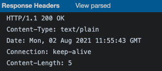
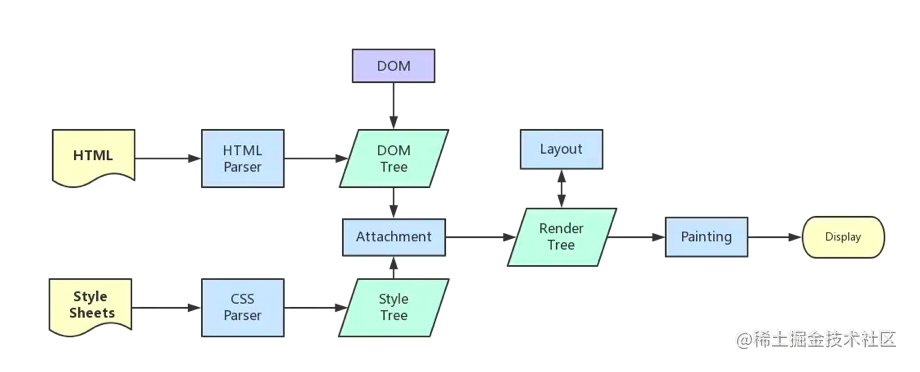
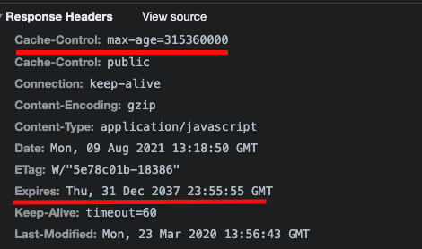

# 浏览器架构

## 浏览器整体架构


- 浏览器进程
  - 负责页面显示,用户交互,子进程管理,提供存储
- 渲染进程
  - 每个tab(每个独立站点)都有单独的渲染进程,用于渲染页面
- 网络进程
  - 处理网络请求
- 插件进程
  - 浏览器插件运行
- GPU进程
  - 3d绘制,提高性能

## 渲染进程


- 每个tab(每个独立站点)都有单独的渲染进程,用于渲染页面

### GUI 渲染线程

- `绘制页面`，解析 HTML、CSS，构建 DOM 树，布局和绘制等
- `页面重绘和回流`
- 与 JS 引擎线程`互斥`，也就是所谓的 JS 执行阻塞页面更新

### JS 引擎线程

- 负责 `JS 脚本代码`的执行
- 负责执行准备好待执行的事件，即定时器计数结束，或异步请求成功并正确返回的事件
- 与 GUI 渲染线程互斥，执行时间过长将阻塞页面的渲染

### 事件触发线程

- 负责将准备好的事件交给 JS 引擎线程执行
- 多个事件加入任务队列的时候需要排队等待(JS 的单线程)

### 定时器触发线程

- 负责执行异步的定时器类的事件，如 setTimeout、setInterval
- 定时器到时间之后把注册的回调加到任务队列的队尾

### HTTP 请求线程

- 负责执行异步请求
- 主线程执行代码遇到异步请求的时候会把函数交给该线程处理，当监听到状态变更事件，如果有回调函数，该线程会把回调函数加入到任务队列的队尾等待执行

## 网络七层模型
  - 物理层
  - 网络层(IP)
  - 传输层
    - TCP: 安全可靠,分包传输
    - UDP: 丢包
  - 应用层(HTTP)

## 从URL输入到页面展现到底发生什么？
### 1. 查找缓存
先去查找缓存, 检测缓存是否过期, 直接返回缓存中内容

### 2. 准备IP地址和端口
- DNS协议 将域名解析成IP地址(DNS基于UDP)
- DNS缓存
  - 浏览器缓存
  - 系统缓存
  - 路由器缓存
  - IPS服务器缓存
  - 根域名服务器缓存
  - 顶级域名服务器缓存
  - 主域名服务器缓存

> CDN(Content Delivery Network)就是利用DNS的重定向技术，DNS服务器会返回一个跟 用户最接近的点的IP地址给用户，CDN节点的服务器负责响应用户的请求，提供所需的内容。

### 3. 等待tcp队列
一个域名同时最多建立6个TCP链接

### 4. 创建tcp连接
- 客户端发送一份SYN包, (表示想建立连接)
- 服务端接收到SYN包后,发送SYN+ACK包,
- 客户端发送ACK, 然后客户端和服务端建立连接

> 第三次握手, 确认服务端也有发送能力(能够发送给客户端, 客户端能接收到)


**为什么不能两次握手就建立连接**


- 防止已失效的请求报文, 突然又传到服务器导致错误
- 如果采用两次握手, 客户端会建立一个连接, 而服务器则认为建立两个连接. 从而导致状态不一致

### 5. 请求HTTPS ssl协商
### 6. 发送http请求


### 7. 服务器收到数据后响应(响应行 响应头 空行 响应体)



- 服务器返回301,302会进行重定向操作
- 服务器304, 去查询浏览器缓存进行返回

### 8. 开始渲染



- 解析HTML, 构建DOM树
  - 下载解析html
  - 遇到没有async和defer的script标签,
    - 会停止构建DOM树(冻结)
    - 加载js文件,执行js代码
    - 执行完成后继续构建dom树
  - 生成dom树
- 解析CSS, 构建样式树
  - 构建DOM树和样式树是并行的
  - 但script执行和样式树构建不能同时,构建样式树会阻塞js执行
- 布局(layout,repaint)
  - 将DOM树和样式树进行布局
  - 负责各元素尺寸、位置的计算
- 渲染到页面中

### 9. 断开tcp


**步骤**

- 客户端发送FIN包给服务器, 表示要关闭连接, 客户端进入FIN wait1阶段
- 服务器接收到FIN包后, 给客户端发送ACK包, 表示服务器进入close wait关闭等待阶段, 客户端接收到ACK包后进入 FIN-wait-2阶段

// 在此期间, 客户端可以继续接收, 服务器可以继续发送未发送数据

- 服务端发送完毕后向客户端发送一个FIN包, 进入最后确认阶段
- 客户端接收到FIN包后, 发送一个ACK包, 进入TIME-WAIT(超时等待状态), 进入超时事件后关闭连接, 服务端接收到ACK包立即关闭连接

**超时等待的原因**
- 保证ACK包到达服务端, 不然如果未到达服务端, 则服务端一直停留在最后确认状态

**tip**
- 默认不会断开, keep-alive为了下次传输数据时,可以复用上次创建的链接
- 在http1.1以下直接关闭TCP连接
- 在http1.1及以上默认保持连接 `keep-alive`

## 重绘和重排
- 重排也叫回流，就是改变一个元素的尺寸位置属性时，会重新进行样式计算，布局、绘制以及后面所有流程
- 重绘比如改变元素的颜色时，就会触发重绘，重绘不会重新触发布局，但还是会触发样式计算和绘制
- 所以重排一定会触发重绘，重绘不一定会触发重排
- 在页面首次加载时，必然会触发重排和重绘


## 缓存

> 浏览器每次发起请求时，先在本地缓存中查找结果以及缓存标识，根据缓存标识来判断是否使用本地缓存。如果缓存有效，则使用本地缓存；否则，则向服务器发起请求并携带缓存标识

### 强缓存
- 第一次请求时，服务器把资源的过期时间通过响应头中的Expires和Cache-Control两个字段告诉浏览器，
- 之后再请求这个资源的话，会判断有没有过期，没有过期就直接拿来用，不向服务器发起请求



#### Expires
> 用来指定资源到期绝对时间，服务器响应时，添加在响应头中。

```
Expires: Wed, 22 Nov 2021 08:41:00 GMT
```

#### Cache-Control

> 指定资源过期时间(秒s)

```
Cache-control:max-age=300
```

#### 区别

| 区别 | Expires| Cache-Control|
| ---- | ---- | ---- |
| http版本 | HTTP1.0 | HTTP1.1 |
| 优先级 | 低 | 高 |

#### Cache-Control请求头
| 字段 | 说明 |
| :---: | :---: |
| max-age=300 | 拒绝接受长于300秒的资源，为0时表示获取最新资源 |
| no-cache | 不使用强缓存，需要与服务器验证缓存是否新鲜 |
| no-store | 不使用强缓存和协商缓存 |
| max-stale=100 | 缓存过期之后的100秒内，依然拿来用 |
| min-fresh=50 | 缓存到期时间还剩余50秒开始，就不给拿了，不新鲜了 |
| only-if-chached | 只使用缓存，没有就报504错误 |

#### Cache-Control响应头
| 字段 | 说明 |
| :---: | :---: |
| max-age=300 | 缓存有效期300秒 |
| s-maxage=500 | 缓存过期之后的100秒内，依然拿来用 |
| public | 可以被任何终端缓存，包括代理服务器、CDN等 |
| private | 只能被用户的浏览器终端缓存(私有缓存) |
| no-cache | 先和服务端确认资源是否发生变化，没有就使用 |
| no-store | 不缓存 |

#### 缺点
- 就是缓存过期之后，不管资源有没有变化，都会重新发起请求，重新获取资源

### 协商缓存

#### Last-Modified/If-Modified-Since
- 第一次请求资源时，服务器除了会返回给浏览器上面说的过期时间，还会在响应头添加 `Last-Modified` 字段，告诉浏览器该资源的最后修改时间

```
last-modified: Fri, 27 Oct 2021 08:35:57 GMT
```
- 然后浏览器再次请求的时候就把这个时间再通过另一个字段`If-Modified-Since`，发送给服务器

```
If-Modified-Since: Fri, 27 Oct 2021 08:35:57 GMT
```
- 服务器比较两个时间
  - 一样的说明没被更新过,返回304,浏览器直接拿过期的资源继续使用
  - 如果不一样,返回200和新的资源

#### ETag/If-None-Match

- 第一次请求资源时，服务器返回`Etag`字段，表示当前资源文件的一个唯一标识。这个标识符由服务器基于文件内容编码生成，能精准感知文件的变化，只要文件内容不同，ETag就会重新生成
```
etag: W/"132489-1627839023000"
```
- 然后浏览器再次请求的时候就把这个文件标识 再通过另一个字段 `If-None-Match`，发送给服务器
```
if-none-match: W/"132489-1627839023000"
```
- 服务器再把这两个字段对比，
  - 如果发现是一样的，就说明文件没有被更新过，就返回状态码304和空响应体给浏览器，浏览器直接拿过期了的资源继续使用；
  - 如果对比不一样说明资源有更新，就返回状态码200和新的资源

#### 区别

| 区别 | Last-Modified/If-Modified-Since| ETag/If-None-Match |
| ---- | ---- | ---- |
| http版本 | HTTP1.0 | HTTP1.1 |
| 比较依据 | 修改时间 | 资源唯一标识 |
| 精度 | 低 | 高 |
| 优先级 | 低 | 高 |
| 性能 | 高 | 低 |

### 强缓存 vs 协商缓存

- 强缓存优先协商缓存
- 强缓存不发请求到服务器
- 协商会发请求到服务器,
- 协商缓存: html
- 强缓存: css,image,js

**策略**
- 频繁修改
  - 走协商缓存
  - 设置cache-control:no-cache
  - 配合ETag/Last-Modified验证资源有效
- 不常修改
  - 走强缓存
  - Cache-control或expires

### 单线程

## cookie/session

- http协议是无状态的协议
- 为了服务端识别特定的客户端
- 每次http请求客户端都会发送响应的cookie信息到服务端
- 大部分应用都是cookie去实现session
  - 第一次创建session的时候,服务端会在响应头告诉客户端在cookie记录一个session
- 禁用cookie,可以使用url重写记录,每次http交互url带上sid记录用户信息
- 补充http协议是无状态的, 可以判断多个请求是否是同一个用户发起

### 特点
- 有安全问题
- 每个域名下的cookie不能超过20个,大小不能超过4k
- 每次请求都会在请求头带上
- 跨域名不能共享cookie

### cookie字段
- name:字段名
- size: 大小
- value: 保存用户登录状态
- Path：可以访问此 Cookie 的路径。比如 juejin.cn/editor ，path是/editor，只有/editor这个路径下的才可以读取 Cookie
- httpOnly：表示禁止通过 JS 访问 Cookie，减少 XSS 攻击。
- Secure：只能在 https 请求中携带
- SameSite：规定浏览器不能在跨域请求中携带 Cookie 减少 CSRF 攻击
- Domain：域名，跨域或者 Cookie 的白名单，允许一个子域获取或操作父域的 Cookie，实现单点登录的话会非常有用
- Expires/Max-size：指定时间或秒数的过期时间，没设置的话就和 Session 一样关闭浏览器就失效

### LocaStorage/SessionStorage

- 共同点
  - 存储体积5M
  - 同源策略限制,只有同源才可以访问
  - api
    - getItem
    - setItem
    - removeItem
    - clear
    - key
- 不同点
  - LocalStorage: 永久存储,除非主动清楚
  - SessionStorage: 用于临时保存同一窗口或标签页的数据，刷新页面时不会删除，但是关闭窗口或标签页之后就会删除这些数据
  - SessionStorage更加严格，只有在同一浏览器的同一窗口下才能共享

### indexDB
- 键值对储存：内部用对象仓库存放数据，所有类型的数据都可以直接存入，包括js对象，以键值对的形式保存，每条数据都有对应的主键，主键是唯一的
- 异步：indexDB操作时用户依然可能进行其他操作，异步设计是为了防止大量数据的读写，拖慢网页的表现
- 支持事务：比如说修改整个表的数据，修改了一半的时候报了个错，这时候会全部恢复到没修改之关的状态，不存在修改一半成功的情况
- 同源限制：每一个数据库应创建它对应的域名，网页只能访问自身域名下的数据库
- 存储空间大：一般来说不少于250MB，甚至没有上限
- 支持二进制存储：比如ArrayBuffer对象和Blob对象

## 浏览器渲染
### 回流(重排)
- 回流触发的条件就是:对 DOM 结构的修改引发 DOM `几何尺寸变化`的时候,会发生回流过程。

***触发回流***
- 一个 DOM 元素的`几何属性`变化，常见的几何属性有width、height、padding、margin、left、top、border 等等, 这个很好理解。
- 使 DOM 节点发生`增减或者移动`。
- 读写 `offset族、scroll族和client`族属性的时候，浏览器为了获取这些值，需要进行回流操作。
- 调用 `window.getComputedStyle` 方法。

一些常用且会导致回流的属性和方法：

clientWidth、clientHeight、clientTop、clientLeft
offsetWidth、offsetHeight、offsetTop、offsetLeft
scrollWidth、scrollHeight、scrollTop、scrollLeft
scrollIntoView()、scrollIntoViewIfNeeded()
getComputedStyle()
getBoundingClientRect()
scrollTo()

### 重绘
- 当页面中元素样式的改变并不影响它在文档流中的位置时（例如：color、background-color、visibility等），浏览器会将新样式赋予给元素并重新绘制它，这个过程称为重绘。

### 合成
- 更改了一个既不要布局也不要绘制的属性，那么渲染引擎会跳过布局和绘制，直接执行后续的合成操作，这个过程就叫合成。
- 举个例子：比如使用CSS的transform来实现动画效果，避免了回流跟重绘，直接在非主线程中执行合成动画操作。显然这样子的效率更高，毕竟这个是在非主线程上合成的，没有占用主线程资源，另外也避开了布局和绘制两个子阶段，所以相对于重绘和重排，合成能大大提升绘制效率。

## 事件机制


### 阶段

- 事件捕获阶段
- 处于目标阶段
- 事件冒泡阶段

### demo

> app2 -> app1

```html
<div id="app1">
  <div id="app2">1111</div>
</div>
<script>
  app1.onclick = () => {
    alert('app1')
  }
  app2.onclick = () => {
    alert('app2')
  }
</script>
```

### 捕获/冒泡

**addEventListener第三个参数为true是捕获阶段，false为冒泡阶段(默认值为false)**

```html
<div id="app1">
  <div id="app2">1111</div>
</div>
<script>
  // app1 capture 捕获
  // app2 capture 捕获
  // app2 bubbling 冒泡
  // app1 bubbling 冒泡
  app1.addEventListener('click', () => {
    console.log('app1 capture 捕获')
  }, true)
  app2.addEventListener('click', () => {
    console.log('app2 capture 捕获')
  }, true)
  app1.addEventListener('click', () => {
    console.log('app1 bubbling 冒泡')
  }, false)
  app2.addEventListener('click', () => {
    console.log('app2 bubbling 冒泡')
  }, false)
</script>
```

### 事件流阻止

#### preventDefault

> 取消事件对象的默认动作以及继续传播。

#### 阻止冒泡

```html
<div id="app1">
  <div id="app2">1111</div>
</div>
<script>
  // app1 capture 捕获
  // app2 capture 捕获
  // app2 bubbling 冒泡
  app1.addEventListener('click', () => {
    console.log('app1 capture 捕获')
  }, true)
  app2.addEventListener('click', (e) => {
    console.log('app2 capture 捕获')
  }, true)
  app1.addEventListener('click', () => {
    console.log('app1 bubbling 冒泡')
  }, false)
  app2.addEventListener('click', (e) => {
    e.stopPropagation();
    console.log('app2 bubbling 冒泡')
  }, false)
</script>
```

**兼容写法**

```js
// app2 bubbling 冒泡
app1.addEventListener('click', () => {
  console.log('app1 bubbling 冒泡')
}, false)
app2.addEventListener('click', (e) => {
  if (e.stopPropagation) {
    e.stopPropagation()
  } else {
    e.preventDefault = true
  }
  console.log('app2 bubbling 冒泡')
}, false)
```


### stopImmediatePropagation

```js
// app2 bubbling 冒泡
// 我又监听了一次冒泡
app2.addEventListener('click', (e) => {
  e.stopPropagation()
  console.log('app2 bubbling 冒泡')
}, false)
app2.addEventListener('click', (e) => {
  console.log('我又监听了一次冒泡')
}, false)
```

> 这种先注册的调用stopImmediatePropagation后续不会执行

```js
// app2 bubbling 冒泡
app2.addEventListener('click', (e) => {
  e.stopImmediatePropagation()
  console.log('app2 bubbling 冒泡')
}, false)
app2.addEventListener('click', (e) => {
  console.log('我又监听了一次冒泡')
}, false)
```

> 但在后面注册函数调用stopImmediatePropagation前面的还是会执行

```js
// 我又监听了一次冒泡
// app2 bubbling 冒泡
app2.addEventListener('click', (e) => {
  console.log('我又监听了一次冒泡')
}, false)
app2.addEventListener('click', (e) => {
  e.stopImmediatePropagation()
  console.log('app2 bubbling 冒泡')
}, false)
```

### 事件委托

> 利用事件的冒泡原理，通过event找到触发事件的源dom

```html
<ul id="app2">
  <li>1</li>
  <li>2</li>
  <li>3</li>
  <li>4</li>
</ul>
<script>
  window.onload = () => {
    app2.addEventListener('click', (e) => {
      const { target } = e
      if (target.nodeName === 'LI') {
        console.log(target.innerHTML)
      }
    })
  }
</script>
```


