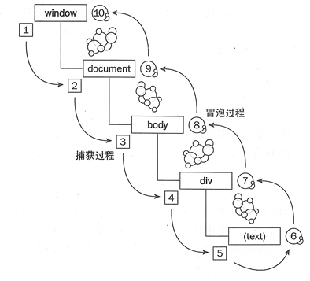

# 浏览器架构

- https://juejin.cn/post/6916157109906341902/
- https://juejin.cn/post/6847902222349500430

## 进程与线程
- 进程是操作系统资源分配的基本单位,进程包含线程
- 线程是有进程所管理的,为了提高浏览器的稳定性和安全性,浏览器采用多进程的模型

## 浏览器多进程
- 浏览器进程
  - 负责页面显示,用户交互,子进程管理,提供存储
- 渲染进程
  - 每个页卡都有单独的渲染进程,用于渲染页面
- 网络进程
  - 处理网络资源加载(html,css,js)
- 插件进程
  - chrome安装的插件
- GPU进程
  - 3d绘制,提高性能


## 浏览器渲染


## 事件机制



### 阶段

- 事件捕获阶段
- 处于目标阶段
- 事件冒泡阶段

### demo

> app2 -> app1

```html
<div id="app1">
  <div id="app2">1111</div>
</div>
<script>
  app1.onclick = () => {
    alert('app1')
  }
  app2.onclick = () => {
    alert('app2')
  }
</script>
```

### 捕获/冒泡

**addEventListener第三个参数为true是捕获阶段，false为冒泡阶段(默认值为false)**

```html
<div id="app1">
  <div id="app2">1111</div>
</div>
<script>
  // app1 capture 捕获
  // app2 capture 捕获
  // app2 bubbling 冒泡
  // app1 bubbling 冒泡
  app1.addEventListener('click', () => {
    console.log('app1 capture 捕获')
  }, true)
  app2.addEventListener('click', () => {
    console.log('app2 capture 捕获')
  }, true)
  app1.addEventListener('click', () => {
    console.log('app1 bubbling 冒泡')
  }, false)
  app2.addEventListener('click', () => {
    console.log('app2 bubbling 冒泡')
  }, false)
</script>
```

### 事件流阻止

#### preventDefault

> 取消事件对象的默认动作以及继续传播。

#### 阻止冒泡

```html
<div id="app1">
  <div id="app2">1111</div>
</div>
<script>
  // app1 capture 捕获
  // app2 capture 捕获
  // app2 bubbling 冒泡
  app1.addEventListener('click', () => {
    console.log('app1 capture 捕获')
  }, true)
  app2.addEventListener('click', (e) => {
    console.log('app2 capture 捕获')
  }, true)
  app1.addEventListener('click', () => {
    console.log('app1 bubbling 冒泡')
  }, false)
  app2.addEventListener('click', (e) => {
    e.stopPropagation();
    console.log('app2 bubbling 冒泡')
  }, false)
</script>
```

**兼容写法**

```js
// app2 bubbling 冒泡
app1.addEventListener('click', () => {
  console.log('app1 bubbling 冒泡')
}, false)
app2.addEventListener('click', (e) => {
  if (e.stopPropagation) {
    e.stopPropagation()
  } else {
    e.preventDefault = true
  }
  console.log('app2 bubbling 冒泡')
}, false)
```


### stopImmediatePropagation

```js
// app2 bubbling 冒泡
// 我又监听了一次冒泡
app2.addEventListener('click', (e) => {
  e.stopPropagation()
  console.log('app2 bubbling 冒泡')
}, false)
app2.addEventListener('click', (e) => {
  console.log('我又监听了一次冒泡')
}, false)
```

> 这种先注册的调用stopImmediatePropagation后续不会执行

```js
// app2 bubbling 冒泡
app2.addEventListener('click', (e) => {
  e.stopImmediatePropagation()
  console.log('app2 bubbling 冒泡')
}, false)
app2.addEventListener('click', (e) => {
  console.log('我又监听了一次冒泡')
}, false)
```

> 但在后面注册函数调用stopImmediatePropagation前面的还是会执行

```js
// 我又监听了一次冒泡
// app2 bubbling 冒泡
app2.addEventListener('click', (e) => {
  console.log('我又监听了一次冒泡')
}, false)
app2.addEventListener('click', (e) => {
  e.stopImmediatePropagation()
  console.log('app2 bubbling 冒泡')
}, false)
```

### 事件委托

> 利用事件的冒泡原理，通过event找到触发事件的源dom

```html
<ul id="app2">
  <li>1</li>
  <li>2</li>
  <li>3</li>
  <li>4</li>
</ul>
<script>
  window.onload = () => {
    app2.addEventListener('click', (e) => {
      const { target } = e
      if (target.nodeName === 'LI') {
        console.log(target.innerHTML)
      }
    })
  }
</script>
```


