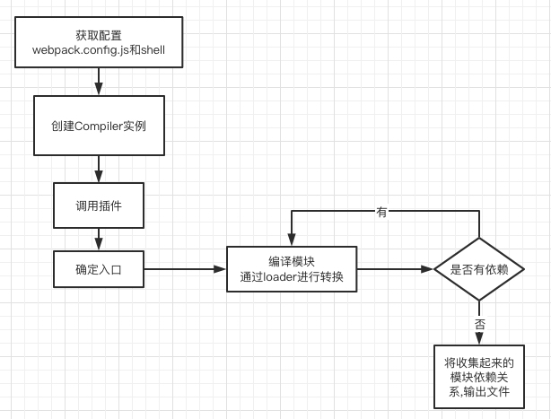

# 手写webpack

> 代码仓库

<a href="https://github.com/xuxiaozhou/blog/tree/master/code/frame/react/my-react">https://github.com/xuxiaozhou/blog/tree/master/code/frame/react/my-react</a>

### 分析一下打包后的文件
> webpack4

```js
// index.js
const { sum } = require('./sum')
sum(1, 2)

// sum.js
const sum = (a, b) => {
    return a + b
}
exports.sum = sum
```

**核心就实现__webpack_require__**

```js
(function (modules) { // webpackBootstrap
  // The module cache
  // 已经安装的模块
  var installedModules = {};

  // The require function
  // 自己 实现 require 函数
  function __webpack_require__(moduleId) {
    // Check if module is in cache
    // 先从缓存中找
    if (installedModules[moduleId]) {
      return installedModules[moduleId].exports;
    }
    // 创建新模块
    // Create a new module (and put it into the cache)
    var module = installedModules[moduleId] = {
      i: moduleId,
      l: false,
      // 核心是exports
      exports: {}
    };

    // Execute the module function
    // 执行模块的函数
    modules[moduleId].call(module.exports, module, module.exports, __webpack_require__);

    // Flag the module as loaded
    module.l = true;

    // Return the exports of the module
    return module.exports;
  }

  // expose the modules object (__webpack_modules__)
  __webpack_require__.m = modules;

  // expose the module cache
  __webpack_require__.c = installedModules;

  // define getter function for harmony exports
  __webpack_require__.d = function (exports, name, getter) {
    if (!__webpack_require__.o(exports, name)) {
      Object.defineProperty(exports, name, { enumerable: true, get: getter });
    }
  };

  // define __esModule on exports
  __webpack_require__.r = function (exports) {
    if (typeof Symbol !== 'undefined' && Symbol.toStringTag) {
      Object.defineProperty(exports, Symbol.toStringTag, { value: 'Module' });
    }
    Object.defineProperty(exports, '__esModule', { value: true });
  };

  // create a fake namespace object
  __webpack_require__.t = function (value, mode) {
    if (mode & 1) value = __webpack_require__(value);
    if (mode & 8) return value;
    if ((mode & 4) && typeof value === 'object' && value && value.__esModule) return value;
    var ns = Object.create(null);
    __webpack_require__.r(ns);
    Object.defineProperty(ns, 'default', { enumerable: true, value: value });
    if (mode & 2 && typeof value != 'string') for (var key in value) __webpack_require__.d(ns, key, function (key) { return value[key]; }.bind(null, key));
    return ns;
  };

  // getDefaultExport function for compatibility with non-harmony modules
  __webpack_require__.n = function (module) {
    var getter = module && module.__esModule ?
      function getDefault() { return module['default']; } :
      function getModuleExports() { return module; };
    __webpack_require__.d(getter, 'a', getter);
    return getter;
  };

  // Object.prototype.hasOwnProperty.call
  __webpack_require__.o = function (object, property) { return Object.prototype.hasOwnProperty.call(object, property); };

  // __webpack_public_path__
  __webpack_require__.p = "";

  // Load entry module and return exports
  // 执行入口文件
  return __webpack_require__(__webpack_require__.s = "./src/index.js");
})
  ({
    // 模块map
    "./src/index.js": (function (module, exports, __webpack_require__) {
      const { sum } = __webpack_require__(/*! ./sum */ "./src/sum.js")
      sum(1, 2)
    }),
    "./src/sum.js": (function (module, exports) {
      const sum = (a, b) => {
        return a + b
      }
      exports.sum = sum
    })
  });
```

## 前期准备工作

> npm link

### package.json

```json
{
  "bin": {
    "my-pack": "./bin/index.js"
  },
  "dependencies": {
    "@babel/generator": "^7.18.9",
    "@babel/traverse": "^7.18.9",
    "@babel/types": "^7.18.9",
    "babylon": "^6.18.0"
  }
}
```

## 正式流程

### 文件
- Compiler.js: 编译
- hook.js: 钩子
- index.js: 主入口文件
- parser.js: 解析js
- template.js: 生成文件的模板
- utils.js: 工具函数

### 入口文件index.js

```js
// index.js
#! /usr/bin/env node
const path = require('path')
const Compiler = require('./Compiler')

// 获取webpack.config.js
const config = require(path.resolve('webpack.config.js'))

// 编译
const compiler = new Compiler(config)

compiler.hooks.entryOption.call()

// 编译且生成文件
compiler.run()
```

### Compiler

```js
const path = require('path')
const fs = require('fs')
const { SyncHook } = require('./hook')
const { parser } = require('./parser')
const generateTemplate = require('./template')
const { getFileContent } = require('./utils')

class Compiler {
    constructor (config) {
        // 初始化
        this.config = config
        // 所有的模块
        this.modules = {}
        // 入口文件
        this.entry = config.entry
        // 入口文件路径
        this.entryId = null
        // 项目路径
        this.root = process.cwd()

        // 注册钩子
        this.hooks = {
            entryOption: new SyncHook(),
            compile: new SyncHook(),
            afterCompile: new SyncHook(),
            afterPlugins: new SyncHook(),
            run: new SyncHook(),
            emit: new SyncHook(),
            done: new SyncHook(),
        }

        // 执行插件
        const { plugins } = config
        plugins?.forEach(plugin => {
            plugin.apply(this)
        })

        this.hooks.afterPlugins.call()
    }

    // 使用loader转换内容
    loaderSource(modulePath, source) {
        const { rules = [] } = this.config.modules ?? {}
        const rule = rules.find(_rule => _rule.test.test(modulePath))

        if (!rule) {
            return source
        }

        const { use = [] } = rule
        return use.reduceRight((prevResult, loaderPath) => {
            const loader = require(loaderPath)
            return loader(prevResult)
        }, source)
    }

    // 构建模块
    buildModule(modulePath, isEntry) {
        // 获取文件内容 
        let source = getFileContent(modulePath, this.root)
        // 使用loader进行转换
        source = this.loaderSource(modulePath, source)

        const moduleName = './' + path.relative(this.root, modulePath)

        // 返回 处理require的代码文件内容 和 依赖项
        const { sourceCode, dependencises } = parser(source, path.dirname(moduleName))

        // 记录入口和模块
        if (isEntry) {
            this.entryId = modulePath
        }
        this.modules[moduleName] = sourceCode

        // 递归构建依赖
        dependencises.forEach(dependencise => {
            this.buildModule(
                path.resolve(this.root, dependencise)
            )
        })
    }

    // 生成文件
    emitFile() {
        const { path: outputBasePath, filename } = this.config.output
        const outputPath = path.join(outputBasePath, filename)

        // 生成文件
        const code = generateTemplate(
            this.entryId,
            this.modules
        )

        this.assets = {}
        this.assets[outputPath] = code
        this.hooks.emit.call()

        // 写入文件
        Object.keys(this.assets).forEach(url => {
            fs.writeFileSync(url, this.assets[url])
        })
    }

    // 启动编译
    run() {
        this.hooks.run.call()
        this.hooks.compile.call()

        // 从入口文件构建模块
        this.buildModule(this.entry, true)

        this.hooks.afterCompile.call()

        // 生成文件
        this.emitFile()
        this.hooks.done.call()
    }
}

module.exports = Compiler
```

### 钩子 hook.js
```js
// 同步钩子
class SyncHook {
    constructor () {
        this.tasks = []
    }

    // 注册钩子
    tap(name, task) {
        this.tasks.push(task)
    }

    call(...args) {
        this.tasks.forEach(task => {
            task(...args)
        })
    }
}

exports.SyncHook = SyncHook
```

### parser.js 
> 转换require, 并且收集依赖

```js
const path = require('path')
const babylon = require('babylon')
const types = require('@babel/types')
const generator = require('@babel/generator').default
const traverse = require('@babel/traverse').default

const parser = (source, parentPath) => {
    // 依赖
    const dependencises = []
    // 转换
    const ast = babylon.parse(source, { sourceType: 'module' })
    traverse(ast, {
        CallExpression(p) {
            // 改写require
            const { node } = p
            if (node.callee.name === 'require') {
                // console.log(node)
                // 把 require 改成 __webpack_require__
                node.callee.name = '__webpack_require__'

                // 获取文件名, 此处是路径是相对于当前文件的路径
                let moduleName = node.arguments[0].value
                // 补全后缀
                moduleName = moduleName + (path.extname(moduleName) ? '' : '.js')
                // 补全前缀
                moduleName = './' + path.join(parentPath, moduleName)

                // 收集依赖
                dependencises.push(moduleName)

                node.arguments = [types.stringLiteral(moduleName)]
            }
        }
    })

    const sourceCode = generator(ast).code

    return {
        sourceCode,
        dependencises
    }
}

exports.parser = parser
```

### 生成文件的模板 template.js

> 生成文件

```js
/**
 * 生成文件
 * @param {*} entryId 入口文件路径, 在modules里面的key
 * @param {*} modules 模块map
 * @returns 
 */
const generateTemplate = (entryId, modules) => {
  const modulesText = Object.entries(modules).reduce((text, [key, module]) => {
    return `${text}${text ? ',' : ''} "${key}": (function (module, exports, __webpack_require__) {
      ${module}
    })`
  }, '')

  return `
(function (modules) { // webpackBootstrap
  // The module cache
  // 已经安装的模块
  var installedModules = {};

  // The require function
  // 自己 实现 require 函数
  function __webpack_require__(moduleId) {
    // Check if module is in cache
    // 先从缓存中找
    if (installedModules[moduleId]) {
      return installedModules[moduleId].exports;
    }
    // 创建新模块
    // Create a new module (and put it into the cache)
    var module = installedModules[moduleId] = {
      i: moduleId,
      l: false,
      // 核心是exports
      exports: {}
    };

    // Execute the module function
    // 执行模块的函数
    modules[moduleId].call(module.exports, module, module.exports, __webpack_require__);

    // Flag the module as loaded
    module.l = true;

    // Return the exports of the module
    return module.exports;
  }

  // expose the modules object (__webpack_modules__)
  __webpack_require__.m = modules;

  // expose the module cache
  __webpack_require__.c = installedModules;

  // define getter function for harmony exports
  __webpack_require__.d = function (exports, name, getter) {
    if (!__webpack_require__.o(exports, name)) {
      Object.defineProperty(exports, name, { enumerable: true, get: getter });
    }
  };

  // define __esModule on exports
  __webpack_require__.r = function (exports) {
    if (typeof Symbol !== 'undefined' && Symbol.toStringTag) {
      Object.defineProperty(exports, Symbol.toStringTag, { value: 'Module' });
    }
    Object.defineProperty(exports, '__esModule', { value: true });
  };

  // create a fake namespace object
  __webpack_require__.t = function (value, mode) {
    if (mode & 1) value = __webpack_require__(value);
    if (mode & 8) return value;
    if ((mode & 4) && typeof value === 'object' && value && value.__esModule) return value;
    var ns = Object.create(null);
    __webpack_require__.r(ns);
    Object.defineProperty(ns, 'default', { enumerable: true, value: value });
    if (mode & 2 && typeof value != 'string') for (var key in value) __webpack_require__.d(ns, key, function (key) { return value[key]; }.bind(null, key));
    return ns;
  };

  // getDefaultExport function for compatibility with non-harmony modules
  __webpack_require__.n = function (module) {
    var getter = module && module.__esModule ?
      function getDefault() { return module['default']; } :
      function getModuleExports() { return module; };
    __webpack_require__.d(getter, 'a', getter);
    return getter;
  };

  // Object.prototype.hasOwnProperty.call
  __webpack_require__.o = function (object, property) { return Object.prototype.hasOwnProperty.call(object, property); };

  // __webpack_public_path__
  __webpack_require__.p = "";

  // Load entry module and return exports
  // 执行入口文件
  return __webpack_require__(__webpack_require__.s = "${entryId}");
})({${modulesText}})
`
}

module.exports = generateTemplate
```

### utils
```js
const path = require('path')
const fs = require('fs')

const getFileContent = (modulePath, root) => {
    return fs.readFileSync(
        path.resolve(root, modulePath),
        { encoding: 'utf-8' }
    )
}

exports.getFileContent = getFileContent
```

## webpack执行流程



### 构建流程
- 初始化参数：解析webpack配置参数，合并`shell`传入和`webpack.config.js`文件配置的参数,形成最后的配置结果；
- 开始编译：上一步得到的参数初始化`compiler`对象，注册所有配置的`插件`，插件监听webpack构建生命周期的事件节点，做出相应的反应，执行对象的`run`方法开始执行编译；
- 确定入口：从配置的`entry`入口，开始解析文件构建AST语法树，找出`依赖`，递归下去；
- 编译模块：递归中根据`文件类型和loader`配置，调用所有配置的loader对文件进行转换，再找出该模块依赖的模块，再递归本步骤直到所有入口依赖的文件都经过了本步骤的处理；
- 完成模块编译并输出：递归完事后，得到每个文件结果，包含每个模块以及他们之间的依赖关系，根据entry或分包配置`生成代码块`chunk;
- 输出完成：输出所有的chunk到文件系统；

## 模块打包本质

> 为每个模块创造一个可以导出和引入的环境


## 自定义loader

### less-loader

```js
const less = require('less')
function loader(source) {
  let css = ''
  less.render(source,(err,c)=>{
    css = c.css
  })

  return css
}

module.exports = loader
```

### css-loader
```js
module.exports = (source) => {
    return JSON.stringify(source)
}
```

### style-loader

```js
module.exports = (source) => {
    return `
        const style = document.createElement('style');
        style.innerHTML = '${source.replace(/\"/g, '').replace(/\n/g, '')}';
        document.head.appendChild(style);
    `
}
```

## 自定义plugins

> 类似webpack-html-plugin的功能

```js
class MyHtmlPlugin {
    apply(compiler) {
        const outputName = compiler.options.output.filename
        compiler.hooks.emit.tap('MyHtmlPlugin', (compilation) => {
            compilation.assets['index.html'] = {
                source() {
                    return `
<!DOCTYPE html>
<html lang="en">
<head>
    <meta charset="UTF-8">
    <meta http-equiv="X-UA-Compatible" content="IE=edge">
    <meta name="viewport" content="width=device-width, initial-scale=1.0">
    <title>Document</title>
</head>
<body>
    <div id="root"></div>
    <script src="./${outputName}"></script>  
</body>
</html>`
}
            }
        })
    }
}

module.exports = MyHtmlPlugin
```
