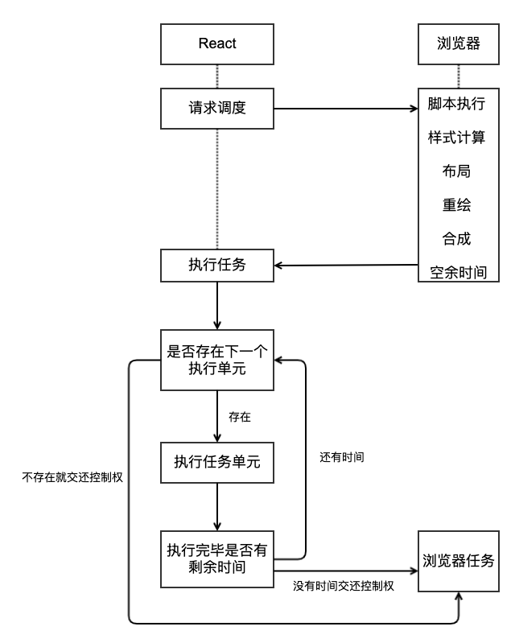
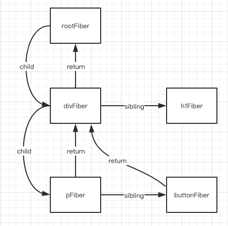

# fiber

## 概念
### 目的
> 为了提高 React 渲染页面的效率，减少页面卡顿，提升用户体验。

### 在 Fiber 出现之前 React 存在什么问题
> 核心就是递归比对的过程长期占用主线程产生了性能问题。

- 在 Virtual DOM 比对的过程中 React 使用了递归，递归调用的过程不能被终止，
- 如果 Virtual DOM 的层级比较深，递归比对的过程就会长期占用主线程，
- 而 JavaScript 又是单线程，不能同时执行多个任务，其他任务只能等待执行，而且 JavaScript 的执行和 UI 的渲染又是互斥的，
- 此时用户要么看到的就是空白界面，要么就是有界面但是不能响应用户操作，处于卡顿状态，用户体验差。

### Fiber 如何解决性能问题

- 在 Fiber 架构中 React 放弃了递归调用，采用循环来模拟递归，因为循环可以随时被中断。
- React 利用`浏览器空闲时间`执行比对任务， 解决了 React 执行比对任务长期占用主线程的问题。
- React 在执行完一个任务单元后，查看是否有其他的`高优先级任务`，如果有，放弃占用主线程，先执行优先级高的任务。

### 什么是 Fiber
- Fiber 是一个执行单元
  - 在 React 15 中，将 VirtualDOM 树整体看成一个任务进行递归处理，任务整体庞大执行耗时且不能中断。
  - 在 React 16 中，将整个任务拆分成了一个一个小的任务进行处理，每一个小的任务指的就是一个 Fiber 节点的构建。
  - 任务会在浏览器的空闲时间被执行，每个单元执行完成后，React 都会检查是否还有空余时间，如果有就交还主线程的控制权。




- Fiber 是一种数据结构
  - Fiber 是一种数据结构，支撑 Fiber 构建任务的运转。 
  - React 通过链表结构找到下一个要执行的任务单元。
  - 要构建链表结构，需要知道每一个节点的父级节点是谁，要知道他的子级节点是谁，要知道他的下一个兄弟节点是谁。
  - Fiber 其实就是 JavaScript 对象，在这个对象中有 child 属性表示节点的子节点，有 sibling 属性表示节点的下一个兄弟节点，有 return 属性表示节点的父级节点。

```ts
type Fiber = {
  // 组件类型 div、span、组件构造函数
  type: any,
  // DOM 对象, 函数组件, 类组件实例
  stateNode: any,  
  // 指向自己的父级 Fiber 对象
  return: Fiber | null,
  // 指向自己的第一个子级 Fiber 对象
  child: Fiber | null,
  // 指向自己的下一个兄弟 iber 对象
  sibling: Fiber | null,
};
```



### Fiber 的工作方式

- fiber 的工作分为两个阶段：render 阶段和 commit 阶段。
  - render 阶段：构建 Fiber 对象，构建链表，在链表中标记要执行的 DOM 操作 ，可中断。
    - 先从上向下走，构建节点对应的 Fiber 对象，然后再从下向上走，构建 Fiber 对象及链表。
  - commit 阶段：根据构建好的链表进行 DOM 操作，不可中断。

## 架构

- Scheduler（调度器）—— 调度任务的优先级，高优任务优先进入Reconciler
- Reconciler（协调器）—— 负责找出变化的组件
- Renderer（渲染器）—— 负责将变化的组件渲染到页面上

## requestIdleCallback

> 利用浏览器的空余时间执行任务，如果有更高优先级的任务要执行时，当前执行的任务可以被终止，优先执行高级别任务。

> 页面是一帧一帧绘制出来的，当每秒绘制的帧数达到 60 时，页面是流畅的，小于这个值时， 用户会感觉到卡顿

> 1s 60帧，每一帧分到的时间是 1000/60 ≈ 16 ms，如果每一帧执行的时间小于16ms，就说明浏览器有空余时间

如果任务在剩余的时间内没有完成则会停止任务执行，继续优先执行主任务，也就是说 requestIdleCallback 总是利用浏览器的空余时间执行任务

```js
function calc(idleDeadline) {
  // 当剩余时间大于1时才执行
  while (count > 0 && idleDeadline.timeRemaining() > 1) {
    console.log(11)
    value = Math.random() < 0.4 ? Math.random() : Math.random()
    count--
  }
  // 再次去申请浏览器空余时间执行
  requestIdleCallback(calc)
}

btn1.onclick = () => {
  // 申请浏览器空余时间执行calc计算方法
  requestIdleCallback(calc)
}
```

## 问题

> 对更新 VirtualDOM 递归无法中断，执行重任务耗时长。 JavaScript 又是单线程，无法同时执行其他任务，导致任务延迟页面卡顿，用户体验差。

## 方案

1. 利用浏览器空闲时间执行任务，拒绝长时间占用主线程
2. 放弃递归只采用循环，因为循环可以被中断
3. 任务拆分，将任务拆分成一个个的小任务

## 思路

在 Fiber 方案中，为了实现任务的终止再继续，DOM比对算法被分成了两部分：

1. 构建 Fiber (Reconciler)       (可中断)
2. 提交 Commit (Renderer)  (不可中断)

DOM 初始渲染: virtualDOM -> Fiber -> Fiber[] -> DOM

DOM 更新操作: newFiber vs oldFiber -> Fiber[] -> DOM

Fiber 对象

```
{
  type         节点类型 (元素, 文本, 组件)
  props        节点属性
  stateNode    节点 DOM 对象 | 组件实例对象 | 函数组件
  tag          节点标记 (hostRoot || hostComponent || classComponent || functionComponent)
  effects      数组, 存储需要更改的 fiber 对象
  effectTag    当前 Fiber 要被执行的操作 (新增, 删除, 修改)

  return       当前 Fiber 的父级 Fiber
  child        当前 Fiber 的大儿子 Fiber
  sibling      当前 Fiber 的下一个兄弟 Fiber
  alternate    Fiber 备份 fiber 比对时使用
}
```

## 步骤
### 挂载
- 调用render,往任务队列添加任务,
- 将虚拟dom构建成fiber(render)(申请浏览器空闲时执行任务)(异步可中断)
  - 处理children
    - 为每个child构建fiber
      - 记录return(父fiber),child(大儿子fiber),slibing(兄弟fiber)
    - 标记effectTag
  - 如果有child(大儿子): 处理child
  - 如果有slibing(兄弟节点): 处理slibing
  - 都没有处理父亲的兄弟节点(slibing)
  - 记录当前的effects, 从里到外的顺序
- commitAllWork(将更新effects插入dom上)(commit)(同步)
  - 根据遍历effects执行更新,删除,挂载等操作
### 更新
- 往任务队列添加组件更新任务
- 从rootFiber开始
- 将虚拟dom构建成fiber(此时就有alternate)
  - 可以比较虚拟dom和旧的fiber的差异
  - 给fiber打上不同的effectTag
- commitAllWork(renderer)(同步)

## 实现
```js
import { arrified, createStateNode, getRootFiber, getTag } from '../utils'
import { updateNodeElement } from '../utils/dom'
import taskQueue from '../utils/taskQueue'

/**
 * 1. 往任务队列添加任务
 * 2. 在浏览器空闲时执行任务
 * 
 * 任务
 * 通过vdom构建fiber对象
 */

let subTask = null

// 获取第一个任务
function getFirstTask() {
  const task = taskQueue.pop()

  // 组件状态更新
  if (task.from === 'class_component') {
    // 通过类组件实例找到根fiber
    const rootFiber = getRootFiber(task.instance)
    // 将更新的state记录到fiber身上
    task.instance.__fiber.partialState = task.partialState

    return {
      props: rootFiber.props,
      stateNode: rootFiber.stateNode,
      tag: "host_root",
      effects: [],
      return: null,
      child: null,
      alternate: rootFiber
    }
  }

  // 返回最外层的fiber对象
  return {
    props: task.props,
    stateNode: task.dom,
    tag: "host_root",
    effects: [],
    return: null,
    child: null,
    alternate: task.dom.__rootFiber
  }
}

let pendingCommit = null

function commitAllWork(fiber) {
  fiber.effects.forEach(effect => {
    if (effect.tag === 'class_component') {
      // 如果是类组件,记录fiber到实例上
      effect.stateNode.__fiber = effect
    }

    if (effect.effectTag === 'placement') {
      // 挂载
      let currentFiber = effect
      let parentFiber = effect.return

      // 如果是类组件或函数组件,需要往上找,找到普通dom节点
      while (
        parentFiber.tag === 'class_component'
        || parentFiber.tag === 'function_component'
      ) {
        parentFiber = parentFiber.return
      }

      if (currentFiber.tag === 'host_component') {
        parentFiber.stateNode.appendChild(currentFiber.stateNode)
      }
    } else if (effect.effectTag === 'update') {
      // 更新
      if (effect.type === effect.alternate.type) {
        // 节点类型相同
        updateNodeElement(effect.stateNode, effect, effect.alternate)
      } else {
        // 节点类型不同
        effect.return.stateNode.replaceChild(
          effect.stateNode,
          effect.alternate.stateNode
        )
      }
    } else if (effect.effectTag === 'delete') {
      // 删除
      effect.return.stateNode.removeChild(effect.stateNode)
    }
  })

  // 备份旧的fiber对象到dom
  fiber.stateNode.__rootFiber = fiber
}

function reconcileChildren(returnFiber, jsxElementChildren) {
  const arrifiedChildren = arrified(jsxElementChildren)

  let index = 0
  const { length } = arrifiedChildren
  let jsxElement = null
  let newFiber = null
  let prevFiber = null

  let alternate = null

  if (returnFiber.alternate && returnFiber.alternate.child) {
    alternate = returnFiber.alternate.child
  }

  while (index < length || alternate) {
    jsxElement = arrifiedChildren[index]

    if (jsxElement && !alternate) {
      // 初始渲染
      newFiber = {
        type: jsxElement.type,
        props: jsxElement.props,
        effects: [],
        effectTag: 'placement',
        tag: getTag(jsxElement),
        // 指定父级
        return: returnFiber,
      }

      newFiber.stateNode = createStateNode(newFiber)
    } else if (jsxElement && alternate) {
      // 更新操作
      newFiber = {
        type: jsxElement.type,
        props: jsxElement.props,
        effects: [],
        effectTag: 'update',
        tag: getTag(jsxElement),
        return: returnFiber,
        alternate
      }

      if (jsxElement.type === alternate.type) {
        // 类型相同: 复用旧节点
        newFiber.stateNode = alternate.stateNode
      } else {
        // 类型不同
        newFiber.stateNode = createStateNode(newFiber)
      }
    } else if (!jsxElement && alternate) {
      alternate.effectTag = 'delete'
      returnFiber.effects.push(alternate)
    }

    if (index === 0) {
      returnFiber.child = newFiber
    } else if (jsxElement) {
      prevFiber.siling = newFiber
    }

    // 更新alternate
    if (alternate && alternate.siling) {
      alternate = alternate.siling
    } else {
      alternate = null
    }

    prevFiber = newFiber
    index++
  }
}

// 执行任务, 返回新任务
// 构建子级fiber
function executeTask(returnFiber) {
  // 构建子级fiber
  if (returnFiber.tag === 'class_component') {
    // 更新state
    if (
      returnFiber.stateNode.__fiber
      && returnFiber.stateNode.__fiber.partialState
    ) {
      returnFiber.stateNode.state = {
        ...returnFiber.stateNode.state,
        ...returnFiber.stateNode.__fiber.partialState
      }
    }

    reconcileChildren(returnFiber, returnFiber.stateNode.render())
  } else if (returnFiber.tag === 'function_component') {
    reconcileChildren(returnFiber, returnFiber.stateNode(returnFiber.props))
  } else {
    reconcileChildren(returnFiber, returnFiber.props.children)
  }

  // 如果有大儿子, 优先处理大儿子
  if (returnFiber.child) {
    return returnFiber.child
  }

  let currentExcuteFiber = returnFiber

  while (currentExcuteFiber.return) {
    // 将自己合并到当前effects
    currentExcuteFiber.effects = [
      ...currentExcuteFiber.effects,
      currentExcuteFiber
    ]

    // 将当前effects合并到父级
    currentExcuteFiber.return.effects = [
      ...currentExcuteFiber.return.effects,
      ...currentExcuteFiber.effects
    ]

    // 如果有同级, 处理兄弟节点
    if (currentExcuteFiber.siling) {
      return currentExcuteFiber.siling
    }

    // 如果没有同级, 回退到父级, 找父级的兄弟节点
    currentExcuteFiber = currentExcuteFiber.return
  }

  // 根节点
  pendingCommit = currentExcuteFiber
}

// 循环执行任务
function workLoop(deadline) {
  if (!subTask) {
    subTask = getFirstTask()
  }

  while (subTask && deadline.timeRemaining() > 1) {
    // 如果有子任务, 且还有剩余事件就执行任务
    subTask = executeTask(subTask)
  }

  // 走到这里就协调器任务完成
  // 开始把渲染页面
  if (pendingCommit) {
    commitAllWork(pendingCommit)
  }
}

// 执行任务
function preformTask(deadline) {
  // 执行任务
  workLoop(deadline)

  // 判断是否还有任务
  if (subTask || !taskQueue.isEmpty()) {
    // 请求浏览器空闲时执行
    requestIdleCallback(preformTask)
  }
}

export function render(jsxElement, rootContainer) {
  // 往任务队列添加任务
  taskQueue.push({
    dom: rootContainer,
    props: {
      children: jsxElement
    }
  })

  requestIdleCallback(preformTask)
}

export function scheduleUpdate(instance, partialState) {
  // 添加任务
  taskQueue.push({
    from: 'class_component',
    instance,
    partialState
  })
  requestIdleCallback(preformTask)
}
```

