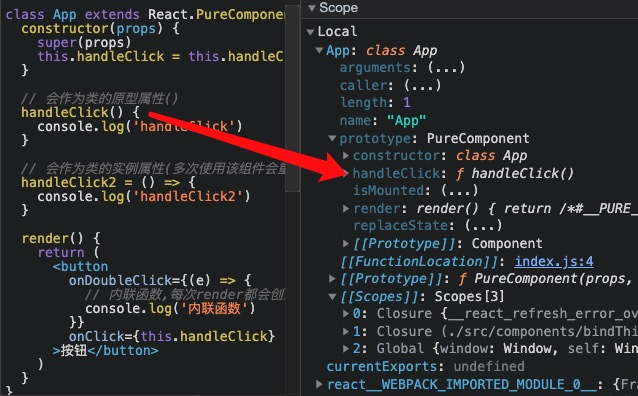

# 性能优化

> React 性能优化的核心是减少渲染真实 DOM 节点的频率，减少 virtual DOM diff 的频率

## 组件卸载前进行清理操作
> 注册全局事件,定时器等需要进行清除

## 使用纯组件降低组件重新渲染的频率

- 什么是纯组件
> 相同的输入 (state、props) 呈现相同的输出. 在输入内容相同的情况下纯组件不会被重新渲染.

- 如何实现纯组件
  - 纯组件会对 props 和 state 进行浅层比较, 如果上一次的 props、state 和下一次的 props、state 相同, 则不会重新渲染组件.
  - React 提供了 PureComponent 类, 类组件在继承它以后, 类组件就变成了纯组件. 
  - 函数组件需要`React.memo(Component)`

```js
class App extend React.PureComponent {}

class App extend React.Component {
  shouldComponenUpdate(nextProps,nextState){
    return (
      !shallowDiff(this.props,nextProps) 
      || !shallowDiff(this.state,nextState)
    )
  }
}

function App(){}
const AppMemo = React.memo(App, (prevProps,nextProps)=>{
  return !shallowDiff(this.props,nextProps)
})

```

- 什么是浅层比较
  - 比较基本数据类型是否具有相同的值
  - 比较复杂数据类型的第一层值是否相同。

- 浅层比较难道没有性能消耗吗

> 和进行 dom-diff 比较操作相比，浅层比较将消耗更少的性能。diff 操作会重新遍历整颗 virtualDOM 树, 而浅层比较值操作当前组件的 state 和 props

## 高阶组件 HOC
- 什么是高阶组件 Higher Order Component ( HOC )
  - 高阶组件是 React 应用中共享代码, 增加逻辑复用的一种方式. 比如 A 组件和 B 组件都需要使用一个相同的逻辑，如何将逻辑抽取到一个公共的地方呢？答案就是使用高阶组件。
- 高阶组件的核心思想
  - 在组件的外层再包裹一层执行逻辑的组件，在外层组件中执行逻辑，再将逻辑执行的结果传递到内层组件。
- 高阶组件形式是一个函数，接收组件作为参数, 返回一个新的组件. 参数组件就是需要复用逻辑的组件，函数内部返回的新组件就是执行逻辑的组件，在新组件内部执行完逻辑以后再调用参数组件并将逻辑结果传递给参数组件。

```js
function withResizer(WrapperComponent) {
  class WithResizer extends React.Component {
    state = {
      pos: [window.innerWidth, window.innerHeight]
    }

    componentDidMount() {
      window.addEventListener('resize', ()=>{
        this.setState({
          pos: [window.innerWidth, window.innerHeight]
        })
      }))
    }
    // 处理业务逻辑,
    // 在render函数将处理好的数据传递给新组件
    render() {
      return <WrapperComponent {...this.props} {...this.state} />
    }
  }

  return WithResizer
}

function A(props) {
  return (<p>{`${props.pos}`}</p>)
}

// 使用withResize包装后的组件就具有能实时获取窗口宽度
const WithResizeA = withResizer(A)
```

## React.memo 介绍

- 与 PureComponent 相似, 如果上一次输入的 props 和下一次输入的 props 相同, 则组件不会重新渲染, 从而使组件更高效.
- PureComponent 应用于类组件, React.memo 应用于函数组件.
- React.memo 使用的也是使用浅层比较.
- 第二个参数是函数,areEqual(是否相同)
  - 返回 true；不渲染
  - 返回 false: 渲染

```js
React.memo(App, (prevProps,nextProps)=>{
  // 返回true: 不重新渲染
  // 返回false: 重新渲染
})
```

## shouldComponentUpdate

- shouldComponentUpdate 是类组件的生命周期函数, 
- 在组件 props 或者 state 发生改变后调用. 
- 返回值(组件是否更新)
  - 返回 true, 重新渲染组件, 
  - 返回 false, 阻止组件重新渲染.

```js
shouldComponentUpdate(nextProps,nextState){
  // this.props nextProps
  // this.state nextState
}
```

## 使用组件懒加载

> 使用组件懒加载可以减少 bundle 文件大小, 加快组件呈递速度.

### 路由组件懒加载

- 使用lazy和Suspense实现路由懒加载
- import指定`/* webpackChunkName: "home" */`规定生成文件名

```js
const Home = lazy(() => import(/* webpackChunkName: "home" */'./Home'))
const About = lazy(() => import(/* webpackChunkName: "about" */'./About'))

<HashRouter>
  <Switch>
    <Route path='/' exact>
      <Suspense fallback={<div>loading</div>}>
        <Home />
      </Suspense>
    </Route>
  </Switch>
</HashRouter>
```

## 使用 Fragment 以避免额外的标记

```jsx
<Fragment></Fragment>
<></>
```

## 不要使用内联函数定义

在使用内联函数后, render 方法每次运行时都会创建该函数的新实例, 导致 React 在进行 Virtual DOM 比对时, 新旧函数比对不相等，导致React 总是为元素绑定新的函数实例, 而旧的函数实例又要交给垃圾回收器处理. 

```jsx
export default class App extends React.Component {
  render() {
    return (
      <input
        value={this.state.inputValue}
        // 每次函数都是新创建的
        onChange={e => this.setState({ inputValue: e.target.value })}
        />
    )
  }
}
```

## react类组件的this绑定
- 内联函数: 每次render都会创建新的函数
- 普通函数:
  - 会作为类的原型属性
  - 需要在constructor进行this绑定
- 箭头函数:
  - 会作为类的实例属性
  - 多次调用该组件会重复创建相同的实例属性

```js
import React from 'react'

class App extends React.PureComponent {
  constructor(props) {
    super(props)
    this.handleClick = this.handleClick.bind(this)
  }

  // 会作为类的原型属性()
  handleClick() {
    console.log('handleClick')
  }

  // 会作为类的实例属性(多次使用该组件会重复创建相同的函数)
  handleClick2 = () => {
    console.log('handleClick2')
  }

  render() {
    return (
      <button
        onDoubleClick={(e) => {
          // 内联函数,每次render都会创建新的
          console.log('内联函数')
        }}
        onClick={this.handleClick}
      >按钮</button>
    )
  }
}
```



## 避免使用内联样式属性

- 当使用内联 style 为元素添加样式时, 内联 style 会被编译为 JavaScript 代码, 通过 JavaScript 代码将样式规则映射到元素的身上, 浏览器就会花费更多的时间执行脚本和渲染 UI, 从而增加了组件的渲染时间.
- 将 CSS 文件导入样式组件.

## 优化条件渲染

- 频繁的挂载和卸载组件是一项耗性能的操作, 为了确保应用程序的性能, 应该减少组件挂载和卸载的次数.

## 不要在 render 方法中更改应用状态

- render 方法应该被作为纯函数. 这意味着, 在 render 方法中不要做以下事情, 比如不要调用 setState 方法, 不要使用其他手段查询更改原生 DOM 元素, 以及其他更改应用程序的任何操作. render 方法的执行要根据状态的改变, 这样可以保持组件的行为和渲染方式一致.

## 错误边界

- 错误边界是一种 React 组件，
- 这种组件可以捕获并打印发生在其子组件树任何位置的 JavaScript 错误，并且，它会渲染出备用 UI，而不是渲染那些崩溃了的子组件树。
- 错误边界在*渲染期间、生命周期方法和整个组件树的构造函数*中捕获错误。

### 无法捕获
- 事件处理
- 异步代码（setTimeout/requestAnimationFrame）
- 服务端渲染
- 它自身抛出来的错误（并非它的子组件）

```js
class MyError extends React.PureComponent {
  state = { hasError: false }

  static getDerivedStateFromError(error) {
    // 渲染备用 UI 
    console.log('getDerivedStateFromError', error)
    return { hasError: true }
  }

  //  打印错误信息
  componentDidCatch(error, errorInfo) {
    console.log('componentDidCatch', error, errorInfo)
  }

  render() {
    if (this.state.hasError) {
      return (<div>发生错误</div>)
    }

    return <App />
  }
}
```

## 避免数据结构突变

## 为列表数据添加唯一标识

- key 属性可以让 React 直接了当的知道哪些列表项发生了变化, 从而避免了 React 内部逐一遍历 Virtual DOM 查找变化所带来的性能消耗. 避免了元素因为位置变化而导致的重新创建.
- 当列表数据没有唯一标识时, 可以临时使用索引作为 key 属性的值, 但是仅限于列表项是静态的, 不会被动态改变. 比如不会对列表项进行排序或者过滤, 不会从顶部或者中间添加或者删除项目. 当发生以上行为是, 索引会被更改, 并不可靠.

## 节流和防抖
- 节流 throttle
  - 在高频触发事件时，可以以指定的间隔调用事件处理函数。
- 防抖 debounce
  - 在触发高频事件时，只在最后一次触发事件后进行响应。


## 外部资源使用 CDN 加载

1. 什么是 CDN (Content Delivery Network) ?
   内容交付网络（CDN）指的是地理上分散的服务器组, 它们一起工作以提供网络内容的快速交付.

2. 使用 CDN 有什么好处 ?
   1. 浏览器对于同一个域下的并发请求有数量上的限制. 主流浏览器的同一域下的并发请求数量是 6 或 10. 意味着超过并发数量的其他资源需要等待, 这就增加了应用呈递的时间. 我们可以将不同的资源放在不同的 CDN 中, 这样就可以突破浏览器的并发限制, 加入应用的呈递速度.
   2. CDN 通常由大型公司托管, 在全球都分布了数据中心, 当你向 CDN 发送请求时, 它会通过离你最近的数据中心进行响应, 减少网络延迟, 增加程序性能.
   3. 缓存使访问速度更加快速.

## 虚拟列表

- 虚拟列表就是按需显示, 不必一次渲染所有列表项, 只显示用户可视区域内的元素, 再根据用户的滚动位置逐步渲染其余数据. 

**分页,上拉加载与分页列表**
- 上拉/分页加载是随着滚动请求数据和渲染数据,
- 虚拟列表是一次请求所有数据, 随着滚动按需渲染.

```js
import { List } from 'react-virtualized'
import faker from 'faker'

function createRecord(count) {
  let records = []
  for (let i = 0;i < count;i++) {
    records.push({
      username: faker.internet.userName(),
      email: faker.internet.email()
    })
  }
  return records
}

const records = createRecord(10000)
function rowRenderer({ index, key, style }) {
  const record = records[index]
  return (
    <div style={style} key={key}>
      {record.username}{record.email}
    </div>
  )
}
export default function App() {
  return (
    <List
      width={400}
      height={300}
      rowHeight={30}
      rowCount={records.length}
      rowRenderer={rowRenderer}
    />
  )
}
```
