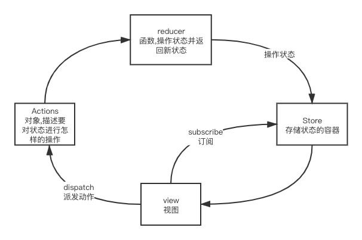

# 手撕redux

## 概念

- js状态容器,提供`可预测化`的`状态`管理

### 数据流



### 为什么要是使用redux

- 在React中组件通信的数据流是`单向`的
  - 顶层组件可以通过props属性向下层组件传递数据,
  - ⽽下层组件不能向上层组件传递数据, 要实现下层组件修改数据, 需要上层组件传递修改数据的⽅法到下层组件.
- 当项⽬越来越⼤的时候, 组件之间`传递数据`变得越来越困难.
- 使⽤Redux管理数据，由于数据管理`独⽴`于组件，解决了组件与组件之间传递数据困难的问题。

### 原则
- `单一`数据源
  - 整个应用的 state 被储存在一棵 object tree 中，并且这个 object tree 只存在于唯一一个 store 中。
- State 是`只读`的
  - 唯一改变 state 的方法就是 store.dispatch 触发 action，action 是一个用于描述已发生事件的普通对象。
- 使用纯函数来执行修改
  - 为了描述 action 如何改变 state tree ，你需要编写 reducers。

## redux

### 手写createStore

```ts
type Action = { type: string, payload?: unknown }

type Reducer<T> = (state: T, action: Action) => T

type Store<T> = {
    getState: () => T,
    dispatch: (action: Action) => void,
    subscribe: (fn: () => void) => () => void
}

type Enhancer<T> = (createStore: CreateStore<T>) => (
    (reducer: Reducer<T>, initialState?: Partial<T>) => Store<T>
)

type CreateStore<T = any> = (reducer: Reducer<T>, initialState?: Partial<T>, enhancer?: Enhancer<T>) => Store<T>
```

```js
export function createStore(reducer, initialState, enhancer) {
    // 如果传递增强函数
    if (typeof enhancer === 'function') {
        return enhancer(createStore)(reducer, initialState)
    }

    let state = initialState

    // 订阅回调函数集合
    const listeners = new Set()

    // 派发action
    const dispatch = (action) => {
        // 计算新的状态
        state = reducer(state, action)
        // 执行订阅回调函数
        listeners.forEach(listener => listener())
    }

    // 订阅
    const subscribe = (listener) => {
        // 添加订阅
        listeners.add(listener)
        // 返回取消订阅的函数
        return () => {
            listeners.delete(listener)
        }
    }

    const store = {
        // 获取状态
        getState() {
            return state
        },
        // 派发动作
        dispatch,
        // 订阅
        subscribe
    }

    // 初始化
    dispatch({ type: '@@REDUX/INIT' })

    return store
}
```

### 手写bindActionCreators

> 将处理函数与store.dispatch绑定

```js
const minus = (payload) => ({ type: MINUS, payload })
const actions = bindActionCreators({ minus }, store.dispatch)

actions.minus(2)

// 等价于
actions.minus = (payload)=>{
    store.dispatch(minus(payload))
}
```

**实现**

```js
export const bindActionCreators = (actionCreators, dispatch)=>{
    return Object.keys(actionCreators).reduce((memo, key)=>{
        return {
            ...memo,
            [key]: (payload)=>{
                return dispatch(actionCreators[key](payload))
            }
        }
    }, {})
}
```

### 手写combineReducers

> 将多个单独reducer聚合成一个rootReducer

reducer的数据结构 `type Reducer<T> = (state: T, action: Action) => T`

```js
const count1 = (state = { count: 1 }, action) => {
    switch (action.type) {
        case ADD1:
            return { ...state, count: state.count + 1 }
        case MINUS1:
            return { ...state, count: state.count - 1 }
        default:
            return state
    }
}

const count2 = (state = { count: 10 }, action) => {
    switch (action.type) {
        case ADD2:
            return { ...state, count: state.count + 1 }
        case MINUS2:
            return { ...state, count: state.count - 1 }
        default:
            return state
    }
}

const rootReducer = combineReducers({
    count1,
    count2
})

// state = {count1: {count: 1}, count2: {count: 10}}
// 每个单独reducer只处理state[key]的值
```

#### 实现
```js
// 把reducers对象变成reducer函数
export const combineReducers = (reducers) => {
    return function rootReducer(state = {}, action) {
        const nextState = {}

        for (const key in reducers) {
            nextState[key] = reducers[key](state[key], action)
        }

        return nextState
    }
}   
```

## react-redux

### react直接使用redux

```jsx
class Counter extends React.Component {
    constructor (props) {
        super(props)
        this.state = { count: 0 }
    }
    componentDidMount() {
        this.unsubscribe = store.subscribe(() => {
            this.setState({
                count: store.getState().count
            })
        })
    }
    componentWillUnmount() {
        this.unsubscribe?.()
    }
    render() {
        return (
            <div>
                <h2>{this.state.count}</h2>
                <button
                    onClick={() => {
                        store.dispatch({ type: ADD })
                    }}
                >+1</button>
            </div>
        )
    }
}
```

### ReactReduxContext

> 创建Redux上下文

```js
import React from "react";

const ReactReduxContext = React.createContext({ store: null })

export default ReactReduxContext
```

### ReactRedux.Provider

```js
import React from "react";
import ReactReduxContext from './ProviderContext'

function Provider(props) {
    const value = React.useMemo(() => ({ store: props.store }), [props.store])
    return (
        <ReactReduxContext.Provider value={value}>
            {props.children}
        </ReactReduxContext.Provider>
    )
}

export default Provider
```

**用法**

```js
<Provider store={store}>
    <Counter1 />
    <Counter2 />
</Provider>
```

### connect

> 将store与组件关联起来

**函数版本**

```js
export const connect = (mapStateToProps, mapDispatchToProps) => {
    return (Component) => {
        return function (props) {
            // 处理强制更新
            const [_, forceUpdate] = React.useReducer((x) => x + 1, 0)
            // 获取仓库
            const { store } = useContext(ProviderContext)
            const { getState, dispatch } = store

            // 获取最新值
            const prevState = getState()

            // 计算传递给state
            const state = React.useMemo(() => mapStateToProps(prevState), [prevState])

            // 计算传递dispatchProps
            // 1. { add: (payload)=>({type:ADD, payload}) }
            // 2. (dispatch) => ({a: (payload)=>{dispatch({type:ADD, payload})}}) 
            // 3. 啥也不传也会传递dispatch
            const dispatchProps = React.useMemo(() => {
                return typeof mapDispatchToProps === 'function'
                    ? mapDispatchToProps(dispatch)
                    : (
                        mapDispatchToProps
                            ? bindActionCreators(mapDispatchToProps, store.dispatch)
                            : { dispatch }
                    )
            }, [store])

            React.useLayoutEffect(() => {
                // 订阅更新
                return store.subscribe(forceUpdate)
            }, [store])

            return <Component {...props} {...state} {...dispatchProps} />
        }
    }
}
```

**类组件版本**

```js
export const connect = (mapStateToProps, mapDispatchToProps) => {
    return (Component) => {
        return class extends React.PureComponent {

            static contextType = ProviderContext

            componentDidMount() {
                this.unsubscribe = this.context.store.subscribe(() => {
                    this.forceUpdate()
                })
            }

            componentWillUnmount() {
                this.unsubscribe?.()
            }

            render() {
                const { getState, dispatch } = this.context.store
                const prevState = getState()
                const state = mapStateToProps(prevState)
                const dispatchProps = typeof mapDispatchToProps === 'function'
                    ? mapDispatchToProps(dispatch)
                    : (
                        mapDispatchToProps
                            ? bindActionCreators(mapDispatchToProps, this.store.dispatch)
                            : { dispatch }
                    )

                return <Component {...this.props} {...state} {...dispatchProps} />
            }
        }
    }
}
```

### useStore/useSelector/useDispatch

```js
import React from "react";
import ProviderContext from '../ProviderContext'

export const useStore = () => {
    const { store } = React.useContext(ProviderContext)
    return store
}

export const useSelector = (selector) => {
    const store = useStore()

    const state = store.getState()
    const selectedState = React.useMemo(() => selector(state), [state])

    const [_, forceUpdate] = React.useReducer((x) => x + 1, 0)

    React.useEffect(() => {
        return store.subscribe(forceUpdate)
    }, [])

    return selectedState
}

export const useDispatch = () => {
    const store = useStore()
    return store.dispatch
}
```

### 使用applyMiddleware

**使用**

```js
import { applyMiddleware, createStore } from "../../core/redux"
import rootReducer from "./reducer"

function logger(middlewareAPI) {
    return function loggerNext(next) {
        return function loggerDispatch(action) {
            console.log('prev state', middlewareAPI.getState())
            next(action)
            console.log('next state', middlewareAPI.getState())
        }
    }
}

function thunk(middlewareAPI) {
    return function thunkNext(next) {
        return function thunkDispatch(action) {
            if (typeof action === 'function') {
                return action(middlewareAPI.dispatch, middlewareAPI.getState)
            }
            return next(action)
        }
    }
}

function promise(middlewareAPI) {
    return function promiseNext(next) {
        return function promiseDispatch(action) {
            if (typeof action?.then === 'function') {
                return action.then(data => middlewareAPI.dispatch(data))
            }
            return next(action)
        }
    }
}

const store = createStore(rootReducer, {}, applyMiddleware(logger, thunk, promise))

export default store
```

**细节**
```js
function logger(middlewareAPI) {
    return function loggerNext(next) {
        return function loggerDispatch(action) {
            console.log('prev state', middlewareAPI.getState())
            next(action)
            console.log('next state', middlewareAPI.getState())
        }
    }
}

function thunk(middlewareAPI) {
    return function thunkNext(next) {
        return function thunkDispatch(action) {
            if (typeof action === 'function') {
                return action(middlewareAPI.dispatch, middlewareAPI.getState)
            }
            return next(action)
        }
    }
}

function promise(middlewareAPI) {
    return function promiseNext(next) {
        return function promiseDispatch(action) {
            if (typeof action?.then === 'function') {
                return action.then(data => middlewareAPI.dispatch(data))
            }
            return next(action)
        }
    }
}

const middlewares = [logger,thunk,promise]
const chains = middlewares.map(middleware => middleware(middlewareAPI))

// 结果
chains = [
    loggerNext,
    thunkNext,
    promiseNext
]

const composeChain = compose(...chains)

function compose(...fns) {
    return fns.reduce((lastFn, currentFn) => {
        return (...args) => {
            return currentFn(lastFn(...args))
        }
    })
}

// 结果
// 第一次遇到 loggerNext 和 thunkNext
lastFn = (...args) => {
    loggerNext(thunkNext(...args))
}

// 第二次遇到 lastFn 和 promiseNext
composeChain = (...args)=>{
    lastFn(promiseNext(...args))
}

// 完整
composeChain = (...args) => {
    return ()=>loggerNext(thunkNext(promiseNext(...args)))()
}

dispatch = composeChain(store.dispatch)

dispatch = (action) => loggerNext(thunkNext(promiseNext(store.dispatch)(action)))

// 执行顺序
promiseDispatch(action)
thunkDispatch(action)
loggerDispatch(action)
```

**中间件的格式**

```js
// middlewareAPI 包含 getState, dispatch(此处的dispatch是经过中间件包装过的函数, 不是原生的dispatch)
function middleware (middlewareAPI){
    // next: 在第一个中间是store.dispatch, 后续是下一个中间件
    return function middlewareNext(next){
        // dispatch派发的action
        return function middlewareDispatch(action){
        }
    }
}
```

### 实现applyMiddleware

```js
export const applyMiddleware = (...middlewares) => {
    return (createStore) => {
        return (reducer, initialState) => {
            const store = createStore(reducer, initialState)

            let dispatch

            // 创建中间件api
            const middlewareAPI = {
                getState: store.getState,
                dispatch: action => dispatch(action)
            }

            // 包裹middlewareAPI
            const chains = middlewares.map(middleware => middleware(middlewareAPI))
            // 获取处理过的dispatch
            dispatch = compose(...chains)(store.dispatch)

            return {
                ...store,
                dispatch
            }
        }
    }
}

function compose(...fns) {
    return fns.reduce((lastFn, currentFn) => {
        return (...args) => {
            return currentFn(lastFn(...args))
        }
    })
}
```

## redux-saga


```js
// store.js

// 获取saga中间件
const sagaMiddleware = createSagaMiddleware()

// 应用saga中间件
const store = createStore(rootReducer, {}, applyMiddleware(sagaMiddleware))

// 启动saga
sagaMiddleware.run(rootSaga)

// rootSaga.js
function* rootSaga() {
    console.log('启动saga')

    for (let i = 0; i < 3; i += 1) {
        yield take(ASYNC_ADD1)
        yield put({ type: ADD1 })
    }
    console.log('结束saga')
}
```

### createSagaMiddleware

```js
import runSaga from './runSaga'
import createChannel from './channel'

const createSagaMiddleware = () => {
    // 发布订阅的管道
    const channel = createChannel()

    let boundRunSaga
    const sagaMiddleware = (middlewareAPI) => {
        const { getState, dispatch } = middlewareAPI
        const env = { getState, dispatch, channel }
        
        boundRunSaga = runSaga.bind(null, env)

        return (next) => {
            return action => {
                // 拦截
                const result = next(action)

                // 发布action的动作
                channel.publication(action)

                return result
            }
        }
    }

    // 启动saga
    sagaMiddleware.run = (saga) => {
        boundRunSaga?.(saga)
    }

    return sagaMiddleware
}

export default createSagaMiddleware
```

### createChannel

> channel 订阅发布的管道

```js
function createChannel() {
    let currentTakers = []
    
    // 订阅动作
    // 在take中callback则代表next
    function subscribe(actionType, callback) {
        callback.actionType = actionType

        callback.cancel = () => {
            currentTakers = currentTakers.filter(itemTaker => itemTaker !== callback)
        }

        currentTakers.push(callback)
    }

    function publication(action) {
        currentTakers.forEach(taker => {
            if (taker.actionType === action.type) {
                taker.cancel?.()
                taker(action)
            }
        })
    }

    return { subscribe, publication }
}

export default createChannel
```

### runSaga

```js
import { ALL, CALL, CPS, FORK, PUT, SELECT, TAKE } from './effectTypes'

function runSaga(env, saga, doneCallback) {
    const { getState, dispatch, channel } = env

    // saga可能是迭代器, 也可能是生成器
    // 函数就是生成器
    const it = typeof saga === 'function' ? saga() : saga

    function next(value, isError) {
        let result
        if (isError) {
            result = it.throw(value)
        } else {
            result = it.next(value)
        }

        const { done, value: resultValue } = result

        // 迭代器执行完毕
        if (done) {
            doneCallback?.(resultValue)
            return
        }

        // 迭代器
        if (typeof resultValue[Symbol.iterator] === 'function') {
            const newIt = resultValue
            // 开启新的子进程
            runSaga(env, newIt)
            // 不阻塞
            next()
            return
        }

        // promise
        if (typeof resultValue?.then === 'function') {
            // 需要阻塞
            resultValue
                .then(next)
                .catch(e => {
                    next(e, true)
                })
            return
        }

        switch (resultValue.type) {
            case TAKE:
                // 订阅动作
                // 等待动作发生, 等不到就一直等, 阻塞
                channel.subscribe(resultValue.actionType, next)
                break
            case PUT:
                // 不会阻塞saga执行
                dispatch(resultValue.action)
                next()
                break
            case FORK:
                // 开启新的子进程执行saga
                runSaga(env, resultValue.saga)
                next()
                break
            case CALL:
                resultValue.fn(...resultValue.args)
                    .then(next)
                    .catch(e => {
                        next(e, true)
                    })
                break
            case CPS:
                resultValue.fn(...resultValue.args, (error, ...newArgs) => {
                    if (!error) {
                        next(newArgs)
                    } else {
                        next(error, true)
                    }
                })
                break
            case ALL:
                const effects = resultValue.effects
                const result = []
                let completeCount = 0

                effects.forEach((effect, index) => {
                    const finashCallback = (ret) => {
                        completeCount += 1
                        result[index] = ret
                        if (completeCount === effects.length) {
                            next(result)
                        }
                    }
                    runSaga(env, effect, finashCallback)
                })
                break
            case SELECT:
                const state = resultValue.selector(getState())
                next(state)
                break
            default:
                break
        }
    }

    next()
}

export default runSaga
```

### effects

```js
import { ALL, CALL, CPS, FORK, PUT, SELECT, TAKE } from "./effectTypes"

export const take = (actionType) => {
    return { type: TAKE, actionType }
}

export const put = (action) => {
    return { type: PUT, action }
}

export const takeEvery = (actionType, saga) => {
    function* takeEveryHelper() {
        while (true) {
            // 等待新的进程
            yield take(actionType)
            // 开启新子进程执行saga
            yield fork(saga)
        }
    }

    return fork(takeEveryHelper)
}

export const fork = (saga) => {
    return { type: FORK, saga }
}

export const call = (fn, ...args) => {
    return { type: CALL, fn, args }
}

export const cps = (fn, ...args) => {
    return { type: CPS, fn, args }
}

export const all = (effects) => {
    return { type: ALL, effects }
}

export const select = (selector) => {
    return { type: SELECT, selector }
}
```