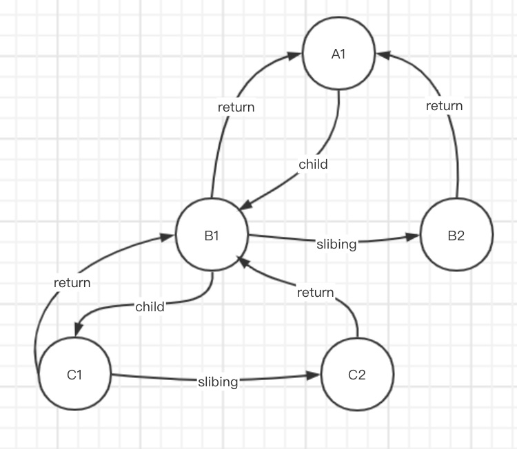

# 手写react16(fiber+hook+dom-diff)

## 前置知识
### requestAnimationFrame

> 你希望执行一个动画，并且要求浏览器在下次重绘之前调用指定的回调函数更新动画。该方法需要传入一个回调函数作为参数，该回调函数会在浏览器下一次重绘之前执行

### 实现休眠函数

```js
const sleep = (delayMs) => {
    for (let start = Date.now(); Date.now() - start <= delayMs;) {
    }
}
const sleep = (delayMs) => {
    const start = Date.now()
    while (Date.now()-start<=delayMs) {
    }
}
```

### requestIdleCallback

> 这个函数将在浏览器空闲时期被调用。这使开发者能够在主事件循环上执行后台和低优先级工作，而不会影响延迟关键事件，如动画和输入响应。函数一般会按先进先调用的顺序执行，然而，如果回调函数指定了执行超时时间timeout，则有可能为了在超时前执行函数而打乱执行顺序。

```js
const tasks = [
    () => {
        console.log('任务1开始')
        sleep(20)
        console.log('任务1结束')
    },
    () => {
        console.log('任务2开始')
        sleep(20)
        console.log('任务2结束')
    },
    () => {
        console.log('任务3开始')
        sleep(20)
        console.log('任务3结束')
    },
]

requestIdleCallback(workLoop, { timeout: 1000 })

function workLoop(deadline) {
    console.log('deadline', deadline.timeRemaining())
    /**
     * 本帧还有剩余时间或者任务已经超时
     * 并且还有任务
     */
    if ((deadline.timeRemaining() > 0 || deadline.didTimeout) && tasks.length > 0) {
        preformUnitOfWork()
    }

    // 本帧没有剩余时间, 需要把控制权交还给浏览器
    if (tasks.length > 0) {
        // 还有任务需要向浏览器申请空闲时间执行
        requestIdleCallback(workLoop, { timeout: 1000 })
    }
}

function preformUnitOfWork() {
    tasks.shift()()
}
```

### 链表更新state

```js
type BaseState = Record<string, unknown>
type StatePayload = object | ((prevState: object) => object)

class Updater {
    nextUpdater: Updater | null
    payload: StatePayload

    constructor(payload: StatePayload, nextUpdater: Updater | null = null) {
        this.payload = payload
        // next指针, 指向下一个更新
        this.nextUpdater = nextUpdater
    }
}

class UpdateQueue {
    baseState: null | BaseState
    firstUpdater: null | Updater
    lastUpdater: null | Updater

    constructor() {
        // 原状态
        this.baseState = null
        // 第一个更新
        this.firstUpdater = null
        // 最后一个更新
        // 作为中间值
        //      1. 上一个更新.nextUpdater指向当前更新
        //      2. 更新最后一个更新为当前值
        this.lastUpdater = null
    }

    queueUpdater(updater: Updater) {
        if (!this.firstUpdater) {
            // 第一次
            this.firstUpdater = this.lastUpdater = updater
            return
        }
        // 更新后续
        if (this.lastUpdater) {
            // 给上一个更新绑定nextUpdater到当前更新
            this.lastUpdater.nextUpdater = updater
            // 将当成更新作为最后一个更新
            this.lastUpdater = updater
        }
    }

    forceUpdate() {
        let currentState = this.baseState || {}
        let currentUpdater = this.firstUpdater

        // 递归调用nextUpdater
        while (currentUpdater) {
            const nextState = typeof currentUpdater.payload === 'function'
                ? currentUpdater.payload(currentState)
                : currentUpdater.payload
            currentState = { ...currentState, ...nextState }

            currentUpdater = currentUpdater.nextUpdater
        }

        this.firstUpdater = this.lastUpdater = null
        this.baseState = currentState

        return currentState
    }
}

const queue = new UpdateQueue()
queue.queueUpdater(
    new Updater({ name: 'allen' })
)
queue.queueUpdater(
    new Updater({ age: 27 })
)
queue.queueUpdater(
    new Updater((state: { age: number }) => ({ age: state.age + 1 }))
)
queue.queueUpdater(
    new Updater((state: { age: number }) => ({ age: state.age + 1 }))
)

queue.forceUpdate()

console.log(queue.baseState)
```

### fiber



- 顺序
  - 大儿子 `child`
  - 下一个兄弟 `slibing`
  - 返回父亲 `return`

```js
let nextUnitOfWork = null

// 开始工作循环
function workLoop(deadline) {
    // 还有剩余时间, 未过期
    // 还有下一个工作单元
    while (
        (deadline.timeRemaining() > 0 || deadline.didTimeout) 
        && nextUnitOfWork
    ) {
        nextUnitOfWork = preformUnitOfWork(nextUnitOfWork)
    }

    if (!nextUnitOfWork) {
        console.log('render ended')
        nextUnitOfWork = null
        return
    }

    requestIdleCallback(workLoop, { timeout: 1000 })
}

// 处理单个执行单元 -> 返回下一个执行单元
function preformUnitOfWork(fiber) {
    // 开始
    beginWork(fiber)

    // 1. 有大儿子
    if (fiber.child) {
        return fiber.child
    }

    // 没有儿子, 则表示此fiber结束
    while (fiber) {
        // 当前fiber完成
        completeUnitOfWork(fiber)

        // 2. 有兄弟就返回兄弟
        if (fiber.slibing) {
            return fiber.slibing
        }

        // 3. 返回父亲
        fiber = fiber.return
    }
}

function beginWork(fiber) {
    console.log('开始', fiber.props.key)
}

function completeUnitOfWork(fiber) {
    console.log('完成', fiber.props.key)
}

function start(newNextUnitOfWork) {
    nextUnitOfWork = newNextUnitOfWork
    requestIdleCallback(workLoop, { timeout: 1000 })
}
```

**示例**

```js
const A1 = { type: 'div', props: { key: 'A1' } }

const B1 = { type: 'div', props: { key: 'B1' }, return: A1 }
const B2 = { type: 'div', props: { key: 'B2' }, return: A1 }

const C1 = { type: 'div', props: { key: 'C1' }, return: B1 }
const C2 = { type: 'div', props: { key: 'C2' }, return: B1 }

A1.child = B1

B1.slibing = B2

B1.child = C1

C1.slibing = C2

start(A1)

// 开始 A1
// 开始 B1
// 开始 C1
// 完成 C1
// 开始 C2
// 完成 C2
// 完成 B1
// 开始 B2
// 完成 B2
// 完成 A1
// render ended
```
