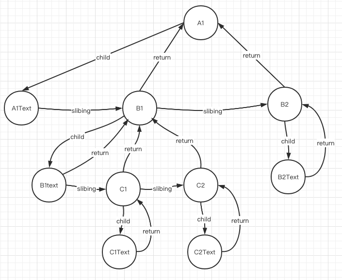
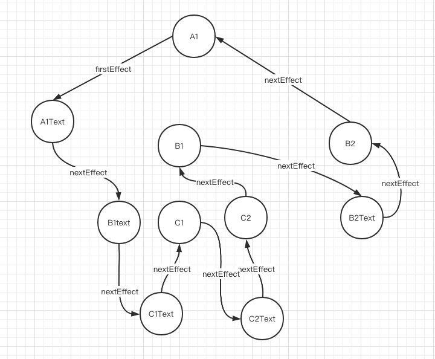

# 手写react16(fiber+hook+dom-diff)

## 概念篇

### 目的
> 为了提高 React 渲染页面的效率，减少页面卡顿，提升用户体验。

### 在 Fiber 出现之前 React 存在什么问题

> 核心就是`递归`比对的过程长期占用主线程产生了性能问题。

- 在 Virtual DOM 比对的过程中 React 使用了`递归`，递归调用的过程`不能被终止`，如果 Virtual DOM 的层级比较深，递归比对的过程就会长期占用`主线程`，而 JavaScript 又是单线程，不能同时执行多个任务，其他任务只能等待执行，而且 JavaScript 的执行和 UI 的渲染又是互斥的，此时用户要么看到的就是空白界面，要么就是有界面但是不能响应用户操作，处于卡顿状态，用户体验差。

### Fiber 如何解决性能问题

- 在 Fiber 架构中 React 放弃了递归调用，采用循环来模拟递归，因为循环可以随时被中断。
- React 利用`浏览器空闲时间`执行比对任务， 解决了 React 执行比对任务长期占用主线程的问题。
- React 在执行完一个任务单元后，查看是否有其他的`高优先级任务`，如果有，放弃占用主线程，先执行优先级高的任务。

### 什么是 Fiber
- Fiber 是一个执行单元
  - 在 React 15 中，将 VirtualDOM 树整体看成一个任务进行递归处理，任务整体庞大执行耗时且不能中断。
  - 在 React 16 中，将整个任务拆分成了一个一个小的任务进行处理，每一个小的任务指的就是一个 Fiber 节点的构建。
  - 任务会在浏览器的空闲时间被执行，每个单元执行完成后，React 都会检查是否还有空余时间，如果有就交还主线程的控制权。
- Fiber 是一种数据结构
  - Fiber 是一种数据结构，支撑 Fiber 构建任务的运转。 
  - React 通过链表结构找到下一个要执行的任务单元。
  - 要构建链表结构，需要知道每一个节点的父级节点是谁，要知道他的子级节点是谁，要知道他的下一个兄弟节点是谁。
  - Fiber 其实就是 JavaScript 对象，在这个对象中有 child 属性表示节点的子节点，有 sibling 属性表示节点的下一个兄弟节点，有 return 属性表示节点的父级节点。

### Fiber 的工作方式

- fiber 的工作分为两个阶段：render 阶段和 commit 阶段。
  - render 阶段：构建 Fiber 对象，构建链表，在链表中标记要执行的副作用(DOM 操作) ，可中断。
    - 先从上向下走，构建节点对应的 Fiber 对象，
    - 然后再从下向上走，构建 Fiber 对象及链表。
  - commit 阶段：根据构建好的`副作用`链表进行 DOM 操作，不可中断。

## 前置知识
### requestAnimationFrame

> 你希望执行一个动画，并且要求浏览器在下次重绘之前调用指定的回调函数更新动画。该方法需要传入一个回调函数作为参数，该回调函数会在浏览器下一次重绘之前执行

### 实现休眠函数

```js
const sleep = (delayMs) => {
    for (let start = Date.now(); Date.now() - start <= delayMs;) {
    }
}
const sleep = (delayMs) => {
    const start = Date.now()
    while (Date.now()-start<=delayMs) {
    }
}
```

### requestIdleCallback

> 这个函数将在浏览器空闲时期被调用。这使开发者能够在主事件循环上执行后台和低优先级工作，而不会影响延迟关键事件，如动画和输入响应。函数一般会按先进先调用的顺序执行，然而，如果回调函数指定了执行超时时间timeout，则有可能为了在超时前执行函数而打乱执行顺序。


**任务**
```js
const tasks = [
    () => {
        console.log('任务1开始')
        sleep(20)
        console.log('任务1结束')
    },
    () => {
        console.log('任务2开始')
        sleep(20)
        console.log('任务2结束')
    },
    () => {
        console.log('任务3开始')
        sleep(20)
        console.log('任务3结束')
    },
]
```

```js

requestIdleCallback(workLoop, { timeout: 1000 })

function workLoop(deadline) {
    // 是否让出执行权
    let isYield = false
    console.log('开启此次任务')

    // 不让出执行权 并且 并且还有任务
    while (tasks.length > 0 && !isYield) {
        preformUnitOfWork()
        // 如果没时间 并且 没超时
        isYield = deadline.timeRemaining() <= 0 && !deadline.didTimeout
    }

    console.log('结束此次任务')

    // 本帧没有剩余时间, 需要把控制权交还给浏览器
    if (tasks.length > 0) {
        // 还有任务需要向浏览器申请空闲时间执行
        requestIdleCallback(workLoop, { timeout: 1000 })
    }
}

function preformUnitOfWork() {
    tasks.shift()()
}
```

### 链表更新state

```js
type BaseState = Record<string, unknown>
type StatePayload = object | ((prevState: object) => object)

class Updater {
    nextUpdater: Updater | null
    payload: StatePayload

    constructor(payload: StatePayload, nextUpdater: Updater | null = null) {
        this.payload = payload
        // next指针, 指向下一个更新
        this.nextUpdater = nextUpdater
    }
}

class UpdateQueue {
    baseState: null | BaseState
    firstUpdater: null | Updater
    lastUpdater: null | Updater

    constructor() {
        // 原状态
        this.baseState = null
        // 第一个更新
        this.firstUpdater = null
        // 最后一个更新
        // 作为中间值
        //      1. 上一个更新.nextUpdater指向当前更新
        //      2. 更新最后一个更新为当前值
        this.lastUpdater = null
    }

    queueUpdater(updater: Updater) {
        if (!this.firstUpdater) {
            // 第一次
            this.firstUpdater = this.lastUpdater = updater
            return
        }
        // 更新后续
        if (this.lastUpdater) {
            // 给上一个更新绑定nextUpdater到当前更新
            this.lastUpdater.nextUpdater = updater
            // 将当成更新作为最后一个更新
            this.lastUpdater = updater
        }
    }

    forceUpdate() {
        let currentState = this.baseState || {}
        let currentUpdater = this.firstUpdater

        // 递归调用nextUpdater
        while (currentUpdater) {
            const nextState = typeof currentUpdater.payload === 'function'
                ? currentUpdater.payload(currentState)
                : currentUpdater.payload
            currentState = { ...currentState, ...nextState }

            currentUpdater = currentUpdater.nextUpdater
        }

        this.firstUpdater = this.lastUpdater = null
        this.baseState = currentState

        return currentState
    }
}

const queue = new UpdateQueue()
queue.queueUpdater(
    new Updater({ name: 'allen' })
)
queue.queueUpdater(
    new Updater({ age: 27 })
)
queue.queueUpdater(
    new Updater((state: { age: number }) => ({ age: state.age + 1 }))
)
queue.queueUpdater(
    new Updater((state: { age: number }) => ({ age: state.age + 1 }))
)

queue.forceUpdate()

console.log(queue.baseState)
```

### fiber


- 顺序
  - 大儿子 `child`
  - 下一个兄弟 `slibing`
  - 返回父亲 `return`

```js
let nextUnitOfWork = null

// 开始工作循环
function workLoop(deadline) {
    // 还有剩余时间, 未过期
    // 还有下一个工作单元
    while (
        (deadline.timeRemaining() > 0 || deadline.didTimeout) 
        && nextUnitOfWork
    ) {
        nextUnitOfWork = preformUnitOfWork(nextUnitOfWork)
    }

    if (!nextUnitOfWork) {
        console.log('render ended')
        nextUnitOfWork = null
        return
    }

    requestIdleCallback(workLoop, { timeout: 1000 })
}

// 处理单个执行单元 -> 返回下一个执行单元
function preformUnitOfWork(fiber) {
    // 开始
    beginWork(fiber)

    // 1. 有大儿子
    if (fiber.child) {
        return fiber.child
    }

    // 没有儿子, 则表示此fiber结束
    while (fiber) {
        // 当前fiber完成
        completeUnitOfWork(fiber)

        // 2. 有兄弟就返回兄弟
        if (fiber.slibing) {
            return fiber.slibing
        }

        // 3. 返回父亲
        fiber = fiber.return
    }
}

function beginWork(fiber) {
    console.log('开始', fiber.props.key)
}

function completeUnitOfWork(fiber) {
    console.log('完成', fiber.props.key)
}

function start(newNextUnitOfWork) {
    nextUnitOfWork = newNextUnitOfWork
    requestIdleCallback(workLoop, { timeout: 1000 })
}
```

**示例**

```js
const A1 = { type: 'div', props: { key: 'A1' } }

const B1 = { type: 'div', props: { key: 'B1' }, return: A1 }
const B2 = { type: 'div', props: { key: 'B2' }, return: A1 }

const C1 = { type: 'div', props: { key: 'C1' }, return: B1 }
const C2 = { type: 'div', props: { key: 'C2' }, return: B1 }

A1.child = B1

B1.slibing = B2

B1.child = C1

C1.slibing = C2

start(A1)

// 开始 A1
// 开始 B1
// 开始 C1
// 完成 C1
// 开始 C2
// 完成 C2
// 完成 B1
// 开始 B2
// 完成 B2
// 完成 A1
// render ended
```

## 举例

```jsx
<div id='A1' style={style}>
    A1Text
    <div id='B1' style={style}>
        B1Text
        <div id='C1' style={style}>C1Text</div>
        <div id='C2' style={style}>C2Text</div>
    </div>
    <div id='B2' style={style}>B2Text</div>
</div>
```

### fiber树

> beginWork开始阶段 收集 fiber树



### effect list链表

> completeUnitOfWork 收集有副作用的fiber链表

> commit 阶段直接就rootFiber.fisrtEffect, 然后一直nextEffect



## 数据结构

```ts
type FunctionComponent<T = any> = (props: T) => VDOM
interface VDOM {
    type: string | TinyReact.Component | TinyReact.PureComponent | FunctionComponent
    props: any
}

interface Fiber {
    stateNode?: HTMLElement | TinyReact.Component | TinyReact.PureComponent
    // Root根 Host原生元素 Text文本 Class类组件, Function函数组件
    tag: Symbol,
    props: VDOM['props'],

    return: Fiber,
    child: Fiber
    slibing: Fiber

    updateQueue: UpdateQueue,
    // PLACEMENT新增
    // UPDATE更新
    // DELETION删除
    effectTag: Symbol,

    nextEffect?: Fiber,
    lastEffect?: Fiber,
    nextEffect?: Fiber
}
```

## TinyReactDOM.render

```js
function render(element, container) {
    // 构建根fiber
    const rootFiber = {
        tag: TAG_ROOT,
        stateNode: container,
        props: {
            children: [element]
        }
    }

    // 调度根fiber
    scheduleRoot(rootFiber)
}
```

## scheduleRoot
```js
// 最核心的就是props和stateNode, 其他属性都是后加的
export function scheduleRoot(rootFiber) {
    if (currentRoot?.alternate) {
        // 最少是第三次渲染
        workInProgressRoot = currentRoot.alternate
        // 重新更改指向
        workInProgressRoot.alternate = currentRoot
        if (rootFiber) {
            // 把最新的props给到当前
            workInProgressRoot.props = rootFiber.props
        }
    } else if (currentRoot) {
        // 第二次更新
        if (rootFiber) {
            rootFiber.alternate = currentRoot
            workInProgressRoot = rootFiber
        } else {
            workInProgressRoot = {
                ...currentRoot,
                alternate: currentRoot
            }
        }
    } else {
        // 初次渲染
        workInProgressRoot = rootFiber
    }

    workInProgressRoot.fisrtEffect = workInProgressRoot.lastEffect = workInProgressRoot.nextEffect = null

    nextUnitOfWork = workInProgressRoot
}
```

## 主体代码

```js
requestIdleCallback(workLoop, { timeout: 500 })

function workLoop(deadline) {
    // ==render阶段==

    // 是否交出控制权
    let shouldYield = false

    while (nextUnitOfWork && !shouldYield) {
        // 执行单个执行单元, 返回下一个执行单元
        nextUnitOfWork = performUnitOfWork(nextUnitOfWork)
        // 看是否还有剩余时间, 如果没有时间则交出控制权, 有时间则继续执行下一个执行单元
        shouldYield = deadline.timeRemaining() < 1
    }

    // ==end render阶段==

    if (!nextUnitOfWork && workInProgressRoot) {
        console.log('render阶段结束')
        // commit阶段
        commitRoot()
    }

    requestIdleCallback(workLoop, { timeout: 500 })
}
```

## performUnitOfWork
> 执行单个执行单元, 返回下一个执行单元

父(开始) -》子(开始) -》 子(结束) -》 父(结束) 

```js
function performUnitOfWork(currentFiber) {
    // 处理当前fiber
    // 构建子级fiber及fiber关系
    beginWork(currentFiber)

    // 执行单个执行单元的顺序
    // 先大儿子
    // 其次兄弟
    // 最后父亲

    if (currentFiber.child) {
        // 有大儿子
        return currentFiber.child
    }

    while (currentFiber) {
        // 自己完成
        completeUnitOfWork(currentFiber)

        if (currentFiber.sibling) {
            // 有弟弟
            return currentFiber.sibling
        }

        // 父亲
        currentFiber = currentFiber.return
    }
}
```

## beginWork

总体任务
- 处理自身
  - 原生元素: 创建真实DOM
  - 类组件: 创建实例
- 构建子级fiber

```js
function beginWork(currentFiber) {
    if (currentFiber.tag === TAG_ROOT) {
        updateHostRoot(currentFiber)
    } else if (currentFiber.tag === TAG_HOST) {
        updateHostElement(currentFiber)
    } else if (currentFiber.tag === TAG_TEXT) {
        updateHostText(currentFiber)
    } else if (currentFiber.tag === TAG_CLASS) {
        // 类组件
        updateClassComponent(currentFiber)
    } else if (currentFiber.tag === TAG_FUNCTION) {
        updateFunctionComponent(currentFiber)
    }
}
```

### 根节点`updateHostRoot`

```js
function updateHostRoot(currentFiber) {
    const { children } = currentFiber.props
    // 创建子fiber
    reconcileChildren(currentFiber, children)
}
```

### 原生元素

- 创建真实DOM
- 构建子级fiber

```js
function updateHostElement(currentFiber) {
    // 创建真实dom
    if (!currentFiber.stateNode) {
        // 根据fiber创建真实dom
        currentFiber.stateNode = cretateDOM(currentFiber)
    }

    const { children } = currentFiber.props
    reconcileChildren(currentFiber, children)
}
```

### 文本节点

- 创建真实DOM

```js
function updateHostText(currentFiber) {
    if (!currentFiber.stateNode) {
        currentFiber.stateNode = cretateDOM(currentFiber)
    }
}
```

### 类组件updateClassComponent

- stateNode存放类实例

```js
function updateClassComponent(currentFiber) {
    if (!currentFiber.stateNode) {
        // 类组件的stateNode存放是类的实例
        currentFiber.stateNode = new currentFiber.type(
            currentFiber.props
        )
        currentFiber.stateNode.internalFiber = currentFiber
        currentFiber.updateQueue = new UpdateQueue()
    }

    // 获取最新state
    currentFiber.stateNode.state = currentFiber.updateQueue.forceUpdate(currentFiber.stateNode.state)
    // 调用render, 获取最新的render虚拟dom
    const newElement = currentFiber.stateNode.render()
    reconcileChildren(currentFiber, [newElement])
}
```

### 函数组件 updateFunctionComponent

```js
function updateFunctionComponent(currentFiber) {
    // 记录当前的fiber, 后续hook找到当前的函数fiber是谁
    currentFunctionFiber = currentFiber
    // 重置为0
    hookIndex = 0
    // 重置hooks
    currentFunctionFiber.hooks = []

    const newChildren = currentFiber.type(currentFiber.props)
    reconcileChildren(currentFiber, [newChildren])
}
```

## 构建children的fiber

```js
/**
 * 构建children的fiber
 * currentFiber则是父fiber
 * children是虚拟dom数组
 */
function reconcileChildren(currentFiber, children) {
    let newChildIndex = 0
    // 上一个兄弟fiber
    let prevSlibing

    // 旧子级fiber, 已经渲染过了
    let oldFiber = currentFiber.alternate?.child

    while (newChildIndex < children.length || oldFiber) {
        let newFiber
        // 虚拟dom
        const newChild = children[newChildIndex]

        const sameType = newChild && oldFiber && newChild.type === oldFiber.type

        // 类型一样则可以复用
        if (sameType) {
            // 可以复用, 更新
            newFiber = {
                tag: oldFiber.tag,
                type: oldFiber.type,
                stateNode: oldFiber.stateNode,
                props: newChild.props,
                return: currentFiber,
                // 标记 前一次的fiber
                alternate: oldFiber,
                updateQueue: oldFiber.updateQueue || new UpdateQueue(),
                effectTag: UPDATE,
                nextEffect: null,
                fisrtEffect: null
            }
        } else {
            // 新增
            if (newChild) {
                let tag
                if (typeof newChild.type === 'function' && newChild.type.isReactComponent) {
                    tag = TAG_CLASS
                } else if (typeof newChild.type === 'function') {
                    tag = TAG_FUNCTION
                } else if (newChild.type === ELEMENT_TEXT) {
                    tag = TAG_TEXT
                } else if (typeof newChild.type === 'string') {
                    tag = TAG_HOST
                }

                // 构建子fiber
                newFiber = {
                    tag,
                    type: newChild.type,
                    props: newChild.props,
                    // 虚拟dom对应的真实的dom
                    stateNode: null,
                    // 父级
                    return: currentFiber,
                    updateQueue: new UpdateQueue(),
                    // 副作用的标识: 增加, 删除, 更新
                    effectTag: PLACEMENT,
                    // effect list链表, 只有需要进行副作用的才会有此属性
                    nextEffect: null,
                    fisrtEffect: null
                }
            }

            // 卸载旧fiber
            if (oldFiber) {
                // 删除老的
                oldFiber.effectTag = DELETION
                deletions.push(oldFiber)
            }
        }

        // 移动旧fiber到下一个指针
        if (oldFiber) {
            oldFiber = oldFiber.sibling
        }

        // 构建fiber兄弟与父子关系
        if (newFiber) {
            // 构建fiber关系网
            if (newChildIndex === 0) {
                // 给父亲建立大儿子关系
                currentFiber.child = newFiber
            } else {
                // 给兄弟间建立兄弟关系
                prevSlibing.sibling = newFiber
            }

            prevSlibing = newFiber
        }

        newChildIndex++
    }
}
```

## completeUnitOfWork
> 完成一个执行单元

- 收集effect list链表

```js
function completeUnitOfWork(currentFiber) {
    let returnFiber = currentFiber.return

    if (returnFiber) {
        // 把儿子挂到父亲

        // 如果父亲没有firstEffect, 
        // 就证明是currentFiber是父亲的child,
        // 所以将自身的fistEffect赋给父亲的firstEffect
        if (!returnFiber.fisrtEffect) {
            returnFiber.fisrtEffect = currentFiber.fisrtEffect
        }

        // 自身有lastEffect
        if (currentFiber.lastEffect) {
            if (returnFiber.lastEffect) {
                // 上一个最新lastEffect的nextEffect指向到当前fiber的第一个effect
                returnFiber.lastEffect.nextEffect = currentFiber.fisrtEffect
            }

            // 更新父级fiber的lastEffect
            returnFiber.lastEffect = currentFiber.lastEffect
        }

        // 把自己挂到父亲
        const { effectTag } = currentFiber
        if (effectTag) {
            if (returnFiber.lastEffect) {
                // 前一个lastEffect的nextEffect指向当前fiber
                returnFiber.lastEffect.nextEffect = currentFiber
            } else {
                // 父级fiber没有lastEffect就证明是第一次遇到有副作用的子fiber
                returnFiber.fisrtEffect = currentFiber
            }

            // 父级effect的lastEffect指向当前fiber
            returnFiber.lastEffect = currentFiber
        }
    }
}
```

## commit阶段

```js
function commitRoot() {
    // 执行删除, 删除的会收集到数组中
    deletions.forEach(commitWork)

    // 根据 effect 链条进行commitWork
    let currentFiber = workInProgressRoot.fisrtEffect

    while (currentFiber) {
        commitWork(currentFiber)
        currentFiber = currentFiber.nextEffect
    }
    // 渲染完成后 把当前workInProgressRoot赋值给rootRiber
    currentRoot = workInProgressRoot
    deletions.length = 0
    workInProgressRoot = null
}

// 执行各种dom操作
function commitWork(currentFiber) {
    if (!currentFiber) {
        return
    }

    let returnFiber = currentFiber.return
    while (
        returnFiber.tag !== TAG_HOST
        && returnFiber.tag !== TAG_TEXT
        && returnFiber.tag !== TAG_ROOT
    ) {
        returnFiber = returnFiber.return
    }

    const returnDOM = returnFiber.stateNode

    if (currentFiber.effectTag === PLACEMENT) {
        // 需要找到真实的原生元素或文本的fiber
        let nextFiber = currentFiber
        while (nextFiber.tag !== TAG_HOST && nextFiber.tag !== TAG_TEXT) {
            nextFiber = currentFiber.child
        }
        // 新增
        returnDOM.appendChild(nextFiber.stateNode)
    } else if (currentFiber.effectTag === DELETION) {
        commitDeletion(currentFiber, returnDOM)
        // 删除
        // returnDOM.removeChild(currentFiber.stateNode)
    } else if (currentFiber.effectTag === UPDATE) {
        // 更新
        if (currentFiber.type === ELEMENT_TEXT) {
            // 文本节点
            if (currentFiber.alternate.props.text !== currentFiber.props.text) {
                currentFiber.stateNode.textContent = currentFiber.props.text
            }
        } else {
            updateDomProps(currentFiber, currentFiber.alternate.props, currentFiber.props)
        }
    }

    currentFiber.effectTag = null
}

function commitDeletion(currentFiber, returnDOM) {
    if (currentFiber.tag === TAG_HOST || currentFiber.tag === TAG_TEXT) {
        returnDOM.removeChild(currentFiber.stateNode)
    } else {
        commitDeletion(currentFiber.child, returnDOM)
    }
}
```

## UpdateQueue更新队列

```js
export class Update {
    constructor (payload) {
        this.payload = payload
        this.nextUpdater = null
    }
}

export class UpdateQueue {
    constructor (isUseState = false) {
        this.firstUpdate = null
        this.lastUpdate = null

        this.isUseState = isUseState
    }

    equeueUpdate(update) {
        if (!this.lastUpdate) {
            this.firstUpdate = this.lastUpdate = update
        } else {
            // this.lastUpdate  => 上一个更新
            this.lastUpdate.nextUpdater = update
            this.lastUpdate = update
        }
    }

    forceUpdate(state) {
        let currentUpdate = this.firstUpdate
        while (currentUpdate) {
            const nextState = typeof currentUpdate.payload === 'function'
                ? currentUpdate.payload(state)
                : currentUpdate.payload
            
            state = !this.isUseState ? { ...state, ...nextState } : nextState
            currentUpdate = currentUpdate.nextUpdater
        }

        this.firstUpdate = this.lastUpdate = null

        return state
    }

}
```

## hook

**关键点**

1. 通过alternate获取上一个fiber的hooks数组
2. 通过hookIndex获取上一次hook的数据
   1. 获取不到则第一次, 初始化hook
   2. 获取到则看情况更新hook
3. 把新的hook赋值到当前函数fiber上
4. 移动索引`hookIndex`

```js
// 记录当前函数组件的fiber
let currentFunctionFiber
// 当前函数组件的hook索引
let hookIndex = 0

// 挂载或更新函数组件
function updateFunctionComponent(currentFiber) {
    // 记录当前fiber
    currentFunctionFiber = currentFiber
    // 索引重置为0
    hookIndex = 0
    // 清空hook
    currentFunctionFiber.hooks = []

    const newChildren = currentFiber.type(currentFiber.props)
    reconcileChildren(currentFiber, [newChildren])
}
```

### useReducer和useState

> 函数组件的fiber存放当前函数的hook

`const useState = (initialValue)=> useReducer(null, initialValue)`

```js
const createBaseUseReducer = (isUseState = false) => (
    (reducer, initialValue) => {
        // 从函数组件的fiber获取hook
        let newHook = currentFunctionFiber?.alternate?.hooks?.[hookIndex]
        
        if (newHook) {
            // 非第一次渲染, 获取最新的值
            newHook.state = newHook.updateQueue.forceUpdate(newHook.state)
        } else {
            // 第一次渲染
            newHook = {
                state: initialValue,
                updateQueue: new UpdateQueue(isUseState)
            }
        }

        const dispatch = (action) => {
            newHook.updateQueue.equeueUpdate(
                new Update(
                    // 兼容useState
                    typeof reducer === 'function'
                        ? reducer(newHook.state, action)
                        : action
                )
            )
            scheduleRoot()
        }

        currentFunctionFiber.hooks[hookIndex++] = newHook

        return [newHook.state, dispatch]
    }
)

export const useReducer = createBaseUseReducer()
export const useState = useReducer.bind(null, null)
```

### useCallback

```js
export const useCallback = (callback, deps) => {
    let newHook = currentFunctionFiber?.alternate?.hooks?.[hookIndex]
    // 获取上一次执行完的hook
    if (newHook) {
        // 浅比较
        if (!shallowEqual(newHook.deps, deps)) {
            newHook.callback = callback
            newHook.deps = deps
        }
    } else {
        // 第一次渲染
        newHook = {
            callback,
            deps
        }
    }

    currentFunctionFiber.hooks[hookIndex++] = newHook

    return newHook.callback
}
```

### useMemo

```js
export const useMemo = (factory, deps) => {
    let newHook = currentFunctionFiber?.alternate?.hooks?.[hookIndex]

    if (newHook) {
        if (!shallowEqual(newHook.deps, deps)) {
            newHook.memo = factory()
            newHook.deps = deps
        }
    } else {
        // 第一次渲染
        newHook = {
            memo: factory(),
            deps
        }
    }

    currentFunctionFiber.hooks[hookIndex++] = newHook

    return newHook.memo
}
```

### useContext

```js
export const useContext = (Context) => {
    let newHook = currentFunctionFiber?.alternate?.hooks?.[hookIndex]

    if (newHook) {
        newHook.contextValue = Context.Provider._value
    } else {
        newHook = {
            contextValue: Context.Provider._value
        }
    }

    currentFunctionFiber.hooks[hookIndex++] = newHook
    return newHook.contextValue;
}
```

### useEffect/useLayoutEffect

```js
const createEffect = (delyFn = setTimeout) => {
    return (fn, deps) => {
        let newHook = currentFunctionFiber?.alternate?.hooks?.[hookIndex]

        if (newHook) {
            if (!shallowEqual(newHook.deps, deps)) {
                // 执行销毁函数
                newHook.destoryFb?.()

                delyFn(() => {
                    newHook.destoryFb = fn()
                })
                newHook.deps = deps
            } else {
                newHook.deps = deps
            }
        } else {
            // 第一次渲染
            newHook = {
                deps
            }

            delyFn(() => {
                newHook.destoryFb = fn()
            })
        }

        currentFunctionFiber.hooks[hookIndex++] = newHook
    }
}

export const useEffect = createEffect(setTimeout)

export const useLayoutEffect = createEffect(queueMicrotask)
```

### useImperativeHandle

```js
export const useImperativeHandle = (ref, factory, deps) => {
    let newHook = currentFunctionFiber?.alternate?.hooks?.[hookIndex]

    if (newHook) {
        if (!shallowEqual(deps, newHook.deps)) {
            newHook.imperativeRef = factory()
            newHook.deps = deps
        }
    } else {
        newHook = {
            deps,
            imperativeRef: factory()
        }
    }
    currentFunctionFiber.hooks[hookIndex++] = newHook
    return newHook.imperativeRef
}
```

### useRef

```js
export const useRef = (current) => {
    let newHook = currentFunctionFiber?.alternate?.hooks?.[hookIndex]
    if (!newHook) {
        newHook = { current };
    }

    currentFunctionFiber.hooks[hookIndex++] = newHook

    return newHook
}
```