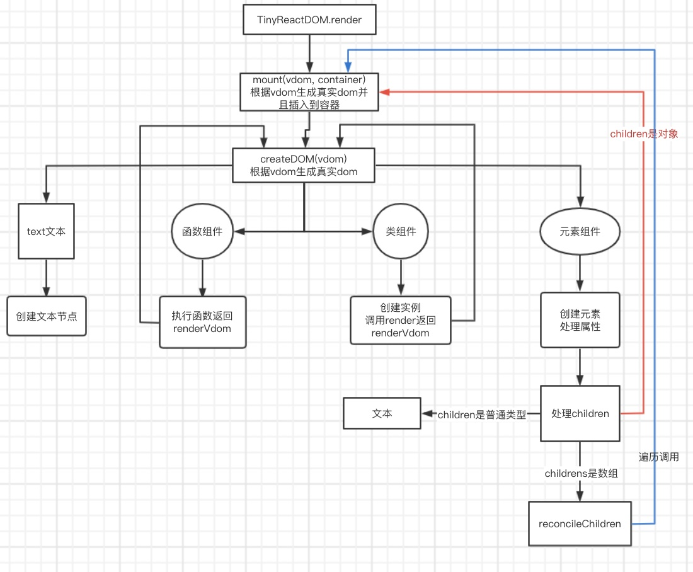

# 手写react(V15)

## 实现的功能

> 代码仓库: 

- TinyReact
  - createElement
  - lifecycle
  - Component
    - state
  - PureComponent
  - memo
  - createContext
  - createRef
  - forwardRef
- TinyReactDOM
  - render
- syntheticEvent

## TinyReact.createElement

> 执行TinyReact.createElement返回虚拟dom

**数据结构**

```ts
interface VDom {
    type: string | FunctionComponent | ClassComponent,
    props: {
        ...props,
        children: VDom | VDom[] | string | null
    },
    dom: HTMLELEMENT
}
```

```js
function createElement(type, props = {}, children) {
    const { ref, ...restProps } = props || {}
    if (arguments.length > 3) {
        children = [...arguments].slice(2).map(wrapperChildren)
    } else {
        children = wrapperChildren(children)
    }
    // 返回虚拟dom
    return {
        type,
        ref,
        props: {
            ...restProps,
            children
        }
    }
}

function wrapperChildren(child) {
    if (typeof child === 'string' || typeof child === 'number') {
        return {
            type: TEXT,
            props: {
                content: child
            }
        }
    }

    return child
}
```

## 渲染流程



### 主渲染
- render: 根节点渲染
- mount: 根据虚拟dom挂载真实的dom
- createDOM: 根据虚拟dom创建真实dom

```js
// 将虚拟dom挂载到容器上
function render(rootVdom, container) {
    // 挂载
    mount(rootVdom, container)
    scheduleUpdate = () => {
        compareTwoVdom(container, rootVdom, rootVdom)
    }
}

/**
 * 渲染虚拟dom
 */
function mount(vdom, container) {
    // 创建真实dom
    const dom = createDOM(vdom)

    container.appendChild(dom)

    dom.componentDidMount?.()
}

// 根据虚拟dom创建真实的dom
export function createDOM(vdom) {
    const { type } = vdom

    // 纯文本
    if (type === TEXT) {
        return mountTextNode(vdom)
    }

    // 是函数组件/类组件
    if (typeof type === 'function') {
        if (type.isReactComponent) {
            // 创建类组件真实dom
            return mountClassComponent(vdom)
        }
        // 创建函数组件真实dom
        return mountFunctionComponent(vdom)
    }

    // 特殊情况: createContext.Provider
    if (typeof type === 'object') {
        const realVdom = type.type(type.props)
        vdom.lastRenderVdom = realVdom
        return createDOM(realVdom)
    }

    return mountElement(vdom)
}
```

### 根据虚拟dom创建文本节点
```js
// 挂载文本节点
function mountTextNode(vdom) {
    const { props = {} } = vdom
    const { content } = props

    const dom = document.createTextNode(content)
    vdom.dom = dom
    return dom
}
```

### 根据虚拟dom创建原生节点

1. 将vdom虚拟dom变成真实dom
2. 将vdom属性更新到dom上
3. 将虚拟dom的儿子们变成真实dom,挂载在自己dom上, 
   1. 儿子是普通类型
   2. 儿子是数组, 则遍历进行挂载mount
   3. 儿子是对象, 则进行挂载mount

```js
// 挂载原生元素
function mountElement(vdom) {
    const { type, props = {} } = vdom
    const { children } = props

    // 创建原生元素标签
    const dom = document.createElement(type)

    if (vdom.ref) {
        vdom.ref.current = dom
    }

    // 处理属性 -> 详情看处理事件机制
    updateProps(dom, props)

    // 处理children 
    if (typeof children === 'string' || typeof children === 'number' || typeof children === 'undefined') {
        dom.textContent = children
    }
    // 是虚拟dom
    else if (typeof children === 'object' && children.type) {
        mount(children, dom)
    }
    // 数组
    else if (Array.isArray(children)) {
        reconcileChildren(children, dom)
    }
    // 啥也不是
    else {
        document.textContent = children ? children.toString() : ''
    }

    vdom.dom = dom

    return dom
}

/**
 * 处理虚拟dom数组变成真实dom
 * @param {*} vDomChildren 虚拟dom数组
 * @param {*} parentDOM 真实父DOM
 */
 function reconcileChildren(vDomChildren, parentDOM) {
    for (let i = 0; i < vDomChildren.length; i += 1) {
        if (vDomChildren[i] !== undefined) {
            mount(vDomChildren[i], parentDOM)
        }
    }
}
```

### 处理类组件

1. 创建类的实例
2. 调用实例的render方法
3. 将render返回的虚拟dom创建成真实dom

```js
/**
 * 将类组件渲染成真实dom
 * @param {*} vdom 
 * @returns 
 */
function mountClassComponent(vdom) {
    const { type: ClassComponent, props, ref } = vdom

    // 创建类的实例
    const instance = new ClassComponent(props)

    if (ref) {
        ref.current = instance
        instance.ref = ref
    }

    // 将类挂载到ownType, 给后面拿到类的静态方法getDerivedStateFromProps
    instance.ownType = ClassComponent

    // 类有静态属性contextType, 则给这个实例增加context属性
    if (ClassComponent.contextType) {
        instance.context = ClassComponent.contextType?.Provider?._value
    }

    // getDerivedStateFromProps 从props得到state
    if (ClassComponent.getDerivedStateFromProps) {
        const state = ClassComponent.getDerivedStateFromProps(instance.props, instance.state)

        instance.state = {
            ...instance.state,
            ...state
        }
    }

    // 调用实例的render方法, 返回虚拟dom
    const renderVdom = instance.render.call(instance)

    // 根据render返回虚拟dom生成真实dom
    const dom = createDOM(renderVdom)

    instance.dom = dom

    // 上次执行render返回的虚拟dom
    instance.lastRenderVdom = renderVdom

    vdom.instance = instance

    if (instance.componentDidMount) {
        dom.componentDidMount = instance.componentDidMount.bind(instance)
    }

    return dom
}
```

### 处理函数组件
1. 调用函数组件
2. 将函数组件返回虚拟dom创建成真实dom

```js
/**
 * 将函数组件渲染成真实dom
 * @param {*} vdom 
 * @returns 
 */
function mountFunctionComponent(vdom) {
    const { type: FunctionComponent, props } = vdom

    // 传入props, 执行函数组件
    const renderVdom = FunctionComponent(props)

    vdom.lastRenderVdom = renderVdom

    // 根据render返回虚拟dom创建真实dom
    const dom = createDOM(renderVdom)

    return dom
}
```

## 处理事件机制

**先看处理元素组件属性**

```js
export function updateProps(currentDOM, newProps, lastProps) {
    for (let key in newProps) {
        // 过滤children
        if (key === 'children') {
            continue
        }

        // 新旧一致
        if (lastProps && lastProps[key] === newProps[key]) {
            continue
        }

        // 处理样式
        if (key === 'style') {
            for (const attr in newProps[key]) {
                currentDOM.style[attr] = newProps[key][attr]
            }
            continue
        }

        if (key.startsWith('on')) {
            // 添加事件
            addEvent(currentDOM, key.toLocaleLowerCase(), newProps[key])
            continue
        }

        currentDOM.setAttribute(key, newProps[key])
    }

    if (!lastProps) {
        return
    }

    for (const key in lastProps) {
        if (newProps[key] === undefined) {
            currentDOM.removeAttribute(key)
        }
    }
}
```

### addEvent

**合成事件**
1. 处理事件在浏览器兼容性
2. 可以在事件处理函数前后做额外操作 `进入批量更新模式` 等操作

```js
/**
 * 给真实DOM绑定事件
 */
export default function addEvent(dom, eventType, handler) {
    if (!dom.store) {
        dom.store = {}
    }
    // 方便冒泡是从dom身上获取事件处理函数
    dom.store[eventType] = handler

    if (!document[eventType]) {
        document[eventType] = dispatchEvent
    }
}
```

### dispatchEvent

> 通过获取触发事件的元素, 冒泡向上

```js
import { updateQueue } from "./Updater"

// 合成事件
let syntheticEvent = {}

function dispatchEvent(event) {
    // 开启: 进入批量更新模式
    updateQueue.isBatchingUpdate = true

    let { target, type } = event
    const eventType = `on${type}`

    createSyntheticEvent(event)

    // 模拟事件冒泡
    while (target) {
        const listener = target.store?.[eventType]
        if (listener) {
            listener.call(undefined, syntheticEvent)
        }
        target = target.parentNode
    }

    // 清除合成事件对象
    clearSyntheticEvent()

    // 进行批量更新
    updateQueue.batchUpdate()
}

// 生成新的合成事件对象
function createSyntheticEvent(event) {
    for (const key in event) {
        syntheticEvent[key] = event[key]
    }
}

// 清除合成事件对象
function clearSyntheticEvent() {
    for (const key in syntheticEvent) {
        syntheticEvent[key] = null
    }
}
```

## TinyReact.Component

```js
// 更新队列
export const updateQueue = {
    // 是否存于批量更新模式
    isBatchingUpdate: false,
    updater: new Set(),
    // 批量更新
    batchUpdate() {
        for (const updater of this.updater) {
            updater.updateClassComponent()
        }
        this.updater.clear()
        this.isBatchingUpdate = false
    }
}

class Updater {
    constructor (classInstance) {
        this.classInstance = classInstance
        // 等待更新的状态
        this.pendingState = []
        // 状态更新后的回调
        this.callbacks = []
    }

    // 先将setState放到队列中
    addState(partialState, cb) {
        this.pendingState.push(partialState)
        if (typeof cb === 'function') {
            this.callbacks.push(cb)
        }
        // 尝试更新
        this.emitUpdate()
    }

    emitUpdate(newProps) {
        this.newProps = newProps

        if (updateQueue.isBatchingUpdate) {
            // 处于批量更新模式
            updateQueue.updater.add(this)
            return
        }

        // 处于非批量更新模式, 直接更新
        this.updateClassComponent()
    }

    // 获取新的state
    getState() {
        const { pendingState, classInstance } = this
        const { state: oldState } = classInstance

        let state = oldState
        pendingState.forEach(nextState => {
            if (typeof nextState === 'function') {
                nextState = nextState.call(classInstance, state)
            }
            state = { ...state, ...nextState }
        })

        pendingState.length = 0

        return state
    }

    updateClassComponent() {
        const { pendingState, classInstance, callbacks, newProps } = this

        if (newProps || pendingState.length > 0) {
            // 拿到最新的props和state
            shouldComponentUpdate(classInstance, newProps, this.getState(), callbacks)
        }
    }
}

// 组件是否更新
function shouldComponentUpdate(classInstance, newProps, nextState, callbacks) {
    // 处理 static getDerivedStateFromProps生命周期
    const { ownType: ClassComponent } = classInstance
    if (ClassComponent.getDerivedStateFromProps) {
        classInstance.state = {
            ...classInstance.state,
            ...ClassComponent.getDerivedStateFromProps(newProps, classInstance.state)
        }
    }

    // 处理shouldComponentUpdate生命周期
    if (
        classInstance.shouldComponentUpdate
        && !classInstance.shouldComponentUpdate(newProps, nextState)
    ) {
        classInstance.state = nextState
        if (newProps) {
            classInstance.props = newProps
        }
        callbacks.length = 0
        return
    }

    classInstance.state = nextState

    if (newProps) {
        classInstance.props = newProps
    }
    classInstance.forceUpdate()
    callbacks.forEach(callback => callback())
    callbacks.length = 0
}

export default Updater
```

```js
export default class Component {
    // 标识是函数组件还是类组件
    static isReactComponent = true

    constructor (props) {
        this.props = props
        this.updater = new Updater(this)
    }

    // 添加更新任务
    setState(partialState, cb) {
        this.updater.addState(partialState, cb)
    }

    // 强制更新
    forceUpdate = () => {
        // 调用render, 拿到最新的render虚拟dom
        const newRenderVdom = this.render.call(this)
        const prevProps = this.lastRenderVdom.props
        const prevState = this.state

        // 找到真实dom
        const oldDOM = findDOM(this.lastRenderVdom)

        // 比较两个虚拟dom
        compareTwoVdom(
            oldDOM?.parentNode || null,
            this.lastRenderVdom,
            newRenderVdom,
        )

        // 记录上一次的render虚拟dom
        this.lastRenderVdom = newRenderVdom
        this.componentDidUpdate?.(prevProps, prevState)
    }
}
```

### 生命周期(类组件)

**挂载阶段**

```js
function mountClassComponent(vdom) {
    // 创建类的实例 -> constructor
    const instance = new ClassComponent(props)

    // static getDerivedStateFromProps 
    // 从props得到state
    if (ClassComponent.getDerivedStateFromProps) {
        const newState = ClassComponent.getDerivedStateFromProps(
            instance.props, 
            instance.state
        )
        
        if(newState!==null){
            instance.state = {
                ...instance.state,
                ...newState
            }
        }
    }

    // render
    // 调用实例的render方法, 返回虚拟dom
    const renderVdom = instance.render.call(instance)

    // 根据render返回虚拟dom生成真实dom
    const dom = createDOM(renderVdom)

    // 先挂载到dom上, 插入页面中后执行componentDidMount
    if (instance.componentDidMount) {
        dom.componentDidMount = instance.componentDidMount.bind(instance)
    }

    // 此时真实dom还未插入页面中
    return dom
}

function mount(vdom, container) {
    const dom = createDOM(vdom)

    container.appendChild(dom)

    // 真正执行componentDidMount
    dom.componentDidMount?.()
}
```

**更新阶段**

```js
function updateClassComponent(classInstance, newProps, nextState, callbacks) {
    // 处理 static getDerivedStateFromProps生命周期
    const { ownType: ClassComponent } = classInstance
    if (ClassComponent.getDerivedStateFromProps) {
        const newState = ClassComponent.getDerivedStateFromProps(newProps, classInstance.state)
        if(newState!==null){
            classInstance.state = {
                ...classInstance.state,
                ...newState
            }
        }
    }

    // 处理shouldComponentUpdate生命周期
    if (
        classInstance.shouldComponentUpdate
        && !classInstance.shouldComponentUpdate(newProps, nextState)
    ) {
        classInstance.state = nextState
        if (newProps) {
            classInstance.props = newProps
        }
        callbacks.length = 0
        return
    }

    classInstance.state = nextState

    if (newProps) {
        classInstance.props = newProps
    }
    classInstance.forceUpdate()
    callbacks.forEach(callback => callback())
    callbacks.length = 0
}

export default class Component {
    forceUpdate = () => {
        // 调用render, 拿到最新的render虚拟dom
        const newRenderVdom = this.render.call(this)
        
        // ...

        this.componentDidUpdate?.(prevProps, prevState)
    }
}
```

## compareTwoVdom(dom-diff)
1. 新旧虚拟dom都没有(啥也不用做)
2. 旧的有虚拟dom, 新的没有虚拟dom(走卸载旧的虚拟dom) 
3. 旧的没有虚拟dom, 新的有虚拟dom(走新的虚拟dom挂载)
4. 新旧都有虚拟dom
   1. 类型不一样(卸载旧的虚拟dom, 挂载新的虚拟dom)
   2. 类型是文本节点(直接替换文本节点内容)
   3. 类型是元素节点
      1. 更新属性(updateProps)
      2. 更新children(updateChildren) -> 见下面
   4. 类型是类组件
      1. 调用类实例的emitUpdate
      2. 在批量更新时执行
      3. updateClassComponent
      4. 判断实例的shouldComponentUpdate
         1. 不通过: 更新state,props等,不调用render
         2. 通过: 
            1. 调用render
            2. 调用compareTwoVdom进行新旧虚拟dom对比

### updateChildren

```js
function updateChildren(parentDOM, lastRendeChildren, newRenderChildren) {
    lastRendeChildren = toArray(lastRendeChildren)
    newRenderChildren = toArray(newRenderChildren)

    const maxLength = Math.max(lastRendeChildren.length, newRenderChildren.length)
    for (let i = 0; i < maxLength; i += 1) {
        const nextDOM = lastRendeChildren.find((vdom, index) => index > i && vdom && vdom.dom)
        compareTwoVdom(parentDOM, lastRendeChildren[i], newRenderChildren[i], nextDOM?.dom)
    }
}
```

### 完整代码

```js
// dom diff
export function compareTwoVdom(parentDOM, lastRenderVdom, newRenderVdom, nextDOM) {
    // 新旧虚拟dom都没有, 什么都不用做
    if (!lastRenderVdom && !newRenderVdom) {
        return
    }

    // 旧的有虚拟dom, 新的没有虚拟dom, 走卸载
    if (lastRenderVdom && !newRenderVdom) {
        const currentDOM = findDOM(lastRenderVdom)
        if (currentDOM) {
            parentDOM.removeChild(currentDOM)
        }

        lastRenderVdom.instance?.componentWillUnMount?.()
        return
    }

    // 旧的没有, 新的有虚拟dom -> 挂载流程
    if (!lastRenderVdom && newRenderVdom) {
        const newDOM = createDOM(newRenderVdom)
        if (nextDOM) {
            parentDOM.insertBefore(newDOM, nextDOM)
        } else {
            parentDOM.appendChild(newDOM)
        }
        newDOM?.componentDidMount?.()
        return newRenderVdom
    }

    // 新老都有, 但类型不一致
    if (lastRenderVdom.type !== newRenderVdom.type) {
        const oldDOM = findDOM(lastRenderVdom)
        const newDOM = createDOM(newRenderVdom)
        lastRenderVdom.classInstance?.componentWillUnMount?.()
        parentDOM.replaceChild(newDOM, oldDOM)
        return newRenderVdom
    }

    // 深度dom-diff
    updateElement(lastRenderVdom, newRenderVdom)
}

// dom-diff
function updateElement(lastRenderVdom, newRenderVdom) {
    const { type } = lastRenderVdom
    // 文本节点
    if (type === TEXT) {
        const { dom: currentDOM } = lastRenderVdom
        newRenderVdom.dom = currentDOM
        if (lastRenderVdom.props.content === newRenderVdom.props.content) {
            return
        }
        currentDOM.textContent = newRenderVdom.props.content
        return
    }

    // 原生元素
    if (typeof type === 'string') {
        // 将原来的dom赋值到新的虚拟dom上
        const { dom: currentDOM } = lastRenderVdom
        newRenderVdom.dom = currentDOM

        // 更新属性
        updateProps(currentDOM, newRenderVdom.props, lastRenderVdom.props)

        // 更新子节点
        updateChildren(currentDOM, lastRenderVdom.props.children, newRenderVdom.props.children)
        return
    }

    // 类组件
    if (type.isReactComponent) {
        updateClassComponent(lastRenderVdom, newRenderVdom)
        return
    }

    // 函数组件
    // console.log(type)
    updateFunctionComponent(lastRenderVdom, newRenderVdom)
}

// 核心dom-diff
function updateChildren(parentDOM, lastRendeChildren, newRenderChildren) {
    lastRendeChildren = toArray(lastRendeChildren)
    newRenderChildren = toArray(newRenderChildren)

    const maxLength = Math.max(lastRendeChildren.length, newRenderChildren.length)
    for (let i = 0; i < maxLength; i += 1) {
        const nextDOM = lastRendeChildren.find((vdom, index) => index > i && vdom && vdom.dom)
        compareTwoVdom(parentDOM, lastRendeChildren[i], newRenderChildren[i], nextDOM?.dom)
    }
}

function findDOM(vdom) {
    if (!vdom) {
        return
    }

    const { type } = vdom

    if (typeof type === 'string' || typeof type === 'symbol') {
        return vdom.dom
    }

    // 类组件
    if (type.isReactComponent) {
        if (vdom.instance.dom) {
            return vdom.instance.dom
        }
        return findDOM(vdom.instance)
    }

    return findDOM(vdom.lastRenderVdom)
}

// 更新类组件
function updateClassComponent(lastVdom, newVdom) {
    const { instance } = lastVdom
    newVdom.instance = instance

    if (instance.ownType.contextType) {
        instance.context = instance.ownType.contextType?.Provider?._value
    }

    instance.updater.emitUpdate(newVdom.props)
}

// 更新函数式组件
function updateFunctionComponent(lastVdom, newVdom) {
    const parentDOM = findDOM(lastVdom).parentNode
    const { type, props } = newVdom

    let newRenderVdom
    if (typeof type === 'function') {
        newRenderVdom = type(props)
    } else {
        // 处理 例如Context.Consumer
        console.log(type)
        newRenderVdom = type.type(type.props)
    }

    compareTwoVdom(parentDOM, lastVdom.lastRenderVdom, newRenderVdom)

    newVdom.lastRenderVdom = newRenderVdom
}
```

## context

```js
const createContext = (initailValue) => {
    Provider._value = initailValue

    // 提供
    function Provider(props) {
        if (!Provider._value) {
            Provider._value = {}
        }
        Provider._value = Object.assign(Provider._value, props.value)

        return props.children
    }

    // 消费
    function Consumer(props) {
        return props.children(Provider._value)
    }

    return {
        Provider,
        Consumer
    }
}

export default createContext
```

**主要处理class组件**

```js
function mountClassComponent(vdom) {
  // ...

  // 将类挂载到ownType, 给后面拿到类的静态方法getDerivedStateFromProps
  instance.ownType = ClassComponent

  // 类有静态属性contextType, 则给这个实例增加context属性
  if (ClassComponent.contextType) {
      instance.context = ClassComponent.contextType?.Provider?._value
  }
    
    // ....
}

// 更新类组件
function updateClassComponent(lastVdom, newVdom) {
    // ...

    if (instance.ownType.contextType) {
        instance.context = instance.ownType.contextType?.Provider?._value
    }

    // ...
}
```

## shouldComponentUpdate

- 组件是否更新
  - true: 更新
  - false: 不更新

```js
export class PureComponent extends Component {
    shouldComponentUpdate(nextProps, nextState) {
        return !(shallowEqual(this.props, nextProps) && shallowEqual(this.state, nextState))
    }
}
```

## TinyReact.memo

- areEqual是否相等
  - true: 不更新
  - false: 更新

```js
function memo(MemoComponent, areEqual) {
    // 如果传了比对函数
    if (areEqual) {
        // 如果一致, 则返回true
        return class extends Component {
            shouldComponentUpdate(nextProps) {
                return !areEqual(this.props, nextProps)
            }
            render() {
                return MemoComponent(this.props)
            }
        }
    }

    return class extends PureComponent {
        render() {
            return MemoComponent(this.props)
        }
    }

}
```

## ref

### TinyReact.createRef

```js
function createRef(current = null) {
    return { current }
}
```

**挂载到原生元素上**

```js
function mountElement(vdom) {
    // 创建原生元素标签
    const dom = document.createElement(type)

    if (vdom.ref) {
        vdom.ref.current = dom
    }
}
```

**ref挂载到类组件上**

```js
function mountClassComponent(vdom) {
    // 创建类的实例
    const instance = new ClassComponent(props)

    if (ref) {
        ref.current = instance
        // 为了forwardRef做准备
        instance.ref = ref
    }
}
```

### React.forwardRef

```js
function forwardRef(FunctionComponent) {
    return class extends PureComponent {
        render() {
            // 函数组件的第二个参数就是ref
            return FunctionComponent(this.props, this.ref)
        }
    }
}
```
