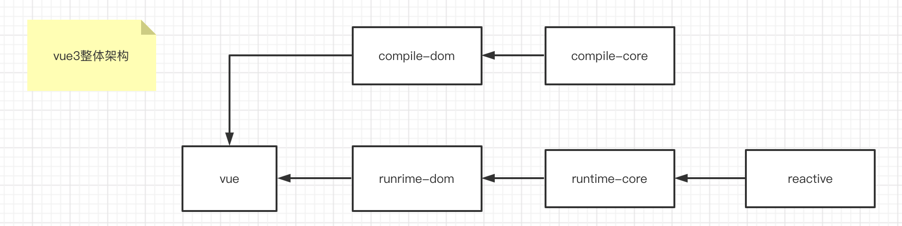
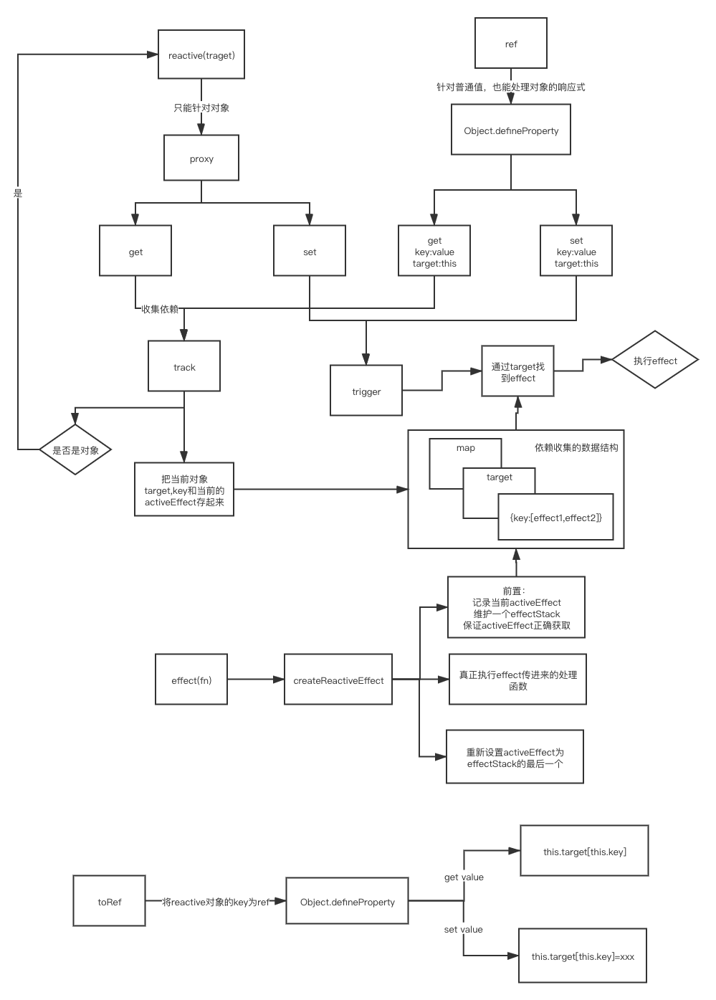
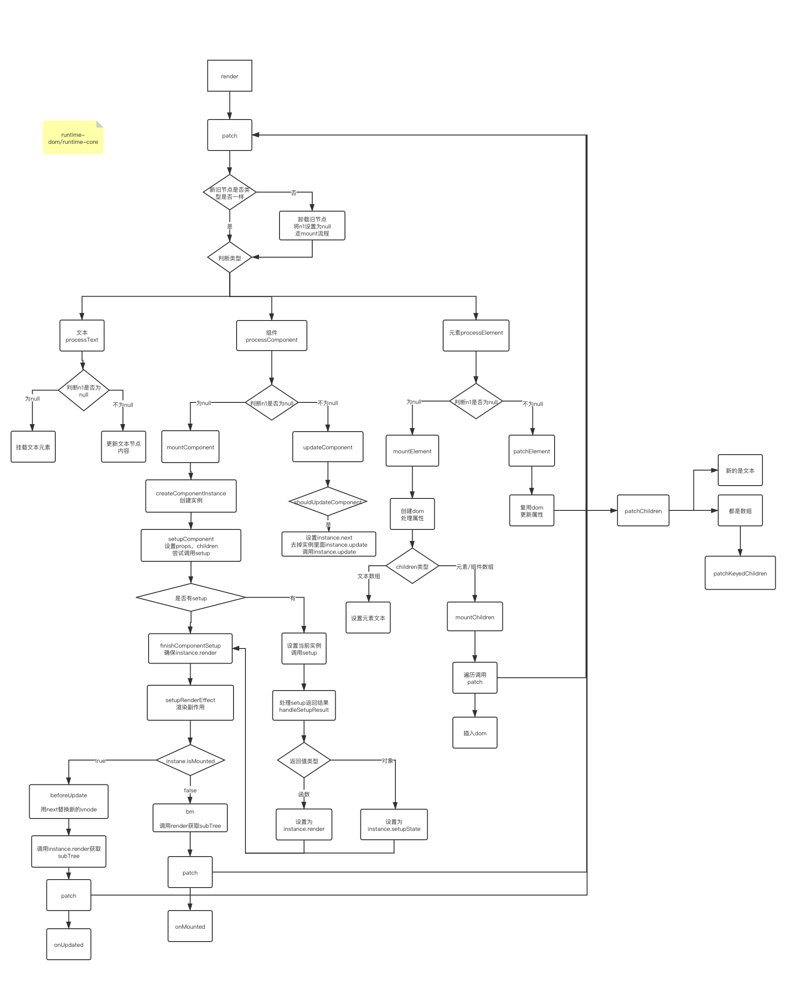
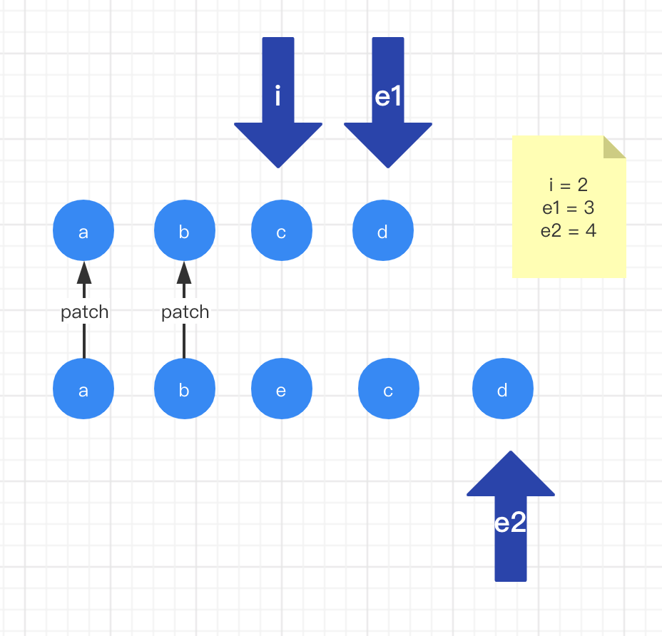
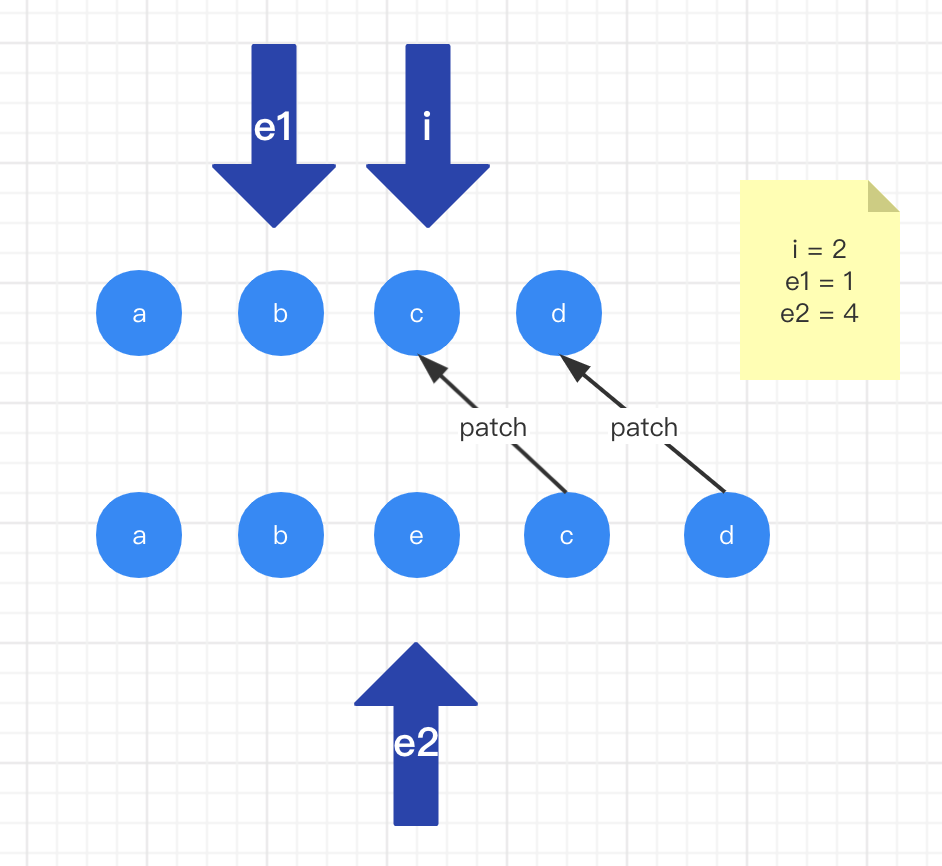
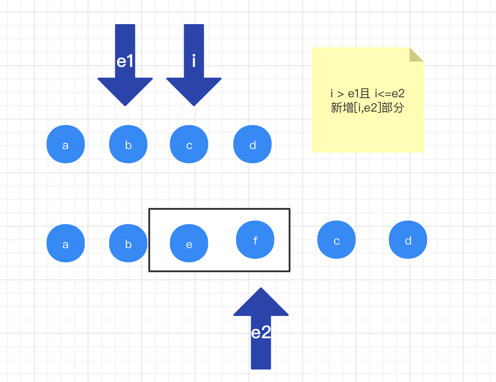
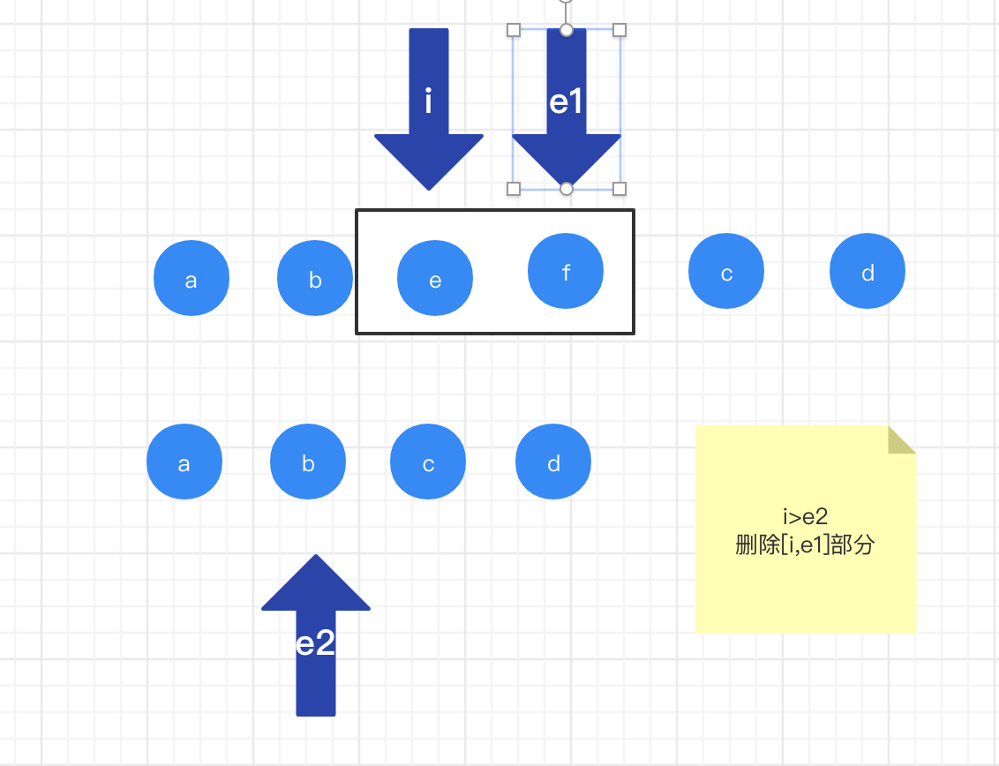

# 手写vue3

> 在线地址：https://github.com/xuxiaozhou/my-vue3

## Vue3目录介绍

- packages 
  - reactivity: 响应式
  - runtime-core: 运行时核心
  - runtime-dom: DOM环境的运行
  - shared: 公共函数
- scripts： 脚本
- rollup.config.js: rollup编译文件
- tsconfig.json:

## 包的关系



## reactivity

### 响应式api

| api             | 作用   | dep  |
| --------------- | ------ | ---- |
| reactive        | 响应式 | 深层 |
| readonly        | 只读   | 深层 |
| shallowReactive | 响应式 | 浅层 |
| shallowReadonly | 只读   | 浅层 |



### API

- 通过高阶函数，只需要传入深浅层和对应的proxy的get,set处理即可实现4个方法

```ts
export function reactive<T = object>(obj: T) {
  return createReactiveObject(obj, false, reactiveHandler);
}

// 对象的任何层都只读
export function readonly<T = object>(obj: T) {
  return createReactiveObject(obj, true, readonlyHandler);
}

// 对象的浅层响应式，深层不响应
export function shallowReactive(obj) {
  return createReactiveObject(obj, false, shallowReactiveHandler);
}

// 对象的浅层只读，深度只读
export function shallowReadonly(obj) {
  return createReactiveObject(obj, true, shallowReadonlyHandler);
}
```

### createReactiveObject

- 都是采用proxy代理响应式
- 只能代理对象
- 通过reactiveMap和readonlyMap的防止重复代理
- 使用weakMap的作用可以在target被销毁是，weakMap能够同时垃圾回收

```ts
// 缓存已经处理过的对象：在target销毁时能被垃圾回收
const reactiveMap = new WeakMap();
const readonlyMap = new WeakMap();

function createReactiveObject(target, isReadonly, baseHandlers) {
  // 只能处理是对象类型
  if (!isObject(target)) {
    return target;
  }

  const map = isReadonly ? readonlyMap : reactiveMap;

  if (map.has(target)) {
    // 返回已经缓存
    return map.get(target);
  }

  const proxy = new Proxy(target, baseHandlers);
  map.set(target, proxy);

  return proxy;
}
```

### handlers

- 主要是实现4个api不同的get和set
- 封装get和set高阶函数，可以传入不同参数

```ts
export const reactiveHandler = {
  get: createGet(),
  set: createSet(true)
};

export const shallowReactiveHandler = {
  get: createGet(false, true),
  set: createSet(true)
};

// readonly的设置都返回报错
export const readonlyHandler = {
  get: createGet(true),
  set: () => {
    console.log('error');
  }
};
export const shallowReadonlyHandler = {
  get: createGet(true, true),
  set: () => {
    console.log('error');
  }
};
```

### createGet

- 创建handler的get
- track的作用是此对象和此属性收集依赖

```ts
/**
 * createGet
 * @param isReadonly 是否只读
 * @param shallow 是否浅层
 * @returns function
 */
function createGet(isReadonly = false, shallow = false) {
  return function (target, key, receiver) {
    // 类比 target[key]
    const result = Reflect.get(target, key, receiver);

    if (!isReadonly) {
      // 非只读，需要收集依赖
      track(target, key, TrackOptType.GET);
    }

    if (shallow) {
      // 浅层的就结束
      return result;
    }

    // 如果是对象，且非浅层的，还是继续递归调用readonly和reactive
    if (isObject(result)) {
      return isReadonly ? readonly(result) : reactive(result);
    }

    // 非对象就直接返回
    return result;
  };
}
```

### createSet

- 设置会判断操作类型：新增或修改
  - 新增：
    - 对象：设置的key不是对象本身已有的属性
    - 数组：key为索引，且索引值大于数组本身长度
  - 修改：新旧值不一样则是修改
- trigger：通知依赖触发更新操作

```ts
/**
 * 创建set
 * @param shallow 是否浅层
 * @returns 
 */
function createSet(shallow = false) {
  return function (target, key, value, receiver) {
    // 获取原来值
    const oldValue = Reflect.get(target, key);

    // 设置后会返回一个是否成功
    const result = Reflect.set(target, key, value, receiver);

    /**
     * 新增
     *    数组：并且设置索引，并且设置的索引比当前数组的长度还长
     *    对象：设置的key不是对象本身已有的属性
     * 修改
     *    新旧值不一样则是修改
     */
    const hasKey = isArray(target) && isInteger(key)
      ? Number(key) < target.length - 1
      : hasOwn(target, key);

    if (!hasKey) {
      // 通知：新增操作
      trigger(target, TriggerOpt.ADD, key, value);
    } else if (hasChanged(oldValue, value)) {
      // 通知：修改操作
      trigger(target, TriggerOpt.SET, key, value, oldValue);
    }

    // 返回修改结果
    return result;
  };
}
```

### 了解effect

> 在了解trigger和track之前，先了解effect

其作用：默认会执行一次，在effect执行函数用到的响应式变量（reactive,readonly,shallowReactive,shallowReadonly,ref,shallowRef包装过）会被收集依赖，当这边变量发生变化是会再次执行此函数

```js
const state = reactive({ hello: 'world', other: 1 })

// 默认会执行此函数fn
effect(()=>{  // fn
  // 使用累reactive包装后的变量
  app.innerHTML = state.hello
})

setTimeout(() => {
  state.hello = 'vue'
  // 修改后会默认调用fn函数
}, 1000);
```

### effect：副作用

```ts
export function effect(fn, options: EffectOptions = {}) {
  // 创建响应式
  const effect = createReactiveEffect(fn, options);

  // 如果没有设置lazy，会立即执行一次
  if (!options.lazy) {
    effect();
  }

  return effect;
}
```

### createReactiveEffect：创建响应式副作用

```ts
// 存放当前的effect，方便track将target，key和对应的effect关联起来
let activeEffect;
// 存放一个栈形结构，保证activeEffect指向正确
const effectStack = [];

let uid = 0;
function createReactiveEffect(fn, options) {
  const effect = function createEffect() {
    // 保证不再重复
    if (!effectStack.includes(effect)) {
      try {
        effectStack.push(effect);
        activeEffect = effect;
      
        // 其实还是调用传进来的函数
        return fn();
      } finally {
        // 保证effect永远正确
        effectStack.pop();
        activeEffect = effectStack[effectStack.length - 1];
      }
    }
  };

  effect.id = uid++;
  effect.__isEffect = true;
  effect.raw = fn;
  effect.options = options;

  return effect;
}
```

### 存在effectStack的原因

```js
effect(()=>{  // effect1
  state.name =1
  effect(()=>{  // effect2
    state.age=2
  })
  state.address=3   // 此处应该存effect1，如果没有当一个effect执行完后重制为数组最后一个，此时存的就是effect1
})
```

### track: 收集依赖

> 对象，key和effect需要关联起来

```ts
/**
 * 收集依赖，将target,key关联起来
 * @param target 对象
 * @param key  属性
 * @param type 类型
 * @returns 
 */
export function track(target, key, type) {
  // 此处的activeEffect是跟effect在同一文件。
  // 主要利用js是单线程的机制
  // 如果当前使用值不在effect里面使用是不需要收集
  if (!activeEffect) {
    return;
  }

  /***
  存储的数据结果
  Weakmap {
    [ target ]: Map {
      [ key ] : Set [ effect1, effect2 ]
    }
  }
  */
  let depsMap = targetMap.get(target);
  if (!depsMap) {
    depsMap = new Map();
    targetMap.set(target, depsMap);
  }

  let depMap = depsMap.get(key);
  if (!depMap) {
    depMap = new Set();
    depsMap.set(key, depMap);
  }

  const dep = depMap.has(activeEffect);
  if (!dep) {
    depMap.add(activeEffect);
  }
}
```

### trigger: 触发更新

- 通过target获取此对象收集的依赖
- 修改数组长度
  - 触发收集length的effect
  - 触发收集索引大于length的effect
- 修改
  - 触发收集对应key的effect
- 如果是数组，且是新增操作
  - 触发收集length的effect

```ts
/**
 * 触发更新
 * @param target 对象
 * @param type 更新类型
 * @param key 属性
 * @param newValue 新值
 * @param oldValue 旧值
 * @returns 
 */
export function trigger(target, type, key: string, newValue?, oldValue?) {
  // 此对象没被依赖收集就不需要处理
  const depsMap = targetMap.get(target);
  if (!depsMap) {
    return;
  }

  // 要执行的effect存到新的集合
  const effects = new Set();
  const add = (effectToAdd) => {
    if (effectToAdd) {
      effectToAdd.forEach(effect => {
        effects.add(effect);
      });
    }
  };

  // 修改数组的长度
  if (isArray(target) && key === 'length') {
    depsMap.forEach((dep, key) => {
      // 更改长度
      // length收集的effects要执行
      // 大于新设置长度的索引收集的effects也要执行
      if (key === 'length' || (isNumber(key) && Number(key) > newValue)) {
        add(dep);
      }
    });
  } else {
    if (key !== undefined) {
      // 修改
      add(depsMap.get(key));
    }

    switch (type) {
      case TriggerOpt.ADD:
        // 数组：新增操作，length收集的effects要执行
        if (isArray(target) && isInteger(key)) {
          add(depsMap.get('length'));
        }
    }
  }

  // 要执行的effects依次执行
  effects.forEach((effect: any) => {
    // effect不一定都是立即执行的，可能做一下其他事情，比如computed
    if (effect.options?.scheduler) {
      effect.options.scheduler(effect);
    } else {
      effect();
    }
  });
}
```

### ref

#### 使用

```ts
const name = ref('hello')
const age = ref({ num: 10 })

effect(() => {
  app.innerHTML = name.value + '---' + age.value.num
})

setTimeout(() => {
  name.value = 'world'
}, 1000);

setTimeout(() => {
  age.value.num = 20
}, 2000);
```

#### 特点

- 针对reactive等不支持对象的形式支持
- 支持除了普通类型也是支持引用类型
- 使用`.value`
- 使用的Object.defineProperty去实现对value的响应式

### ref/shallowRef

```ts
// 传进来的是普通值
export function ref(value: string | number | boolean | object) {
  return createRef(value);
}

// 传进来的是普通值
export function shallowRef(value) {
  return createRef(value, true);
}
```

### createRef

```ts
function createRef(value, isShallow = false) {
  return new RefImpl(value, isShallow);
}

// 如果是对象则采用reactive
const convert = val => isObject(val) ? reactive(val) : val;

class RefImpl {
  // 存放处理过的值
  public _value;
  // 存放原值
  public _rawValue;
  private isShallow;
  // 增加标识
  public _v_isRef = true;

  public constructor(value, isShallow) {
    // 如果是深度且是对象，只用reactive去处理响应式
    this._value = isShallow ? value : convert(value);
    // 保存原值
    this._rawValue = value;
    this.isShallow = isShallow;
  }

  get value() {
    // 收集此对象的 value 字段的依赖
    track(this, 'value', TrackOptType.GET);
    return this._value;
  }

  set value(newValue) {
    // 判断是否有改变
    if (hasChanged(newValue, this._rawValue)) {
      this._rawValue = newValue;
      // 如果非浅层，则判断是否是对象，如果是对象则进行调用reactive
      this._value = this.isShallow ? newValue : convert(newValue);
      
      // 触发此对象 设置 value 字段的更新
      trigger(this, TriggerOpt.SET, 'value', newValue, this._value);
    }
  }
}
```

### toRef

#### 使用

> 将响应式对象的某个属性转成`ref`

```ts
const person = reactive({ name: 'allen', age: 10 })
const name = toRef(person, 'name')

effect(() => {
  app.innerHTML = name.value
})

setTimeout(() => {
  name.value = 'tom'
}, 1000)
```

#### 实现

- 只是做一个层代理

```ts
class ObjectRefImpl {
  public _v_isRef = true;
  public target;
  public key;
  constructor(target, key) {
    this.target = target;
    this.key = key;
  }

  get value() {
    return this.target[this.key];
  }

  set value(newValue) {
    this.target[this.key] = newValue;
  }
}

// 传进来的是响应式对象
// 将一个响应式对象的属性变成ref
// 代理了对象的属性
export function toRef(target, key) {
  return new ObjectRefImpl(target, key);
}
```

### toRefs

```ts
// 传进来的是响应式对象
export function toRefs(target) {
  const ret = isArray(target) ? new Array(target.length) : {};
  for (const key in target) {
    ret[key] = toRef(target, key);
  }

  return ret;
}
```

### computed

#### 使用
```ts
const age = ref(18)
const myAge = computed(() => {
  console.log('runner')
  return age.value + 10
})

// 第一次获取，会走函数
// runner
console.log(myAge.value)  // 28
// 这次computed依赖项没有修改，则不走函数，直接读缓存的值
console.log(myAge.value) // 28

// 修改age，computed依赖项发生改变，但不会立即执行，需要等待下次取值才会走函数
age.value = 10
// 还没更新
// {"_dirty":true,"_value":28}
console.log(JSON.stringify(myAge))  
// 因为依赖项发生改变，会重新执行
// runner
// 20
console.log(myAge.value)
```

#### computed

- getterOrOptions可以是函数/对象

```ts
type Getter<T = unknown> = () => T;
type GetterOption<T = unknown> = {
  get: Getter<T>;
  set: () => void;
};
type GetterOrOptions<T> = Getter<T> | GetterOption<T>;

export function computed<T = unknown>(getterOrOptions: GetterOrOptions<T>) {
  let getter;
  let setter;

  if (isFunction(getterOrOptions)) {
    getter = getterOrOptions;
    setter = () => {
      console.log('no change');
    };
  } else if (isObject(getterOrOptions)) {
    getter = (getterOrOptions as GetterOption).get;
    setter = (getterOrOptions as GetterOption).set;
  }

  return new ComputedRefImpl(getter, setter);
}
```

#### ComputedRefImpl

- computed基于effect
- 通过_dirty是否使用缓存值还是重新计算
- computed的值通过`.value`
- computed本身函数默认不执行，只有获取值是去调用
- 但computed依赖项没有发生改变时，不去走计算函数，直接使用缓存的值
- 但依赖项发生改变，不会立即执行。下次获取获取值是才会重新计算

```ts
// effect的执行由自己控制什么时候执行
class ComputedRefImpl {
  // 需不需要重新计算的标识符
  public _dirty = true;
  // 存储最新的值
  public _value;
  public setter: any;
  public effect;

  constructor(getter, setter) {
    this.setter = setter;
    this.effect = effect(getter, {
      // 不是立即执行
      lazy: true,
      // 调度
      scheduler: () => {
        if (!this._dirty) {
          // 设置下次get的时候执行重新获取最新的值
          // 修改this._dirty,在下次获取时就可以去获取新值
          this._dirty = true;
          // 触发收集这个依赖的effect
          trigger(this, TriggerOpt.SET, 'value');
        }
      }
    });
  }

  get value() {
    if (this._dirty) {
      // 缓存起来，不是每个获取都是去走effect的
      this._value = this.effect();
      this._dirty = false;
    }
    // 收集依赖
    track(this, 'value', TrackOptType.GET);
    return this._value;
  }

  set value(newValue) {
    this.setter(newValue);
  }
}
```

## runtime-dom

- 将dom操作等平台相关操作作为参数传入给createRenderer,是runtime-core是与平台无关
- 重写mount的原因是进行一些平台相关业务操作

```ts
// 渲染用到的方法：
// 跟平台相关的api
// 创建dom，修改dom属性等
const rendererOptions = { ...nodeOps, patchProp };

export function createApp(rootComponent, rootProps = null) {
  const app: any = createRenderer(rendererOptions).createApp(rootComponent, rootProps);
  const { mount } = app;
  // 重写mount，执行一些跟平台相关的操作
  app.mount = function (container) {
    // 获取真实dom
    container = nodeOps.querySelector(container);
    // 清空
    container.innerHTML = '';
    // 才是真正的挂载
    mount(container);
  };
  return app;
}

// 导出runtime-core
export * from '@vue/runtime-core';
```

## runtime-core



> 结合runtime-dom调用

```ts
createRenderer(rendererOptions).createApp(rootComponent, rootProps);
```

### createRenderer
> runtime-core/renderer.ts

```ts
// 创建渲染器
export function createRenderer(rendererOptions) {
  // 核心代码: 在此函数内能获取到平台相关的操作方法，减少传递
  // 。。。

  // 渲染
  const render = (vnode, container) => {
    patch(null, vnode, container);
  };

  return {
    // 调用createAppApi返回createApp，同时传递render
    createApp: createAppApi(render)
  };
}
```

### createAppApi

> runtime-core/createAppApi

```ts
export function createAppApi(render) {
  // 根组件，根组件的props
  return function createApp(rootComponent, rootProps) {
    const app = {
      _props: rootProps,
      _component: rootComponent,
      _container: null,
      mount(container) {
        // 创建虚拟节点
        const vnode = createVNode(rootComponent, rootProps);

        // 调用render
        render(vnode, container);

        app._container = container;
      }
    };
    return app;
  };
}
```

### createVNode 创建VNode

```ts
// 目前只考虑元素和组件
export function createVNode(type, props, children = null) {
  // 标识：为后期patch比较提供便利
  const shapeFlag = isString(type)
    ? ShapeFlags.ELEMENT
    : (isObject(type) ? ShapeFlags.STATEFUL_COMPONENT : 0);

  const vnode = {
    // 是否是vnode
    _v_isVnode: true,

    type,
    props,
    children,

    key: props && props.key,

    // 真实的节点
    el: null,
    // 实例
    component: null,

    shapeFlag
  };

  // 根据children标识
  normalizeChildren(vnode, children);

  return vnode;
}

// 设置children的类型
function normalizeChildren(vnode, children) {
  let type = 0;
  if (children === null) { }
  else if (isArray(children)) {
    type = ShapeFlags.ARRAY_CHILDREN;
  } else {
    type = ShapeFlags.TEXT_CHILDREN;
  }

  vnode.shapeFlag |= type;
}
```

### render 渲染

```ts
// 调用patch
patch(null, vnode, container);
```

### patch: 核心中的核心

> 挂载和更新组件/元素都走此方法

- n1为null是代表走挂载流程
- 否则走更新流程
- 如果新旧VNode的类型不一样，则把旧VNode干掉，重新走挂载流程
- 根据VNode不同类型做不同操作

```ts
/**
  * 打补丁：挂载和更新的功能
  * @param n1 旧节点
  * @param n2 新节点
  * @param container 挂载容器
  * @param anchor 当前元素的参照物
  */
const patch = (n1, n2, container, anchor = null) => {
  const { shapeFlag, type } = n2;

  // 如果有旧vnode，且不是相同类型：直接把旧节点干掉，走挂载的流程
  if (n1 && !isSameVNodeType(n1, n2)) {
    //  删除以前，换成新的
    anchor = hostNextSibling(n1);
    unmount(n1);
    n1 = null;
  }

  // 根据不同类型，做不同操作
  switch (type) {
    case TEXT:
      // 文本节点，特殊处理
      processText(n1, n2, container);
      break;
    default:
      if (shapeFlag & ShapeFlags.ELEMENT) {
        // 元素
        processElement(n1, n2, container, anchor);
      } else if (shapeFlag & ShapeFlags.STATEFUL_COMPONENT) {
        // 组件
        processComponent(n1, n2, container);
      }
  }
};
```

### processText：处理文本节点

- n1为null时，走挂载流程
- n1不为null时，走更新流程
- hostCreateText/hostInsert/hostSetText等方法则是调用createRenderer传递的参数

```ts
const processText = (n1, n2, container) => {
  if (n1 === null) {
    // 挂载
    // 新建文本节点
    n2.el = hostCreateText(n2.children);
    // 插入父容器
    hostInsert(n2.el, container);
  } else {
    // 更新：复用旧节点的元素
    const el = n2.el = n1.el;
    // 比较新旧文本节点的children是否一致
    if (n2.children !== n1.children) {
      // 如果不同只重新设置文本内容
      hostSetText(el, n2.children);
    }
  }
};
```

### processElement：处理Element元素

```ts
const processElement = (n1, n2, container, anchor = null) => {
  if (n1 === null) {
    // 元素挂载
    mountElement(n2, container, anchor);
  } else {
    // 元素更新
    patchElement(n1, n2, container, anchor);
  }
};
```

### mountElement：挂载元素

```ts
const mountElement = (vnode, container, anchor = null) => {
  const { props, shapeFlag, type, children } = vnode;

  // 创建元素
  const el = (vnode.el = hostCreateElement(type));

  // 处理属性
  if (props) {
    for (const key in props) {
      hostPatchProp(el, key, null, props[key]);
    }
  }

  // 处理元素children
  // 1. children为文本节点
  if (shapeFlag & ShapeFlags.TEXT_CHILDREN) {
    // 文本内容
    hostSetElementText(el, children);
  } else if (shapeFlag & ShapeFlags.ARRAY_CHILDREN) {
    // 2. 元素数组
    mountChildren(children, el);
  }

  // 挂载到容器上
  hostInsert(el, container, anchor);
};
```

### mountChildren: 挂载子节点(文本/Element/组件节点)

> 递归调用patch

```ts
// 挂载子节点
const mountChildren = (children, el) => {
  for (let i = 0; i < children.length; i++) {
    // 标准化子VNode
    // 如果是字符串：则生成文本节点
    const child = normalizeVNode(children[i]);
    // 调用patch进行分别挂载
    patch(null, child, el);
  }
};
```

### patchElement: 处理Element更新

```ts
const patchElement = (n1, n2, container, anchor = null) => {
  // 复用dom节点
  const el = (n2.el = n1.el);

  // 更新属性
  patchProps(n1.props, n2.props, el);

  // 更新子节点
  patchChildren(n1, n2, el);
};
```

### patchChildren

- 新的是文本
  - 旧的是数组：卸载旧节点, 设置文本节点children
- 旧的是数组
  - 新的是数组：走patchKeyedChildren,diff算法
  - 新的为null：卸载旧节点
- 旧的是文本，新的是新数组
  - 重写旧节点children
  - 挂载新数组

```ts
const patchChildren = (n1, n2, container) => {
  const c1 = n1.children;
  const c2 = n2.children;
  // 类型
  const prevShapeFlag = n1.shapeFlag;
  const shapeFlag = n2.shapeFlag;

  // 新的是文本
  if (shapeFlag & ShapeFlags.TEXT_CHILDREN) {
    if (prevShapeFlag & ShapeFlags.ARRAY_CHILDREN) {
      // 旧的是数组，卸载
      unmountChildren(c1);
    }

    if (c1 !== c2) {
      // 新旧children不一致重新设置
      hostSetElementText(container, c2);
    }
    return;
  }

  // 旧的是数组
  if (prevShapeFlag & ShapeFlags.ARRAY_CHILDREN) {
    if (shapeFlag & ShapeFlags.ARRAY_CHILDREN) {
      // 两次都是数组
      patchKeyedChildren(c1, c2, container);
    } else {
      // 老的没有孩子, null
      unmountChildren(c1);
    }
    return;
  }

  // 旧的是文本, 新的是非文本
  if (prevShapeFlag & ShapeFlags.TEXT_CHILDREN) {
    hostSetElementText(container, '');
  }

  if (shapeFlag & ShapeFlags.ARRAY_CHILDREN) {
    mountChildren(c2, container);
  }
};
```

### patchKeyedChildren: diff算法(重点之重点)

### diff01 - 从左到右

```js
function diff(c1, c2) {
  let i = 0
  let e1 = c1.length - 1
  let e2 = c2.length - 1

  // 从左往右，一次比较是否是相同类型，遇到第一个不同类型则跳出循环

  // (a b) c d
  // (a b) e c d
  // i = 2, e1 = 3 , e2 = 4
  while (i <= e1 && i <= e2) {
    if (c1[i] === c2[i]) {
      // 执行patch操作
      i += 1
    } else {
      break
    }
  }
}
```



### diff02 - 从右到左

```ts
function diff(c1, c2) {
  let i = 0
  let e1 = c1.length - 1
  let e2 = c2.length - 1

  // 从左往右
  // ...

  // 从右往左
  // i = 2, e1 = 1, e2 = 2
  // a b (c d)
  // a b e (c d)
  while (i <= e1 && i <= e2) {
    if (c1[e1] === c2[e2]) {
      e1 -= 1
      e2 -= 1
      // 执行patch操作
    } else {
      break
    }
  }

  console.log(i, e1, e2)
}
```



### diff03-处理新增情况

- 条件：`i > e1`且`i <= e2`
- 新增部分 `[i, e2]`

```ts
function diff(c1, c2) {
  let i = 0
  let e1 = c1.length - 1
  let e2 = c2.length - 1

  // 从左往右
  while (i <= e1 && i <= e2) {
  }

  // 从右往左
  while (i <= e1 && i <= e2) {
  }

  if (i > e1) {
    if (i <= e2) {
      // 1. 新增

      // 1.0 前新增
      // (a b c d)
      // f (a b c d)
      // i = 0, e1 = -1, e2 = 0     ===> i> e1 且 [i, e2]部分为新增

      // 1.1 中间新增
      // (a b) (c d)
      // (a b) e (c d)
      // i =2, e1=1, e2=2   ===> i> e1 且 [i,e2]部分为新增

      // 1.2 后新增
      // (a, b, c, d)
      // (a, b, c, d), e, f
      // i = 4, e1 = 4, e2 = 6 ===>i> e1 且 [i,e2]部分为新增

      while (i <= e2) {
        // 新增
        console.log('新增', c2[i])
        i++
      }
    }
  }
}
```



### diff04-处理删除

> 条件 i>e2 ,删除的[i,e1]

```ts
function diff(c1, c2) {
  let i = 0
  let e1 = c1.length - 1
  let e2 = c2.length - 1

  // 从左往右
  while (i <= e1 && i <= e2) {
  }

  // 从右到左
  while (i <= e1 && i <= e2) {
  }

  if (i > e1) {
    if (i <= e2) {
      // 新增: [i, e2]
      // 。。。
    }
  } else if (i > e2) {
    // 后面删除
    // ['a', 'b', 'c', 'd', 'e', 'f']
    // ['a', 'b', 'c', 'd']
    // i= 4. e1 =5, e2 = 3, (i > e2，且删除 [i,e1])

    // 中间删除
    // ['a', 'b', 'e', 'c', 'd']
    // ['a', 'b', 'c', 'd']
    // i = 2，e1 = 2, e2 = 1 (i > e2 且 删除[i,e1])

    // 前面删除
    // ['f', 'a', 'b', 'c', 'd']
    // ['a', 'b', 'c', 'd']
    // i=0, e1 =0, e2=-1 (i> e2 ,且删除 [i,e1])

    // 删除: [i, e1]
    while (i <= e1) {
      console.log('删除', c1[i])
      i++
    }
  }
}
```



### diff5 - 乱序处理

```
['a', 'b', 'c', 'd', 'e', 'f', 'g', 'h'],
['a', 'b', 'e', 'c', 'd', 'i', 'g', 'h'],
```

```ts
function diff(c1, c2) {
  let i = 0
  let e1 = c1.length - 1
  let e2 = c2.length - 1

  // 从左往右，一次比较是否是相同类型，遇到第一个不同类型则跳出循环
  while (i <= e1 && i <= e2) {
  }

  // 从右到左
  while (i <= e1 && i <= e2) {
   
  }

  if (i > e1) {
    if (i <= e2) {
      // 新增: [i, e2]
    }
  } else if (i > e2) {
    // 删除: [i, e1]
  } else {
    // i = 2, e1 = 5, e2 = 5
    // ['a', 'b', 'c', 'd', 'e', 'f', 'g', 'h'],
    // ['a', 'b', 'e', 'c', 'd', 'i', 'g', 'h'],

    // 待处理部分： [s1,e1] [s2,e2]
    // ['c', 'd', 'e', 'f']
    // ['e', 'c', 'd', 'i']

    // 旧索引开始 2
    const s1 = i
    // 新索引开始 2
    const s2 = i

    // 用新的元素做映视表，Map{key: index}
    // 如果在旧的元素找不到则是删除
    const keyToNewIndexMap = new Map()
    for (i = s2;i <= e2;i += 1) {
      keyToNewIndexMap.set(c2[i], i)
    }

    // Map { 'e' => 2, 'c' => 3, 'd' => 4, 'i' => 5 }
    // console.log(keyToNewIndexMap)

    // 新数组中需要处理的个数： 4
    const toBePatched = e2 - s2 + 1
    // [0,0,0,0]
    // 索引代表 在新数组的索引
    // 值代表： 在旧数组的索引
    const newIndexToOldIndexMap = new Array(toBePatched).fill(0);

    let maxNewIndexSoFar = 0
    let moved = false

    // 从旧的元素查找是否是删除或是复用
    for (i = s1;i <= e1;i += 1) {
      const old = c1[i]
      const newIndex = keyToNewIndexMap.get(old)

      if (newIndex === undefined) {
        // 卸载：新的没有，旧的有
        console.log('unmount', old)
      } else {
        // 新的索引 => 旧的索引
        // [5,3,4,0]
        newIndexToOldIndexMap[newIndex - s2] = i + 1

        // 新位置索引小于最大索引，证明需要移动
        if (newIndex >= maxNewIndexSoFar) {
          maxNewIndexSoFar = newIndex
        } else {
          moved = true
        }

        // 做patch
      }
    }

    // 倒序
    for (i = toBePatched - 1;i >= 0;i--) {
      const currentIndex = i + s2

      if (newIndexToOldIndexMap[i] === 0) {
        console.log('新增', c2[currentIndex])
        continue
      } else {
        // 做最长增长序列去优化移动
        console.log('move', c2[currentIndex])
      }
    }
  }
}
```

### processComponent：处理组件

```ts
// 处理组件
const processComponent = (n1, n2, container) => {
  if (n1 === null) {
    // 挂载
    mountComponent(n2, container);
  } else {
    // 组件更新
    updateComponent(n1, n2);
  }
};
```

### mountComponent: 挂载组件

```ts
const mountComponent = (vnode, container) => {
  // 核心流程：setup返回值  -> render

  // 1.创建实例,根据虚拟节点
  const instance = vnode.component = createComponentInstance(vnode);
  // 2. 解析数据解析到实例上
  setupComponent(instance);
  // 3. 创建render的effect
  setupRenderEffect(instance, vnode, container);
};
```

### createComponentInstance: 创建实例
```ts
export function createComponentInstance(vnode) {
  // 组件实例
  const instance: any = {
    vnode,
    type: vnode.type,
    props: {},
    attrs: {},
    slots: {},
    // setup返回一个对象
    setupState: {},
    render: null,
    // 这个组件是否挂载
    isMounted: false
  };

  instance.ctx = { _: instance };
  return instance;
}
```

### setupComponent
```ts
export function setupComponent(instance) {
  const { props, children } = instance.vnode;
  instance.props = props;
  // todo 插槽
  instance.children = children;

  const isStateful = instance.vnode.shapeFlag & ShapeFlags.STATEFUL_COMPONENT;
  // 带状态的组件
  if (isStateful) {
    // 调用setup
    // 并将返回值填充 instance.setupState / instance.render;
    setupStatefulComponent(instance);
  }
}
```

### setupStatefulComponent：调用有状态的组件

```ts
function setupStatefulComponent(instance) {
  // 代理, 将data,props,事件代理到instance.proxy
  instance.proxy = new Proxy(instance.ctx, PublicInstanceProxyHandlers);

  // 组件类型
  const Component = instance.type;
  const { setup } = Component;

  // 调用
  if (setup) {
    const setupContext = createContext(instance);

    // 进入setup前设置当前实例
    currentInstance = instance;

    const setupResult = setup(instance.proxy, setupContext);

    currentInstance = null;

    handleSetupResult(instance, setupResult);
  }
  else {
    finishComponentSetup(instance);
  }
}
```

### handleSetupResult: 处理setup的返回值

```ts
// 处理setup返回结果
function handleSetupResult(instance, setupResult) {
  if (isFunction(setupResult)) {
    // 如果setup返回的是函数，则将这个函数作为实例的render
    instance.render = setupResult;
  } else if (isObject(setupResult)) {
    // 如果是对象，则保存为setupState
    instance.setupState = setupResult;
  }

  finishComponentSetup(instance);
}
```

### finishComponentSetup: 确保有个render
```ts
// 保证instance有render
function finishComponentSetup(instance) {
  const { type: Component } = instance;

  // 处理实例还没有render的，则从type中取render
  if (!instance.render) {
    if (!Component.render && Component.template) {
      // 对template进行模板编译成render
    }

    instance.render = Component.render;
  }
}
```

### setupRenderEffect初始化渲染副作用函数

- 调用instance.render生成subTree
- 调用patch去挂载
- effect调度方式：异步更新，防止每次同步修改都去更新

```ts
const setupRenderEffect = (instance, vnode, container) => {
  // 组件级更新, 数据更新会重新执行对应组件的effect
  instance.update = effect(
    function componentEffect() {
      if (!instance.isMounted) {
        const { bm, m } = instance;

        // beforeMount
        if (bm) {
          invokerArrayFns(bm);
        }

        const { proxy } = instance;
        // 类比react的classComponent，调用render才是要渲染
        const subTree = instance.subTree = instance.render.call(instance, proxy, proxy);

        patch(null, subTree, container);

        // 初始化
        instance.isMounted = true;

        vnode.el = subTree.el;

        // 执行mounted
        if (m) {
          // 在微任务去调用mounted
          Promise.resolve().then(() => {
            invokerArrayFns(m);
          });
        }
      } else {
        const { bu, u } = instance;
        let { next } = instance;

        // 用next赋值给
        if (next) {
          next.el = vnode.el;
          updateComponentPreRender(instance, next);
        } else {
          next = vnode;
        }

        // beforeUpdate
        if (bu) {
          invokerArrayFns(bu);
        }

        // 更新
        const prevTree = instance.subTree;
        const { proxy } = instance;
        // 记录最新的虚拟dom
        const nextTree = instance.subTree = instance.render.call(proxy, proxy);
        patch(prevTree, nextTree, container);

        // updated
        if (u) {
          invokerArrayFns(u);
        }
      }
    },
    {
      // 调度
      // 处理多次调用，只执行一次
      // 异步更新, 同步先走完，在一次性执行
      scheduler: queueJob
    }
  );
};
```

### queueJob: 异步更新

- 在同步执行都会往queue添加effect(去重)
- 在微任务队列中执行queue
- 执行完重置queue和isFlushPending

```ts
const queue = [];

export function queueJob(job) {
  if (!queue.includes(job)) {
    queue.push(job);
    queueFlush();
  }
}

let isFlushPending = false;
function queueFlush() {
  if (!isFlushPending) {
    isFlushPending = true;
    // 在微任务队列才执行effect
    // 在调度前，会将所有同步的都会放到queue
    Promise.resolve().then(flushJobs);
  }
}

function flushJobs() {
  isFlushPending = false;

  // 处理排序，执行父的再执行子的
  queue.sort((a, b) => a.id - b.id);

  for (let i = 0; i < queue.length; i++) {
    const job = queue[i];
    job();
  }

  // 清空
  queue.length = 0;
}
```

### updateComponent：组件的更新

```ts
// 更新组件
const updateComponent = (n1, n2) => {
  // 复用component
  const instance = n2.component = n1.component;

  if (shouldUpdateComponent(n1, n2)) {
    instance.next = n2;

    // 去掉子组件的update队列
    invalidateJob(instance.update);

    // 最后执行一次更新
    instance.update();
  }
};
```

### 生命周期
```ts
// 往实例注入生命周期钩子数组
const injectHook = (type, hook, target) => {
  if (!target) {
    return console.warn('不存在instance');
  }

  const hooks = target[type] || (target[type] = []);
  const wrap = () => {
    // 确保钩子调用getCurrentInstance时都能获取当前的实例
    setCurrentInstance(target);
    hook();
    setCurrentInstance(null);
  };
  hooks.push(wrap);
};

// 创建钩子
const createHook = (lifeCycle: string) => {
  // 在调用onBeforeMount()是在setup里面调用, 先把当前的实例缓存起来
  return (hook, target = currentInstance) => {
    // 标记当前实例
    injectHook(lifeCycle, hook, target);
  };
};

export const onBeforeMount = createHook(LifeCycleHook.BEFORE_MOUNT);
export const onMounted = createHook(LifeCycleHook.MOUNTED);

export const onBeforeUpdate = createHook(LifeCycleHook.BEFORE_UPDATE);
export const onUpdated = createHook(LifeCycleHook.UPDATED);
```

### 生命钩子调用

```ts
const setupRenderEffect = (instance, vnode, container) => {
  // 组件级更新, 数据更新会重新执行对应组件的effect
  instance.update = effect(
    function componentEffect() {
      if (!instance.isMounted) {
        const { bm, m } = instance;

        // beforeMount
        if (bm) {
          invokerArrayFns(bm);
        }

        // ...

        // 执行mounted
        if (m) {
          // 在微任务去调用mounted
          Promise.resolve().then(() => {
            invokerArrayFns(m);
          });
        }
      } else {
        const { bu, u } = instance;

        // ...

        // beforeUpdate
        if (bu) {
          invokerArrayFns(bu);
        }

        // ...

        // updated
        if (u) {
          invokerArrayFns(u);
        }
      }
    },
    { scheduler: queueJob }
  );
};

// 钩子一次执行
export const invokerArrayFns = (fns) => {
  for (let i = 0; i < fns.length; i += 1) {
    fns[i]();
  }
};
```
## compiler-dom

解析 template 生成 AST，AST 转换和生成代码

### 编译过程

```
https://vue-next-template-explorer.netlify.app/
```

- 先将模板进行分析，生成ast树
- 转换transform -> 对动态节点做一些标记
- 代码生产 codegen

### block -> block tree

- diff算法，递归遍历，属于全量比对
- block的作用就是为了收集动态节点
- 在createVnode的时候判断是动态节点后让外层的block进行收集
- 目的是在diff只比较动态节点
- 会标记为block
  - 会影响结构的  v-if  
  - 序列不稳定 v-for  不收集动态节点
- 父会收集儿子block -> blockTree（多个）

### patchFlags 对不同的动态节点进行描述

### 性能优化

- 静态提升
- 事件
  - 缓存事件，防止重新创建事件
- template和jsx
  - template简单（模板编译优化）
  - jsx灵活（没有模板编译优化）
- proxy -> defineProperty
  - 懒递归
- vue3 diff算法（可以根据patchFlag做diff）和vue2（全量diff）
  - vue3最长递增子序列
- 写法
  - vue2： options API
  - vue3: compositeion API
- Fragment
- Teleport
- Suspense
- ts支持
- 自定义渲染器 createRenderer
- monorepo源码管理
- 模板编译优化
