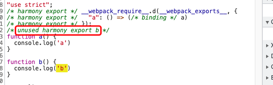

# Webpack

- [ ] 文件监听原理
- [ ] webpack热更新原理HMR
- [ ] 自定义loader/plugin
- [ ] 优化webpack构建速度
  - [ ] 多线程
- [ ] 多入口
- [ ] 代码分割
  - [ ] 公共
  - [ ] 第三包
- [ ] webpack脚手架
- [ ] tree shaking

## 概念

webpack 是一个用于现代 JavaScript 应用程序的 静态模块打包工具

1. 默认只对js进行处理，其他类型需要借助loader
2. 打包：它会在内部构建一个 依赖图(dependency graph)，此依赖图对应映射到项目所需的每个模块，并生成一个或多个 bundle

## 什么是模块？

- 将一个复杂的程序依据一定的规则(规范)封装成几个块(文件), 并进行组合在一起；
- 块的内部数据/实现是私有的, 只是向外部暴露一些接口(方法)与外部其它模块通信；
- 一个模块的组成
  - 数据--->内部的属性；
  - 操作数据的行为--->内部的函数；
- 模块化是指解决一个复杂的问题时自顶向下把系统划分成若干模块的过程，有多种属性，分别反映其内部特性；
- 模块化编码：编码时是按照模块一个一个编码的, 整个项目就是一个模块化的项目；

## 模块化优点

- 更好代码组织方式，利于后期维护
- 按需加载
- 避免命名冲突
- 更好的依赖处理
- 更好的分离

## 模块化

```js
const allenModule = (function () {
  const name = 'allen'
  const sex = 'man'
  return {
    tell() {
      console.log(name, sex)
    }
  }
})()
```

```js
(function (window) {
  const name = 'allen'
  const sex = 'man'
  window.allenModule = {
    tell() {
      console.log(name, sex)
    }
  }
})(window)
```

## 进化史

### AMD

### COMMONJS

> exports和require

```js
// index.js
const a = require('./math')

console.log(a)

const { getSum } = require('./math')
console.log(getSum)

const a2 = require('./math-2')

console.log(a2)

const { desc } = require('./math-2')
console.log(desc)

// math.js
exports.getSum = (a, b) => a + b
exports.desc = (a, b) => a - b

// math-2.js
const getSum = (a, b) => a + b
const desc = (a, b) => a - b

module.exports = {
  getSum,
  desc
}
```

### ES6 MODULE

```js
// index.js
import math, { desc } from './math'
console.log(math, desc)

// math.js
export default {
  getSum: (a, b) => a + b
}

export function desc(a, b) {
  return a - b
}
```

## tapable

### SyncHook

```js
// 同步钩子
class SyncHook {
  constructor() {
    this.tasks = []
  }
  // 注册钩子
  tap(name, task) {
    this.tasks.push(task)
   }

  // 执行钩子
  call(...args) {
    this.tasks.forEach(task => {
      task(...args)
    })
  }
}

const hook = new SyncHook(['name'])

hook.tap('react', (name) => {
  console.log('react', name)
})
hook.tap('node', (name) => {
  console.log('node', name)
})

hook.call('allen')
```

### SyncBailHook

```js
// 同步钩子
class SyncBailHook {
  constructor() {
    this.tasks = []
  }
  // 注册钩子
  tap(name, task) {
    this.tasks.push(task)
  }

  // 执行钩子
  call(...args) {
    for (let i = 0;i < this.tasks.length;i += 1) {
      const task = this.tasks[i]
      const result = task(...args)
      if (result !== undefined) {
        return
      }
    }
  }
}

const hook = new SyncBailHook(['name'])

hook.tap('react', (name) => {
  console.log('react', name)
  return 'all'
})
hook.tap('node', (name) => {
  console.log('node', name)
})

hook.call('allen')
```

## loader的执行顺序

> 从右到左，从下往上

## Loader和Plugin的区别

- Loader 本质就是一个函数，在该函数中对接收到的内容进行转换，返回转换后的结果。因为 Webpack 只认识 JavaScript，所以 Loader 就成了翻译官，对其他类型的资源进行转译的预处理工作。
- Plugin 就是插件，基于事件流框架 Tapable，插件可以扩展 Webpack 的功能，在 Webpack 运行的生命周期中会广播出许多事件，Plugin 可以监听这些事件，在合适的时机通过 Webpack 提供的 API 改变输出结果。
- Loader 在 module.rules 中配置，作为模块的解析规则，类型为数组。每一项都是一个 Object，内部包含了 test(类型文件)、loader、options (参数)等属性。
- Plugin 在 plugins 中单独配置，类型为数组，每一项是一个 Plugin 的实例，参数都通过构造函数传入。

## webpack执行流程


## 模块打包本质

> 为每个模块创造一个可以导出和引入的环境

### 分析一下打包后的文件
```js
(() => {
  // 收集所有的模块
  var __webpack_modules__ = ({
    "./src/index.js": ((__unused_webpack_module, exports) => {
      // __webpack_require__会调用函数作用域的定义
      eval("const {  a} = __webpack_require__(\"./src/demo/a.js\");__webpack_require__(\"./src/index.less\");console.log(a + b);")
    }),
    "./src/demo/a.js": ((__unused_webpack_module, exports) => {
      eval("exports.a = 'allen';")
    }),
    "./src/index.less": ((__unused_webpack_module, exports) => {
      eval("const style = document.createElement('style');style.innerHTML = 'html {  margin: 0;  padding: 0;}';document.head.appendChild(style);")
    })
  });
  var __webpack_module_cache__ = {};

  // 实现一个__webpack_require__的引入方式
  function __webpack_require__(moduleId) {
    // 缓存，单例
    var cachedModule = __webpack_module_cache__[moduleId];
    if (cachedModule !== undefined) {
      return cachedModule.exports;
    }

    // 为每个module创建一个exports，并缓存起来
    var module = __webpack_module_cache__[moduleId] = {
      exports: {}
    };

    // 通过moduleId调用，并把module和exports作为参数传递
    __webpack_modules__[moduleId](module, module.exports, __webpack_require__);

    // 得到的结果返回
    return module.exports;
  }

  // 调用主入口
  var __webpack_exports__ = __webpack_require__("./src/index.js");
})()
```

## loader的执行顺序

> 默认是从右到左（从下到上）

## plugin的执行顺序

> 默认是从左到右（从上到下）


## tree shaking

> 描述移除 JavaScript 上下文中的未引用代码(dead-code)

> 它依赖于 ES2015 模块语法的 静态结构 特性，例如 import 和 export

```js
// utils/index.js
export function a() {
  console.log('a')
}

export function b() {
  console.log('b')
}

// index.js
import { a } from './utils'
console.log(a)
```

### 输出bundle的文件



### 标记为side-effect-free(无副作用)

> 设置为false表示所有文件都不包含副作用，webpack可以安全删除未用到的export

```json
{
  "sideEffects":false
}
```

### 设置为sideEffects存在将css等文件删除

> 需要将这些css会产生副作用排除

```
{
  "sideEffects": ["*.css"]
}
```

## 使用ts/tsx

### 生成tsconfig.json

`npx tsc --init`

### 配置package.json的resolve

```json
{
  resolve: {
    extensions: ['.tsx', '.ts', '.js'],
  },
  optimization: {
    usedExports: true
  }
}
```

## 构建优化点

- 使用module.noParse

```js
{
  module: {
    // 不去解析lodash
    noParse: /lodash/,
  }
}
```

- 使用module.rules.xx.exclude

排除所有符合条件的模块

```js
module: {
    // 不去解析lodash的import
    noParse: /lodash/,
    rules: [
      {
        test: /\.js$/,
        exclude: /node_modules/,
        use: 'babel-loader'
      }
    ]
}
```

- 使用webpack.IgnorePlugin

> 在moment的语言包上使用

```js
new webpack.IgnorePlugin({
  resourceRegExp: /^\.\/locale$/,
  contextRegExp: /moment$/,
})
```

- dll

```js
// webpack.config.dll.js 打包dll
const path = require('path')
const webpack = require('webpack')

module.exports = {
  entry: {
    react: ['react', 'react-dom']
  },
  output: {
    path: path.resolve(__dirname, './dist'),
    filename: '[name]_dll.js',
    library: '[name]_dll',
  },
  plugins: [
    new webpack.DllPlugin({
      name: '[name]_dll',
      path: path.resolve(__dirname, 'dist', 'manifest.json')
    })
  ]
}
```

```js
// webpack.config.js 主配置文件
new webpack.DllReferencePlugin({
  manifest: path.resolve(__dirname, './dist', 'manifest.json')
})
```

## scope hosting

```js
// webpack中mode=production
// 源文件
let a = 1
let b = 2
let c = 3
let d = a + b + c
console.log(d, '---')

// 打包后的文件
console.log(6,"---")
```

## 懒加载

```js
const element = document.createElement('div')

element.innerHTML = '按钮'
element.addEventListener('click', () => {
  // jsonp的形式
  import('./data').then(res => {
    console.log(res.default)
  })
})

document.body.appendChild(element)
```

