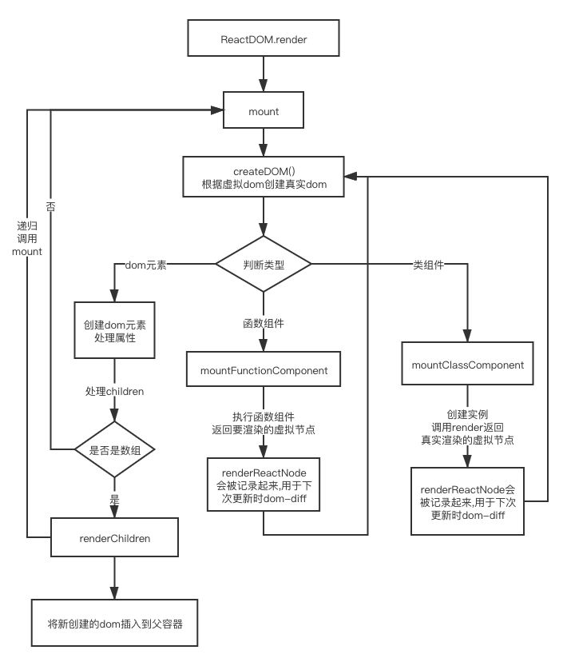

# 手写react

**仓库地址: https://github.com/xuxiaozhou/custom-react**

> 食用指南

```shell
git clone https://github.com/xuxiaozhou/custom-react
yarn
# 构建出react,react-router-dom,react-redux
yarn build
# 示例代码: custom-react-demo
```

## React/ReactDOM

### React.createElement

> 将jsx转成虚拟DOM

```ts
export function createElement(type, props: Props = {}, ...children): ReactNode {
  const { key, ref, ...extProps } = props || {};
  const reactNode: ReactNode = {
    type,
    ref,
    props: {
      ...extProps,
    }
  };

  /**
   * createElement('div',{},'hello')
   * createElement('div',{},createElement('div',{},))
   * createElement('div',{},createElement('div',{},),createElement('div',{}))
   * createElement('div',{},[createElement('div',{},),createElement('div',{})])
   */
  if (children.length === 1) {
    if (children[0] !== undefined) {
      reactNode.props.children = wrapChildren(children[0]);
    }
  } else {
    reactNode.props.children = children.map(wrapChildren);
  }

  return reactNode;
}
```

### 挂载过程
- 根据虚拟节点创建真实dom(createDOM)
  - 是DOM元素
    - 创建DOM元素
    - 处理属性
    - 处理children
  - 是函数组件
    - 调用函数返回真正渲染的虚拟节点
    - 记录上一次真正渲染的虚拟节点
    - 调用createDOM
  - 是类组件(.isReactComponent为true)
    - 创建实例
    - 调用实例的render方法返回真正渲染的虚拟节点
    - 记录上一次真正渲染的虚拟节点
    - 调用createDOM



### 合成事件SyntheticEvent
- 将事件挂载到document
- 通过事件的target
  - 找到真正触发事件的DOM元素
  - 找到事件方法
- 找到DOM元素身上存储store。找到事件处理函数
- 通过递归target.parentNode实现事件冒泡
- 合成事件
  - 浏览器的原生事件的跨浏览器包装器(处理兼容)
  - 提供浏览器原生事件相同接口
  - 可以进行额外处理

```ts
export function addEvent(dom: DOM, type: string, listener: () => void) {
  // 将事件处理放到dom身上
  const store = dom.store || (dom.store = {});
  store[type] = listener;

  // 将事件挂载到document身上
  if (!document[type]) {
    document[type] = dispatchEvent;
  }
}

// 事件触发都用此方法
function dispatchEvent(e) {
  // 进入批量更新模式
  updateQueue.isBatchingUpdate = true;

  const { type } = e;
  let { target } = e;
  const eventType = `on${type}`;

  createSyntheticEvent(e);

  // 通过事件源递归向上找，模拟事件冒泡
  while (target) {
    const { store } = target;
    if (store?.[eventType]) {
      // 原生事件的this为undefined
      const listener = store[eventType];
      listener(syntheticEvent);
    }

    target = target.parentNode;
  }

  resetSyntheticEvent();

  // 最后:批量执行一次
  updateQueue.batchUpdate();
}
```

### Component

- 类组件的基类
- setState会两种模式
  - 批量更新模式:
    - 不会立即执行,会最后一次执行
    - 在类组件的生命周期,事件处理会走批量更新模式
  - 非批量更新模式
    - 会立即执行.
    - 例如:在事件处理函数里执行setTimeout的会调用setState就是立即执行

```ts
// 更新队列, 
export const updateQueue = {
  // 当前更新模式
  isBatchingUpdate: false,
  // 更新实例
  updaters: new Set<Updater>(),
  // 执行更新
  batchUpdate() {
    for (const updater of this.updaters) {
      updater.updateClassComponent();
    }
    this.isBatchingUpdate = false;
    this.updaters.length = 0;
  }
};

class Updater<P = object, S = object> {
  constructor(instance: Component<P, S>) {
    this.instance = instance;
    this.pendingState = [];
    this.callbacks = [];
  }

  addState(partialState: PartialState<S, P>, callback: SetStateCallback) {
    // 将参数添加到实例上
    this.pendingState.push(partialState);
    if (callback) {
      this.callbacks.push(callback);
    }
    // 尝试更新
    this.emitUpdate();
  }

  emitUpdate(newProps?: P) {
    this.newProps = newProps;
    if (updateQueue.isBatchingUpdate) {
      // 批量更新模式
      // 往更新队列里面增加当前更新
      updateQueue.updaters.add(this as any as Updater<object, object>);
    } else {
      // 不是批量更新模式，直接更新
      this.updateClassComponent();
    }
  }

  // 获取最新的state
  getState() {
    const { instance, pendingState } = this;

    let { state, props } = instance;
    pendingState.forEach(nextState => {
      // 处理setState传递函数的情况
      if (typeof nextState === 'function') {
        nextState = nextState.call(instance, state, props);
      }

      state = {
        ...state,
        ...nextState
      };
    });

    pendingState.length = 0;
    return state;
  }

  updateClassComponent() {
    const { instance, pendingState, newProps, callbacks } = this;
    if (newProps || pendingState.length > 0) {
      shouldUpdate<P, S>(instance, newProps, this.getState(), callbacks);
    }
  }
}

// 不管组件是否要更新，props和state都要更新
function shouldUpdate<P, S>(instance: Component<P, S>, newProps: P, nextState: S, callbacks: SetStateCallback[]) {
  // getDerivedStateFromProps
  const { getDerivedStateFromProps } = instance.ownReactNode.type;
  if (getDerivedStateFromProps) {
    const partialState = getDerivedStateFromProps(newProps, instance.state);
    nextState = {
      ...nextState,
      ...partialState,
    };
  }

  // 设置最新的state
  instance.state = nextState;

  // shouldComponentUpdate(组件是否要更新)
  // 返回false，则不需要更新
  // 返回true, 则需要更新
  if (instance.shouldComponentUpdate && !instance.shouldComponentUpdate(newProps, nextState)) {
    return;
  }

  if (newProps) {
    instance.props = newProps;
  }

  // 更新组件
  instance.forceUpdate();

  callbacks.forEach(cb => {
    cb();
  });

  callbacks.length = 0;
}

export class Component<P = object, S = object> {
  // ...其他属性

  constructor(props: P) {
    this.props = props;
    this.updater = new Updater<P, S>(this);
  }

  setState(partialState: PartialState<S, P>, callback?: SetStateCallback) {
    this.updater.addState(partialState, callback);
  }

  forceUpdate() {
    // 走render
    const renderReactNode = (this as any as typeof Component & { render: () => ReactNode; }).render();
    // 走getSnapshotBeforeUpdate, 返回值作为componentDidUpdate的第三个参数
    const extrArgs = this.getSnapshotBeforeUpdate?.();
      
    const oldDom = findDOM(this.lastRenderReactNode);

    // 比较新旧虚拟节点.走dom-diff
    compareTwoVDom(
      oldDom ? oldDom.parentNode : null,
      this.lastRenderReactNode,
      renderReactNode
    );

    this.lastRenderReactNode = renderReactNode;
    // 走componentDidUpdate
    this.componentDidUpdate?.(prevProps, prevState, extrArgs);
  }
}
```

### React.PureComponent

- 主要实现shouldComponentUpdate对新旧props和新旧state进行浅层比较

```ts
export class PureComponent extends Component {
  // 组件是否要更新
  // 返回true,  则需要更新
  // 返回false, 则不需要更新
  shouldComponentUpdate(nextProps, nextState) {
    return !shallowEqual(this.props, nextProps) || !shallowEqual(this.state, nextState);
  }
}
```

### React.memo

> 为函数组件提供类组件shouldComponentUpdate的功能

```ts
export function memo(FunctionComponent, compare?: (prevProps, nextProps) => boolean) {
  if (compare) {
    return class extends Component {
      shouldComponentUpdate(nextProps) {
        return compare(this.props, nextProps);
      }
      render() {
        return FunctionComponent(this.props);
      }
    };
  }

  return class extends PureComponent {
    render() {
      return FunctionComponent(this.props);
    }
  };
}
```

### dom-diff
> compareTwoVDom

- 处理单节点
  - 新旧为null
  - 新的为null,旧的不为null: 走unmount(卸载)
  - 新的不为null,旧的为null: 走mount(挂载)
  - 新旧节点type和key不一样: 卸载老的,挂载新的
  - 处理同为文本节点
- 处理多节点

```ts
export function compareTwoVDom(parentDOM: HTMLElement, oldReactNode: ReactNode, newReactNode: ReactNode, nextDOM?: HTMLElement) {
  // 新旧节点都为null
  if (!newReactNode && !oldReactNode) {
    return;
  }

  // 新的为null，旧的不为null
  if (!newReactNode && oldReactNode) {
    const oldDom = findDOM(oldReactNode);

    if (oldDom) {
      parentDOM.removeChild(oldDom);
    }

    return;
  }

  // 老的为null，新的不为null
  if (!oldReactNode && newReactNode) {
    const newDOM = createDOM(newReactNode);

    parentDOM.insertBefore(newDOM, nextDOM || null);

    return;
  }

  // 新旧都有，但类型不一样
  if (oldReactNode.type !== newReactNode.type) {
    const oldDom = findDOM(oldReactNode);
    const newDOM = createDOM(newReactNode);

    parentDOM.replaceChild(newDOM, oldDom);
    return;
  }

  updateElement(oldReactNode, newReactNode);
}

function updateElement(oldReactNode: ReactNode, newReactNode: ReactNode) {
  const { type } = oldReactNode;
  // 文本
  if (type === TEXT) {
    const currentDOM = newReactNode.dom = oldReactNode.dom;
    currentDOM.textContent = newReactNode.props.content;
    return;
  }

  // 元素
  if (typeof type === 'string') {
    const currentDOM = newReactNode.dom = oldReactNode.dom;
    // 更新属性
    updateProps(currentDOM as HTMLElement, newReactNode.props, oldReactNode.props);

    updateChildren(currentDOM, oldReactNode.props.children, newReactNode.props.children);
    return;
  }

  if ((type as any as Component).isReactComponent) {
    updateClassComponent(oldReactNode, newReactNode);
  } else {
    updateFunctionComponent(oldReactNode, newReactNode as FunctionReactNode);
  }
}

function updateClassComponent(oldReactNode: ReactNode, newReactNode: ReactNode) {
  const instance = newReactNode.instance = oldReactNode.instance;

  instance.updater.emitUpdate(newReactNode.props);
}
function updateFunctionComponent(oldReactNode: ReactNode, newReactNode: FunctionReactNode) {
  const parentDOM = findDOM(oldReactNode).parentNode;
  const { type, props } = newReactNode;
  let lastRenderReactNode = oldReactNode.lastRenderReactNode;
  const newRenderReactNode = type(props);
  compareTwoVDom(parentDOM, lastRenderReactNode, newRenderReactNode);
  newReactNode.lastRenderReactNode = newRenderReactNode;
}

function getArray<T>(item: T | T[]): T[] {
  return Array.isArray(item) ? item : [item];
}

function updateChildren(parentDOM: DOM, oldReactNodeChildren: ReactNode | ReactNode[], newReactNodeChildren: ReactNode | ReactNode[]) {
  oldReactNodeChildren = getArray<ReactNode>(oldReactNodeChildren);
  newReactNodeChildren = getArray<ReactNode>(newReactNodeChildren);

  const maxLength = Math.max(oldReactNodeChildren.length, newReactNodeChildren.length);
  for (let i = 0; i < maxLength; i++) {
    const nextDOM = oldReactNodeChildren.find((item, index) => index > i && item && item.dom);
    compareTwoVDom(parentDOM as HTMLElement, oldReactNodeChildren[i], newReactNodeChildren[i], (nextDOM && nextDOM.dom) as HTMLElement);
  }
}
```

### Context
> Context 提供了一个无需为每层组件手动添加 props，就能在组件树间进行数据传递的方法。

```ts
export function createContext(initialValue?: unknown) {
  Provider._value = initialValue;

  function Provider(props) {
    // 让对象指向不变
    if (!Provider._value) {
      Provider._value = {};
    }
    Provider._value = Object.assign(Provider._value, props.value);

    return props.children;
  }

  function Consumer(props) {
    return props.children(Provider._value);
  }

  return {
    Consumer,
    Provider,
  };
}

// 挂载类组件
function mountClassComponent(reactNode: ClassReactNode) {
  // 判断类组件是否有contextType静态方法
  if (Type.contextType) {
    // 为其实例context赋值
    // 由于在更新时没有改到这个的引用地址,下次渲染还是能获取最新的值
    instance.context = Type.contextType.Provider._value;
  }
}
```

**使用**
```jsx
const MyContext = React.createContext()

// 提供
<MyContext.Provider value={{...context}}>
  {...other}
</MyContext.Provider>  

// 消费：类组件
class Eye extends CustomReact.Component {
  static contextType = MyContext
  render(){
    console.log(this.context)
  }
}

// 消费: 函数组件
<MyContext.Consumer>
  {(props)=><Sub {...props}/>}
</MyContext.Consumer>
```

### ref
> Refs 提供了一种方式，允许我们访问 DOM 节点或在 render 方法中创建的 React 元素。

```ts
export function createRef() {
  return { current: null };
}

function mountClassComponent(reactNode: ClassReactNode) {
  // <Com ref={ref}>
  if (reactNode.ref) {
    reactNode.ref.current = instance;
  }
}

function createDOM(reactNode: ReactNode): DOM {
  const { ref } = reactNode;

  // ref赋值真实dom
  if (ref) {
    ref.current = dom;
  }

  return dom;
}
```

## Hook

> 它可以让你在不编写 class 的情况下使用 state 以及其他的 React 特性。

### 动机
- 在组件之间复用状态逻辑很难
  - Hook 使你在无需修改组件结构的情况下复用状态逻辑
- 复杂组件变得难以理解
  - Hook 将组件中相互关联的部分拆分成更小的函数
- 难以理解的 class
  - Hook 使你在非 class 的情况下可以使用更多的 React 特性
  - 不适用this

### 规则
- 只在最顶层使用 Hook
  - 不要在循环，条件或嵌套函数中调用 Hook
- 只在 React 函数中调用 Hook
  - react函数组件
  - 自定义hook里调用其他hook

### 原理
- 维护为一个`hookState`的数组
- 维护一个`hookIndex`索引,
- 会根据索引去 初始化或获取原来的值

### useReducer

```ts
type ReducerAction = {
  type: string;
  [x: string]: unknown;
};

type ReaducerActionSetState<T> = (state: T) => T;
type Reducer<T> = (state: T, action: ReducerAction | ReaducerActionSetState<T>) => T | null;

export function useReducer<T>(reducer: Reducer<T>, initalState: T) {
  hookState[hookIndex] = hookState[hookIndex] || (typeof initalState === 'function' ? initalState() : initalState);

  const currentIndex = hookIndex;
  function dispatch(action: ReducerAction) {
    let nextState;
    const lastState = hookState[currentIndex];

    if (reducer) {
      // 处理传递reducer的情况
      nextState = reducer(
        lastState,
        action
      );
    } else {
      // 处理reducer为null的情况
      nextState = typeof action === 'function' ? (action as ReaducerActionSetState<T>)(lastState) : action;
    }

    hookState[currentIndex] = nextState;

    // 更新组件
    fullUpdate();
  }

  return [
    hookState[hookIndex++],
    dispatch
  ];
}
```

#### 使用

```js
import React from 'react'

const ADD = 'ADD'
const DESC = 'DESC'
function reducer(state, action) {
  switch (action.type) {
    case ADD:
      return { number: state.number + (action.payload || 1) }
    case DESC:
      return { number: state.number - 1 }
    default:
      return state
  }
}

export default function App() {
  const [state, dispatch] = React.useReducer(reducer, { number: 1 })

  return (
    <div >
      <div>{state.number}</div>
      <button onClick={() => {
        dispatch({
          type: ADD,
          payload: 2
        })
      }}>+2</button>
      <button onClick={() => {
        dispatch({
          type: DESC
        })
      }}>-1</button>
    </div>
  )
}
```

### React.useState()

**使用**
```jsx
import React from 'react'
export default function App() {
  const [number, setNumber] = React.useState(0)

  return (
    <div>
      <p>{number}</p>
      <button onClick={() => {
        setNumber(number + 1)
      }}>按钮</button>
    </div>
  )
}
```

**实现**

```ts
export function useState(initalState) {
  return useReducer(null, initalState);
}
```

### React.useMemo()

> 把“创建”函数和依赖项数组作为参数传入 useMemo，它仅会在某个依赖项改变时才重新计算 memoized 值。这种优化有助于避免在每次渲染时都进行高开销的计算。
> 缓存值。类似vue的computed

**使用**

```js
const data = React.useMemo(() => ({ number }), [number])
```

**实现**

```ts
// hookIndex++ 主要在进入下一个hook函数能获取正确的索引
// 如果没有传deps。每次都会走重新计算的流程
export function useMemo<T>(factory: () => T, deps?: unknown[]): T {
  // 初始化
  if (!hookState[hookIndex]) {
    const newMemo = factory();
    hookState[hookIndex++] = [newMemo, deps];
    return newMemo;
  }

  const [lastMemo, lastDeps] = hookState[hookIndex];
  const same = deps?.every((item, index) => item === lastDeps?.[index]);
  if (same) {
    // 如果依赖项一样，直接返回缓存的值
    hookIndex += 1;
    return lastMemo;
  }

  // 不同则重新计算
  const memoValue = factory();
  hookState[hookIndex++] = [memoValue, deps];
  return memoValue;
}
```

### React.useCallback

```js
const handleClick = CustomReact.useCallback(() => {
  // ...do some thing
}, [number])
```

**实现**

```ts
export function useCallback(callback: () => void, deps?: unknown[]) {
  // 初始化
  if (!hookState[hookIndex]) {
    hookState[hookIndex++] = [callback, deps];
    return callback;
  }

  // 判断依赖项是否一样
  const [lastCallback, lastDeps] = hookState[hookIndex];
  const same = deps?.every((item, index) => item === lastDeps?.[index]);
  if (same) {
    // 一样则返回缓存的callback
    hookIndex += 1;
    return lastCallback;
  }

  // 重新缓存新的callback
  hookState[hookIndex++] = [callback, deps];
  return callback;
}
```

### React.useContext

```js
const context = React.useContext(CounterContext)
```

**实现**

```ts
// 跟React.createContext的实现原理对应
export function useContext(Context: { Provider: { _value: unknown; }; }) {
  return Context.Provider._value;
}
```

### React.useEffect

- useEffect Hook 看做 componentDidMount，componentDidUpdate 和 componentWillUnmount 这三个函数的组合。

```js
function App() {
  const [count, setCount] = React.useState(0)
  
  React.useEffect(() => {
    console.log('use Effect')
    const timer = setInterval(() => {
      setCount(count => count + 1)
    }, 1000)
    return () => {
      clearInterval(timer)
    }
  })

  return <div>{count}</div>
}
```

#### 模拟componentDidMount

```js
React.useEffect(() => {
  // componentDidMount
},[])
```

#### 模拟componentDidUpdate

```js
React.useEffect(() => {
  // componentDidUpdate
})
```

#### 模拟componentWillUnmount
```js
React.useEffect(() => {
  return ()=>{
    // componentWillUnmount
  }
},[])
```

#### 实现

```js
// 使用宏任务。浏览器ui渲染后才执行
type DestyoryFn = () => void;
export function useEffect(cb: () => DestyoryFn, deps?: unknown[]) {
  const currentHook = hookIndex;
  if (!hookState[currentHook]) {
    // 初始化
    // 在宏任务中执行
    setTimeout(() => {
      // 先执行一次
      const destoryFunction = cb();
      hookState[currentHook] = [destoryFunction, deps];
    });
    hookIndex += 1;
    return;
  }

  const [destoryFunction, lastDeps] = hookState[currentHook];
  const same = deps?.every((item, index) => item === lastDeps?.[index]);
  //  如果依赖项一样，则不需要执行effect
  if (same) {
    hookIndex++;
    return;
  }

  // 调用销毁函数
  destoryFunction?.();
  // 重新执行
  setTimeout(() => {
    const destoryFunction = cb();
    hookState[currentHook] = [destoryFunction, deps];
  });
  hookIndex += 1;
}
```

### React.useLayoutEffect

**使用**

```js
function App() {
  const ref = React.useRef(null)
  
  // 会有动画效果
  // 因为useEffect是在宏任务才执行。也就是说浏览器ui渲染`之后`才执行
  React.useEffect(() => {
    ref.current.style.transform = 'translate(500px)'
    ref.current.style.transition = '500ms'
  }, [])

  // 不会有动画效果
  // 因为useLayoutEffect是在微任务才执行。也就是说浏览器ui渲染`之前`才执行
  React.useLayoutEffect(() => {
    ref.current.style.transform = 'translate(500px)'
    ref.current.style.transition = '500ms'
  }, [])

  const style = {
    width: '100px',
    height: '100px',
    backgroundColor: 'red'
  }
  return (
    <div style={style} ref={ref}></div>
  )
}
```

**实现**

> 跟useEffect的区别就是queueMicrotask

```ts
// 微任务。在浏览器ui渲染之前执行: queueMicrotask
export function useLayoutEffect(cb: () => DestyoryFn, deps: unknown[]) {
  const currentHookIndex = hookIndex;
  // 初始化
  if (!hookState[currentHookIndex]) {
    queueMicrotask(() => {
      const destoryFunction = cb();
      hookState[currentHookIndex] = [destoryFunction, deps];
    });
    hookIndex += 1;
    return;
  }

  const [destoryFunction, lastDeps] = hookState[currentHookIndex];
  const same = deps?.every((item, index) => item === lastDeps?.[index]);
  if (same) {
    hookIndex++;
    return;
  }

  // 重新执行。先调用销毁函数。在微任务重新执行
  destoryFunction?.();
  queueMicrotask(() => {
    const destoryFunction = cb();
    hookState[currentHookIndex] = [destoryFunction, deps];
  });
  hookIndex += 1;
}
```

### React.forwardRef

> 像外部组件想获取函数组件的ref
> 但是有安全性问题。给到父组件的ref完全暴露。

```js
import React from 'react'

function Sub(props, ref) {
  return <input ref={ref} />
}

const ForwardedSub = React.forwardRef(Sub)

export default function App() {
  const childRef = React.useRef()

  return (
    <div>
      <ForwardedSub ref={childRef} />
      <button onClick={() => {
        childRef.current.focus()
        // 直接可以干掉子级
        // childRef.current.remove()
      }}>获得焦点</button>
    </div>
  )
}
```

**实现**

```ts
import { Component } from 'React';

export function forwardRef(FunctionComponent) {
  return class extends Component {
    render() {
      if (FunctionComponent.length < 2) {
        // 提示
      }
      return FunctionComponent(this.props, this.ref);
    }
  };
}

// 在类组件
if (reactNode.ref) {
  reactNode.ref.current = instance;
  instance.ref = reactNode.ref;
}
```

### React.useImperativeHandle

```js
import React from 'react'

// ref会作为函数组件第二个参数
function Sub(props, ref) {
  const inputRef = React.useRef()
  
  React.useImperativeHandle(ref, () => ({
    // 返回选择暴露给调用组件的方法/属性
    focus() {
      inputRef.current.focus()
    }
  }))

  return <input ref={inputRef} />
}

const ForwardedSub = React.forwardRef(Sub)

export default function App() {
  const childRef = React.useRef()

  return (
    <div>
      <ForwardedSub ref={childRef} />
      <button onClick={() => {
        childRef.current.focus()
        // 报错
        childRef.current.remove()
      }}>获得焦点</button>
    </div>
  )
}
```

**实现**

```ts
// useImperativeHandle 可以让你在使用 ref 时自定义暴露给父组件的实例值
export function useImperativeHandle(ref, factoy) {
  ref.current = factoy();
}
```

### React.useRef

> 除了DOM的refs,也可以作为类似class的实例属性

**使用**

```js
const childRef = React.useRef()
```

**实现**

```ts
export function useRef(initialState?: unknown) {
  hookState[hookIndex] = hookState[hookIndex] || { current: initialState };
  return hookState[hookIndex++];
}
```

### hook获取不到最新的值

- 函数组件其实是一个闭包。每个函数执行都是新的
- 获取不到最新的值。只能获取当时闭包的值

```js
import React from 'react'
export default function App() {
  const [count, setCount] = React.useState(0)

  function handler() {
    for (let i = 0;i < 3;i += 1) {
      setTimeout(() => {
        // 由于函数组件都是一个闭包。
        // 获取不到最新的值，只能获取到“当时”的值
        console.log(count)  // 0
        setCount(count + 1)
      }, 3000);
    }
  }

  // 页面最后显示的是1
  return (
    <div>
      <p>{count}</p>
      <button onClick={handler}>+</button>
    </div>
  )
}
```

### 使用React.useRef保存最新的值

- 使用React.useRef多次获取都是同一个
- 使用React.createRef每次都是新的

```js
import React from 'react'
export default function App() {
  const [count, setCount] = React.useState(0)
  const countRef = React.useRef()

  React.useEffect(() => {
    countRef.current = count
  })

  function handler() {
    setCount(count + 1)
    setTimeout(() => {
      console.log(count)  // 0
      console.log(countRef.current)  // 永远是最新值
    }, 3000)
  }

  // 页面最后显示的是1
  return (
    <div>
      <p>{count}</p>
      <button onClick={handler}>+</button>
    </div>
  )
}
```

### hook进行数据获取

```js
import React from 'react'
export default function Request() {
  React.useEffect(() => {
    // todo some request
    console.log(1)
  }, [])
  return (
    <div>aaaaa</div>
  )
}
```

### 类似类实例属性
```js
import React from 'react'

export default function App() {
  const intervalRef = React.useRef()
  React.useEffect(() => {
    intervalRef.current = setInterval(() => {
      // do some thing
    }, 100);
    return () => {
      clearInterval(intervalRef.current)
    }
  })

  function stop() {
    // 类似实例的属性
    clearInterval(intervalRef.current)
  }

  return (
    <div onClick={stop}>Hello</div>
  )
}
```

### 只有在更新时执行

```js
import React from 'react'

// 只有在更新时执行
function useUpdateEffect(updateFn) {
  const flagRef = React.useRef()

  React.useEffect(() => {
    if (!flagRef.current) {
      flagRef.current = true
    } else {
      updateFn()
    }
  })
}

export default function Request() {
  const [state, setState] = React.useState(0)
  useUpdateEffect(() => {
    console.log('update')
  })

  return (
    <div onClick={() => { setState(state + 1) }}>{state}</div>
  )
}
```

### 获取上一次的值
```js
import React from 'react'

function usePrevious(count) {
  const prevCountRef = React.useRef();
  React.useEffect(() => {
    prevCountRef.current = count
    debugger
  })
  return prevCountRef.current
}

export default function Request() {
  const [state, setState] = React.useState(0)
  const previousState = usePrevious(state)

  return (
    <div onClick={() => {
      console.log('上一次state', previousState)
      console.log('当前state', state)
      setState(state + 1)
    }}>{state}</div>
  )
}
```

### 强制更新
```js
import React from 'react'

function useForceUpdate() {
  const [, forceUpdate] = React.useReducer(x => x + 1, 0)
  return forceUpdate
}

export default function Request() {
  const forceUpdate = useForceUpdate()
  console.log('更新')
  return (
    <div onClick={forceUpdate}>11</div>
  )
}
```

## react-router-dom

## react-redux


