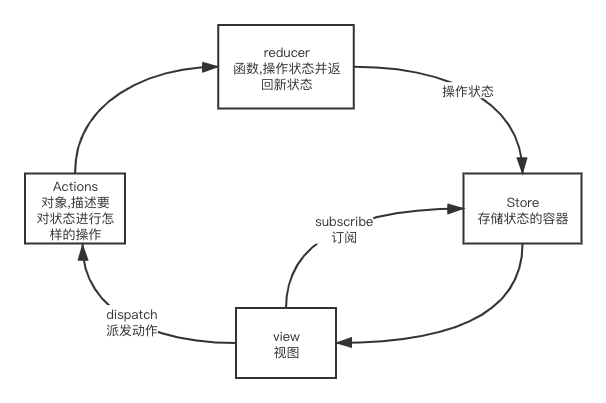

# react-redux

## redux

> js状态容器,提供可预测化的状态管理

## 组成


## 基础用法
```js
import { createStore } from 'redux'

const initalState = { count: 0 }
// 创建reducer.在这里进行state的初始化
function rootReducer(state = initalState, action) {
  switch (action.type) {
    case 'ADD':
      return { count: state.count + 1 }
    case 'DESC':
      return { count: state.count - 1 }
    default:
      return state
  }
}

// 创建store
const store = createStore(rootReducer)

// 获取state
console.log(store.getState())

// 订阅:store更新
store.subscribe(() => {
  document.getElementById('count').innerHTML = store.getState().count
})

// 触发action
const addAction = { type: 'ADD' }
const addBtn = document.getElementById('add')
addBtn.onclick = () => {
  // 派发dispatch
  store.dispatch(addAction)
}
const descBtn = document.getElementById('desc')
const descAction = { type: 'DESC' }
descBtn.onclick = () => {
  // 派发dispatch
  store.dispatch(descAction)
}
```

## 在react中使用redux的原因

- 在React中组件通信的数据流是单向的, 
- 顶层组件可以通过props属性向下层组件传递数据, 
- ⽽下层组件不能向上层组件传递数据, 要实现下层组件修改数据, 需要上层组件传递修改数据的⽅法到下层组件. 
- 当项⽬越来越⼤的时候, `组件之间传递数据变得越来越困难`.

**使用**

- 使⽤Redux管理数据，由于Store独⽴于组件，使得数据管理独⽴于组件，解决了组件与组件之间传递数据困难的问题。

