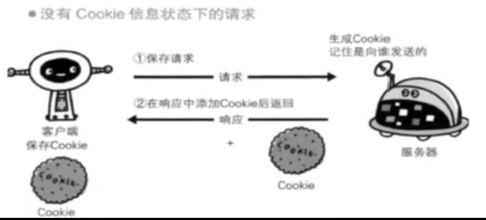

# Web页面请求过程

## 输入网址后发生了什么

1. DNS查找IP地址 -> ip地址
2. 与服务端建立TCP连接
3. 发送HTTP请求
4. 服务端处理请求并返回一个响应
5. 客户端接收响应报文后显示html

## HTTP特点
- 支持客户-服务器模式: 请求-应答
- 简单快速: 协议简单
- 灵活: 支持任意类型的传输
- 无连接: 限制每次连接只处理一个请求,服务器处理完客户端请求后,并收到客户端的应答后断开连接
- 无状态: 对事务处理没有记忆能力,需要前面传输的数据信息需要重传

## 请求报文
### 请求行

```
请求方法 请求地址 http版本
```

#### 请求方法
- get(获取资源)
- post(传输实体)
- put(传输文件)
- head(响应首部)
- delete(删除文件)
- options(询问支持)
- trace(追踪路径)
- connect()

### 请求头部字段
- Cache-Control:
- Host: 服务器的域名
- Referer: 告诉服务器该网页是从哪个页面链接过来的，服务器因此可以获得一些信息用于处理
- max-age: 资源被认为仍然有效的最长时间, 这个请求是相对于 request标头的时间
- Connection: 决定当前事务（一次三次握手和四次挥手）完成后，是否会关闭网络连接
   - 持久性连接，即一次事务完成后不关闭网络连接
```
Connection: keep-alive
```  
    - 非持久性连接，即一次事务完成后关闭网络连接
```
Connection: close
```

- If-Modified-Since
   -  返回200，只有在给定日期的最后一次修改资源后，服务器才会以200状态发送回请求的资源。
   - 如果请求从开始以来没有被修改过，响应会返回304并且没有任何响应体 

- If-None-Match
   - 对于 GET 和 HEAD 方法，仅当服务器没有与给定资源匹配的 ETag 时，服务器才会以200状态发送回请求的资源。
   -  对于其他方法，仅当最终现有资源的ETag与列出的任何值都不匹配时，才会处理请求。

- Accept: 接受请求 HTTP 标头会通告客户端其能够理解的 MIME 类型

## 响应报文

```
起始行
响应头部
空行
响应实体
```

### 起始行
```
http版本 状态码 状态文本
```

### 状态码

***2xx表示请求成功响应***

- 200: 成功响应
- 204: 请求成功处理,但没有资源返回(响应实体)

***3xx需要进行附加操作加以完成***
- 301: 永久重定向, 该状态码表示请求的资源已经重新分配 URI，以后应该使用资源现有的 URI
- 302: 临时性重定向。该状态码表示请求的资源已被分配了新的 URI，希望用户（本次）能使用新的 URI 访问。
- 304: 该状态码表示客户端发送附带条件的请求时，服务器端允许请求访问资源，但未满足条件的情况。

***4xx表示客户端发生错误***
- 401: Unauthorized: 被请求页面需要用户名和密码
- 403 Forbidden: 该状态码表明对请求资源的访问被服务器拒绝了。
- 404 Not Found: 表明服务器上无法找到请求的资源。

***5xx: 服务器发生错误***
- 500: 服务器遇到不可知的情况
- 502: 服务器从上游服务器收到一个无效的响应
- 503: 服务器暂时处于超负载或正在进行停机维护，现在无法处理请求。
- 504: 网关超时

### 响应头

- Access-Control-Allow-Origin: 指定一个来源，它告诉浏览器允许该来源进行`资源访问`
- Keep-Alive: 
- Transfer-Encoding: chunked: 规定了传输报文主体时采用的编码方式
- Set-Cookie: 

## HTTPS

- HTTP 一般是明文传输，很容易被攻击者窃取重要信息
- HTTPS 的全称为 （Hyper Text Transfer Protocol over SecureSocket Layer），全称有点长，HTTPS 和 HTTP 有很大的不同在于 HTTPS 是以`安全`为目标的 HTTP 通道，
- 在 HTTP 的基础上通过`传输加密和身份认证`保证了传输过程的安全性。HTTPS 在 HTTP 的基础上增加了 SSL 层，也就是说 HTTPS = HTTP + SSL。

## CDN
> Content Delivery Network，即内容分发网络，它应用了 HTTP 协议里的缓存和代理技术，代替源站响应客户端的请求。CDN 是构建在现有网络基础之上的网络，它依靠部署在各地的边缘服务器，通过中心平台的负载均衡、内容分发、调度等功能模块，使用户就近获取所需内容，降低网络拥塞，提高用户访问响应速度和命中率。CDN的关键技术主要有内容存储和分发技术。


## COOKIE和session
- http协议是无状态的协议
- 为了服务端识别特定的客户端
- 每次http请求客户端都会发送响应的cookie信息到服务端
- 大部分应用都是cookie去实现session
  - 第一次创建session的时候,服务端会在响应头告诉客户端在cookie记录一个session
- 禁用cookie,可以使用url重写记录,每次http交互url带上sid记录用户信息



### 隐私
- session: 存储服务器
- cookie: 存储客户端

### 有效期
- cookie: 
- session: 关闭浏览器关闭就关闭

## 正向代理/反向代理

- 正向代理: 走一个中介,代理请求者的网络内部, 访问外部网络
- 反向代理: 请求到服务器, 转发到内部其他服务器

## 缓存


