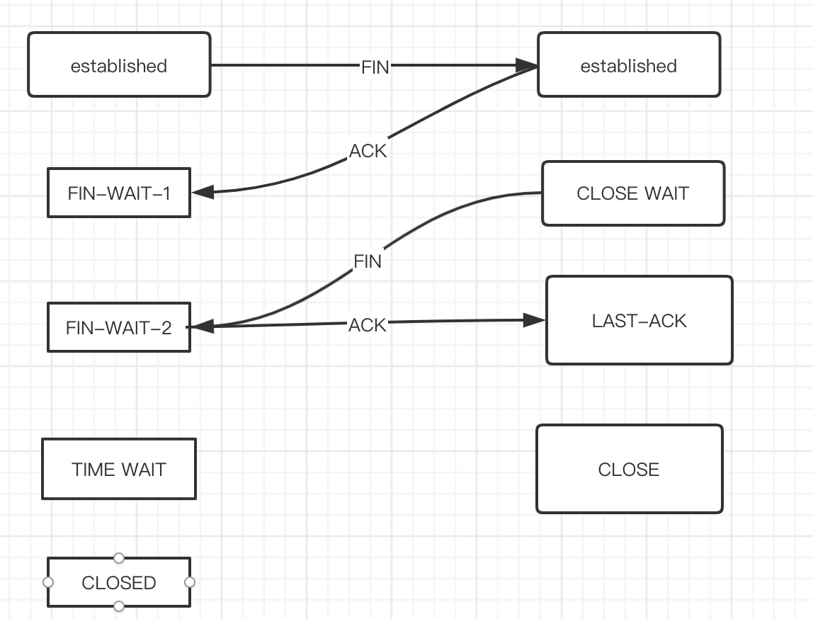

# 网络协议

## OSI网络协议

## TCP/IP协议

- 应用层、表示层、会话层三个层次提供的服务相差不是很大，所以在 TCP/IP 协议中，它们被合并为应用层一个层次。
- 由于数据链路层和物理层的内容很相似，所以在 TCP/IP 协议中它们被归并在网络接口层一个层次里

## TCP

- 传输控制协议，也就是 Transmission Control Protocol，
- TCP 是一种传输层的协议，
- 它是一种`面向连接`的、`可靠`的、基于字节流的传输协议，
- TCP 协议是 TCP/IP 协议簇中的核心协议，
- 它最大的特点就是提供`可靠的数据交付`

### 三次握手

> 都是在不可靠的网络通信中建立可靠的连接

**细节**
1. 客户端发送SYN到服务端, 请求建立连接
2. 如果可以连接, 服务端会发送SYN+ACK包给客户端
3. 客户端收到后发送ACK包建立连接, 服务端收到ACK包后建立连接

**如果是两次握手会存在的问题**

**细节**

1. 第一次发送SYN到服务端,由于网络等问题,没有到达服务端
2. 客户端重发SYN包
3. 服务端接收到SYN包后回复SYN+ACK,直接建立连接
4. 之前未到达的SYN到达服务端,服务端会以为是新的建立请求,但客户端是同一个建立请求.出现了状态不一致

### 四次挥手

**细节**
1. 客户端向服务端发送一个FIN包,表示要关闭连接,自己进入终止等待1状态
2. 服务端向客户端发送一个ACK包,便是服务端进入关闭等待状态, 客户端进入终止等待2状态

中间客户端还可以接收发送请求,客户端还可以发送响应

3. 服务端向客户端发送FIN包,进入最后确认状态
4. 客户端收到后发送ACK包,进入`超时等待`状态,超时后关闭连接. 服务端收到ACK包后立即关闭连接

**客户端为什么要超时等待**
> 保证ACK发送到服务端

- 客户端发送ACK包后立即关闭连接,如果由于网络问题,服务端没收到ACK包,服务端会停留在 LAST-ACK(最后确认状态).
- 客户端回复ACK包后超时等待, 如果服务端在一定时间内未收到ACK包,服务端会重发FIN包给客户端去响应

## UDP
将数据包发送到服务端
- 优点
  - 性能损耗小
  - 资源占用少
- 缺点
  - 稳定性弱

## HTTP
> 超文本传输协议, HTTP 是一个在计算机世界里专门在两点之间`传输`文字、图片、音频、视频等`超文本数据`的约定和规范
