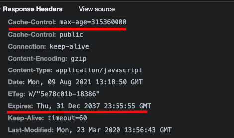

# Web页面请求过程

## 输入网址后发生了什么

1. DNS查找IP地址 -> ip地址
2. 与服务端建立TCP连接
3. 发送HTTP请求
4. 服务端处理请求并返回一个响应
5. 客户端接收响应报文后显示html

## 将URL进行DNS解析
> 拿到IP地址

## 建立TCP连接

- 第一次握手：客户端向服务器发送(SYN,seq)
  - 一个SYN报文
  - 一个客户端初始化随机序列号(seq)
- 第二次握手：服务器收到请求后向客户端发送(SYN,ACK,seq,ack)
  - 自己的SYN报文和ACK报文
  - 一个服务端的初始化随机序列号seq
  - 一个确认号ack=客户端发来的序列号+1，表示自己收到了
- 第三次握手：客户端收到服务器的确认应答后，向服务端发送(ACK,seq,ack)
  - 确认应答ACK报文
  - 一个seq，值为第二次握手客户端发过来的ack的值
  - 一个确认号ack，值为服务端的序列号+1，告诉服务端我收到了

### 发送http请求
- 走强缓存
  - 命中: 直接读取浏览器缓存文件
- 走协商缓存
  - 命中: 返回304和空响应体
  - 没命中: 进行处理
- 浏览器接收到相应数据后,
  - 在http1.1以下直接关闭TCP连接
  - 在http1.1及以上默认保持连接 `keep-alive`

### 关闭TCP连接
- 浏览器先发送FIN报文、Seq=初始化序列号给服务器，并停止发送数据，但仍可以接受服务端响应的数据
- 服务器收到后，发送ACK=浏览器序列号+1给浏览器，表明收到
- 服务器数据都发完了，给浏览器发送FIN报文、Seq=序列号给浏览器
- 浏览器收到后，发送ACK=服务器序列号+1给服务器，表明收到, 
  - 浏览器会过一段时间自动关闭连接, 防止发送给服务器的ACK丢失
  - 服务器接收到ACK立即关闭

## 开始渲染
- 构建DOM树
  - 下载解析html
  - 遇到没有async和defer的script标签,
    - 会停止构建DOM树(冻结)
    - 加载js文件,执行js代码
    - 执行完成后继续构建dom树
  - 生成dom树
- 构建样式树
  - 构建DOM树和样式树是并行的
  - 但script执行和样式树构建不能同时,构建样式树会阻塞js执行
- 布局
  - 将DOM树和样式树进行布局
- 渲染到页面中

### 重绘和重排
- 重排也叫回流，就是改变一个元素的尺寸位置属性时，会重新进行样式计算，布局、绘制以及后面所有流程
- 重绘比如改变元素的颜色时，就会触发重绘，重绘不会重新触发布局，但还是会触发样式计算和绘制
- 所以重排一定会触发重绘，重绘不一定会触发重排
- 在页面首次加载时，必然会触发重排和重绘

### 优化
- js
  - 因

### 单线程

## 缓存
### 强缓存
- 第一次请求时，服务器把资源的过期时间通过响应头中的Expires和Cache-Control两个字段告诉浏览器，
- 之后再请求这个资源的话，会判断有没有过期，没有过期就直接拿来用，不向服务器发起请求



#### Expires
> 用来指定资源到期绝对时间，服务器响应时，添加在响应头中。

```
Expires: Wed, 22 Nov 2021 08:41:00 GMT
```

#### Cache-Control

> 指定资源过期时间(秒s)

```
Cache-control:max-age=300
```

#### 区别

| 区别 | Expires| Cache-Control|
| ---- | ---- | ---- |
| http版本 | HTTP1.0 | HTTP1.1 |
| 优先级 | 低 | 高 |

#### Cache-Control请求头
| 字段 | 说明 |
| :---: | :---: |
| max-age=300 | 拒绝接受长于300秒的资源，为0时表示获取最新资源 |
| max-stale=100 | 缓存过期之后的100秒内，依然拿来用 |
| min-fresh=50 | 缓存到期时间还剩余50秒开始，就不给拿了，不新鲜了 |
| no-cache | 协商缓存验证 |
| no-store | 不使用缓存 |
| only-if-chached | 只使用缓存，没有就报504错误 |

#### Cache-Control响应头
| 字段 | 说明 |
| :---: | :---: |
| max-age=300 | 缓存有效期300秒 |
| s-maxage=500 | 缓存过期之后的100秒内，依然拿来用 |
| public | 可以被任何终端缓存，包括代理服务器、CDN等 |
| private | 只能被用户的浏览器终端缓存(私有缓存) |
| no-cache | 先和服务端确认资源是否发生变化，没有就使用 |
| no-store | 不缓存 |

#### 缺点
- 就是缓存过期之后，不管资源有没有变化，都会重新发起请求，重新获取资源

### 协商缓存

#### Last-Modified/If-Modified-Since
- 第一次请求资源时，服务器除了会返回给浏览器上面说的过期时间，还会在响应头添加 `Last-Modified` 字段，告诉浏览器该资源的最后修改时间

```
last-modified: Fri, 27 Oct 2021 08:35:57 GMT
```
- 然后浏览器再次请求的时候就把这个时间再通过另一个字段`If-Modified-Since`，发送给服务器

```
If-Modified-Since: Fri, 27 Oct 2021 08:35:57 GMT
```
- 服务器比较两个时间
  - 一样的说明没被更新过,返回304,浏览器直接拿过期的资源继续使用
  - 如果不一样,返回200和新的资源

#### ETag/If-None-Match

- 第一次请求资源时，服务器返回`Etag`字段，表示当前资源文件的一个唯一标识。这个标识符由服务器基于文件内容编码生成，能精准感知文件的变化，只要文件内容不同，ETag就会重新生成
```
etag: W/"132489-1627839023000"
```
- 然后浏览器再次请求的时候就把这个文件标识 再通过另一个字段 `If-None-Match`，发送给服务器
```
if-none-match: W/"132489-1627839023000"
```
- 服务器再把这两个字段对比，
  - 如果发现是一样的，就说明文件没有被更新过，就返回状态码304和空响应体给浏览器，浏览器直接拿过期了的资源继续使用；
  - 如果对比不一样说明资源有更新，就返回状态码200和新的资源

#### 区别

| 区别 | Last-Modified/If-Modified-Since| ETag/If-None-Match |
| ---- | ---- | ---- |
| 比较依据 | 修改时间 | 资源唯一标识 |
| 精度 | 低 | 高 |
| 优先级 | 低 | 高 |
| 性能 | 高 | 低 |


### 强缓存 vs 协商缓存

- 强缓存优先协商缓存
- 强缓存不发请求到服务器
- 协商会发请求到服务器,
- 协商缓存: html
- 强缓存: css,image,js

**策略**
- 频繁修改
  - 走协商缓存
  - 设置cache-control:no-cache
  - 配合ETag/Last-Modified验证资源有效
- 不常修改
  - 走强缓存
  - Cache-control或expires

## cookie/session

- 补充http协议是无状态的, 可以判断多个请求是否是同一个用户发起

### 特点
- 有安全问题
- 每个域名下的cookie不能超过20个,大小不能超过4k
- 每次请求都会在请求头带上
- 跨域名不能共享cookie

### cookie字段
- name:字段名
- size: 大小
- value: 保存用户登录状态
- Path：可以访问此 Cookie 的路径。比如 juejin.cn/editor ，path是/editor，只有/editor这个路径下的才可以读取 Cookie
- httpOnly：表示禁止通过 JS 访问 Cookie，减少 XSS 攻击。
- Secure：只能在 https 请求中携带
- SameSite：规定浏览器不能在跨域请求中携带 Cookie 减少 CSRF 攻击，详细说明看这里
- Domain：域名，跨域或者 Cookie 的白名单，允许一个子域获取或操作父域的 Cookie，实现单点登录的话会非常有用
- Expires/Max-size：指定时间或秒数的过期时间，没设置的话就和 Session 一样关闭浏览器就失效

### LocaStorage/SessionStorage

- 共同点
  - 存储体积5M
  - 同源策略限制,只有同源才可以访问
  - api
    - getItem
    - setItem
    - removeItem
    - clear
    - key
- 不同点
  - LocalStorage: 永久存储,除非主动清楚
  - SessionStorage: 用于临时保存同一窗口或标签页的数据，刷新页面时不会删除，但是关闭窗口或标签页之后就会删除这些数据
  - SessionStorage更加严格，只有在同一浏览器的同一窗口下才能共享

### indexDB
- 键值对储存：内部用对象仓库存放数据，所有类型的数据都可以直接存入，包括js对象，以键值对的形式保存，每条数据都有对应的主键，主键是唯一的
- 异步：indexDB操作时用户依然可能进行其他操作，异步设计是为了防止大量数据的读写，拖慢网页的表现
- 支持事务：比如说修改整个表的数据，修改了一半的时候报了个错，这时候会全部恢复到没修改之关的状态，不存在修改一半成功的情况
- 同源限制：每一个数据库应创建它对应的域名，网页只能访问自身域名下的数据库
- 存储空间大：一般来说不少于250MB，甚至没有上限
- 支持二进制存储：比如ArrayBuffer对象和Blob对象


